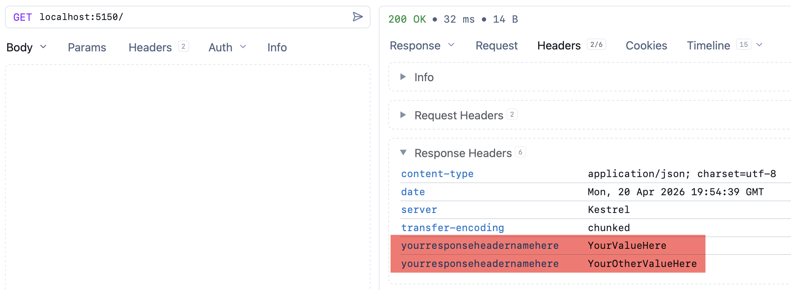
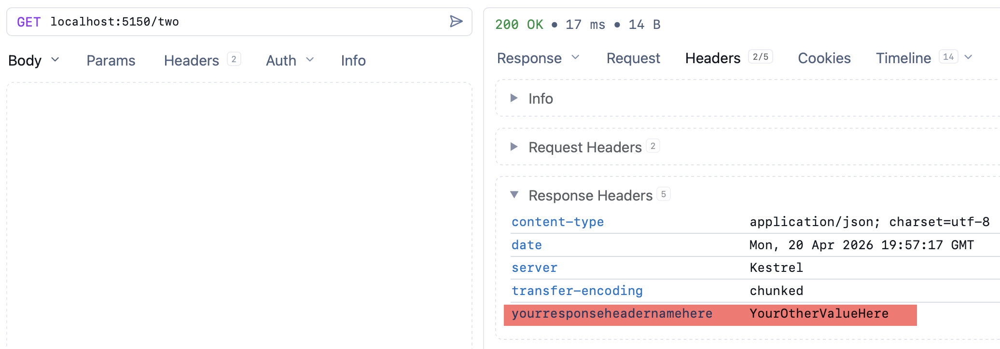

Our previous post, "[Stop Prefixing HTTP Headers With X]()", talked about **prefixes** to to custom **headers**.

In this post, we will look at how to correctly add **headers** to **responses**.

The [Headers](https://learn.microsoft.com/en-us/dotnet/api/microsoft.aspnetcore.http.httpresponse.headers?view=aspnetcore-10.0) is a property of the [Response](https://learn.microsoft.com/en-us/dotnet/api/microsoft.aspnetcore.http.httpcontext.response?view=aspnetcore-10.0) class, which is a property of the [HttpContext](https://learn.microsoft.com/en-us/dotnet/api/microsoft.aspnetcore.http.httpcontext?view=aspnetcore-10.0).

In order to add our own headers, we **inject** the `HttpContext` into our endpoint and then use that to access the `Response`, and in turn, the `Headers` collection, which we can then manipulate.

```c#
app.MapGet("/", (HttpContext context) =>
{
  // Manipulate our headers here
});
```

The next question is **which method** to call to add the actual header(s) and it's corresponding value(s).

Here you have options.

### Add

You can use the `Add` method to add headers to the response, like so:

```c#
app.MapGet("/", (HttpContext context) =>
{
   context.Response.Headers.Add("YourResponseHeaderNameHere", "YourValueHere");
});
```

The danger with this method is it will **throw an exception** if you try to add a header that **already exists**.

### Append

The other, safer method is to use the `Append` method. This will also add headers and their corresponding values to the `Headers` collectiom, but it will **not throw an exception if the header exists**. It will just **add the header again** with the **new value**.

```c#
app.MapGet("/", (HttpContext context) =>
{
   context.Response.Headers.Append("YourResponseHeaderNameHere", "YourValueHere");
   context.Response.Headers.Append("YourResponseHeaderNameHere", "YourOtherValueHere");
});
```

This will return the following:



Typically, you would not want this.

## Headers Collection

The other option is to **set the headers** directly via **index**, like this:

```c#
app.MapGet("/", (HttpContext context) =>
{
    context.Response.Headers["YourResponseHeaderNameHere"] = "YourValueHere";
    context.Response.Headers["YourResponseHeaderNameHere"] = "YourOtherValueHere";

    return Results.Ok("Hello World!");
});
```

This will return the following:



Here we can see that **only the latest header value is preserverd**.

You would typically use this approach if there is a possibility that **subsequent middleware might want to set the header** and you don't want **duplicates** or **exceptions**.

### TLDR

**To add custom headers to your response, can inject the `HttpContext` into your endpoints and throught that access the `Headers` object of the `Response`.**

The code is in my [GitHub](https://github.com/conradakunga/BlogCode/tree/master/2026-03-15%20-%20CustomHeader).

Happy hacking!
