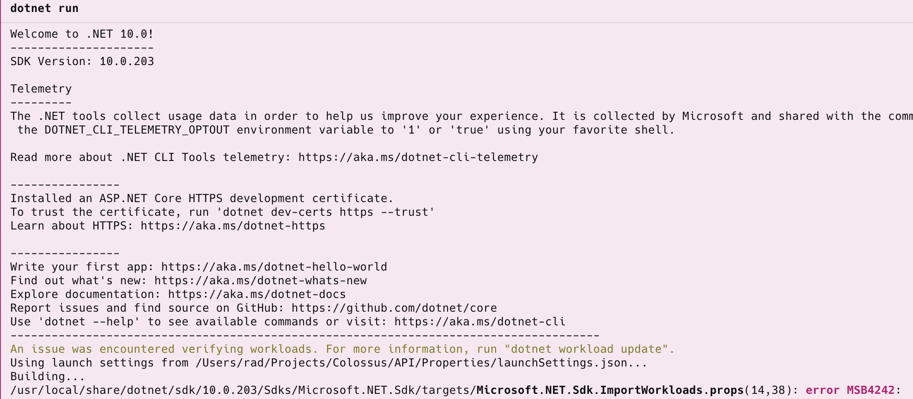

I have just upgraded from [.NET SDK](https://dotnet.microsoft.com/en-us/download) `10.0.202` to `10.0.203` and upon compiling an application, have been treated to the following **error**:



The details are as follows:

```plaintext
An issue was encountered verifying workloads. For more information, run "dotnet workload update".
Using launch settings from /Users/rad/Projects/Colossus/API/Properties/launchSettings.json...
Building...
/usr/local/share/dotnet/sdk/10.0.203/Sdks/Microsoft.NET.Sdk/targets/Microsoft.NET.Sdk.ImportWorkloads.props(14,38): error MSB4242: 
  SDK Resolver Failure: "The SDK resolver "Microsoft.DotNet.MSBuildWorkloadSdkResolver" failed while attempting to resolve the SDK "Microsoft.NET.SDK.WorkloadAutoImportPropsLocat
  or". Exception: "System.InvalidOperationException: Workload set version 10.0.202 has missing manifests likely removed by package management. Run "dotnet workload repair" to fix
   this.
     at Microsoft.NET.Sdk.WorkloadManifestReader.SdkDirectoryWorkloadManifestProvider.GetManifests()
     at Microsoft.NET.Sdk.WorkloadManifestReader.WorkloadResolver.LoadManifestsFromProvider(IWorkloadManifestProvider manifestProvider)
     at Microsoft.NET.Sdk.WorkloadManifestReader.WorkloadResolver.InitializeManifests()
     at Microsoft.NET.Sdk.WorkloadManifestReader.WorkloadResolver.GetInstalledWorkloadPacksOfKind(WorkloadPackKind kind)+MoveNext()
     at Microsoft.NET.Sdk.WorkloadMSBuildSdkResolver.CachingWorkloadResolver.Resolve(String sdkReferenceName, IWorkloadManifestProvider manifestProvider, IWorkloadResolver worklo
  adResolver)
     at Microsoft.NET.Sdk.WorkloadMSBuildSdkResolver.CachingWorkloadResolver.Resolve(String sdkReferenceName, String dotnetRootPath, String sdkVersion, String userProfileDir, Str
  ing globalJsonPath)
     at Microsoft.NET.Sdk.WorkloadMSBuildSdkResolver.WorkloadSdkResolver.Resolve(SdkReference sdkReference, SdkResolverContext resolverContext, SdkResultFactory factory)
     at Microsoft.Build.BackEnd.SdkResolution.SdkResolverService.TryResolveSdkUsingSpecifiedResolvers(IReadOnlyList`1 resolvers, Int32 submissionId, SdkReference sdk, LoggingCont
  ext loggingContext, ElementLocation sdkReferenceLocation, String solutionPath, String projectPath, Boolean interactive, Boolean isRunningInVisualStudio, SdkResult& sdkResult, I
  Enumerable`1& errors, IEnumerable`1& warnings)""
```

The problem, needless to say, is the workloads.

We fix them by running the [dotnet workload update](https://learn.microsoft.com/en-us/dotnet/core/tools/dotnet-workload-update) command:

```bash
dotnet workload update
```

If you are on macOS or Linux, you must run them as root:

```bash
sudo dotnet workload update
```

You should get the following output:

```plaintext
Skipping NuGet package signature verification.
Updated advertising manifest microsoft.net.workloads.
Repairing workload set 10.0.202...
Installing workload manifest microsoft.net.workload.emscripten.current version 10.0.106...
Installing workload manifest microsoft.net.workload.emscripten.net6 version 10.0.106...
Installing workload manifest microsoft.net.workload.emscripten.net7 version 10.0.106...
Installing workload manifest microsoft.net.workload.emscripten.net8 version 10.0.106...
Installing workload manifest microsoft.net.workload.emscripten.net9 version 10.0.106...
Installing workload manifest microsoft.net.sdk.android version 36.1.53...
Installing workload manifest microsoft.net.sdk.ios version 26.2.10233...
Installing workload manifest microsoft.net.sdk.maccatalyst version 26.2.10233...
Installing workload manifest microsoft.net.sdk.macos version 26.2.10233...
Installing workload manifest microsoft.net.sdk.maui version 10.0.20...
Installing workload manifest microsoft.net.sdk.tvos version 26.2.10233...
Installing workload manifest microsoft.net.workload.mono.toolchain.current version 10.0.106...
Installing workload manifest microsoft.net.workload.mono.toolchain.net6 version 10.0.106...
Installing workload manifest microsoft.net.workload.mono.toolchain.net7 version 10.0.106...
Installing workload manifest microsoft.net.workload.mono.toolchain.net8 version 10.0.106...
Installing workload manifest microsoft.net.workload.mono.toolchain.net9 version 10.0.106...
Installing workload version 10.0.203.
Installing workload manifest microsoft.net.workload.emscripten.current version 10.0.107...
Installing workload manifest microsoft.net.workload.emscripten.net6 version 10.0.107...
Installing workload manifest microsoft.net.workload.emscripten.net7 version 10.0.107...
Installing workload manifest microsoft.net.workload.emscripten.net8 version 10.0.107...
Installing workload manifest microsoft.net.workload.emscripten.net9 version 10.0.107...
Installing workload manifest microsoft.net.sdk.android version 36.1.53...
Installing workload manifest microsoft.net.sdk.ios version 26.2.10233...
Installing workload manifest microsoft.net.sdk.maccatalyst version 26.2.10233...
Installing workload manifest microsoft.net.sdk.macos version 26.2.10233...
Installing workload manifest microsoft.net.sdk.maui version 10.0.20...
Installing workload manifest microsoft.net.sdk.tvos version 26.2.10233...
Installing workload manifest microsoft.net.workload.mono.toolchain.current version 10.0.107...
Installing workload manifest microsoft.net.workload.mono.toolchain.net6 version 10.0.107...
Installing workload manifest microsoft.net.workload.mono.toolchain.net7 version 10.0.107...
Installing workload manifest microsoft.net.workload.mono.toolchain.net8 version 10.0.107...
Installing workload manifest microsoft.net.workload.mono.toolchain.net9 version 10.0.107...
No workloads installed for this feature band. To update workloads installed with earlier SDK versions, include the --from-previous-sdk option.
Garbage collecting for SDK feature band(s) 10.0.200...
Deleting workload version 10.0.202.
Uninstalling workload manifest microsoft.net.workload.emscripten.current version 10.0.106/10.0.100...
Uninstalling workload manifest microsoft.net.workload.mono.toolchain.net6 version 10.0.106/10.0.100...
Uninstalling workload manifest microsoft.net.workload.mono.toolchain.net8 version 10.0.106/10.0.100...
Uninstalling workload manifest microsoft.net.workload.mono.toolchain.net9 version 10.0.106/10.0.100...
Uninstalling workload manifest microsoft.net.workload.mono.toolchain.net7 version 10.0.106/10.0.100...
Uninstalling workload manifest microsoft.net.workload.emscripten.net8 version 10.0.106/10.0.100...
Uninstalling workload manifest microsoft.net.workload.emscripten.net6 version 10.0.106/10.0.100...
Uninstalling workload manifest microsoft.net.workload.mono.toolchain.current version 10.0.106/10.0.100...
Uninstalling workload manifest microsoft.net.workload.emscripten.net7 version 10.0.106/10.0.100...
Uninstalling workload manifest microsoft.net.workload.emscripten.net9 version 10.0.106/10.0.100...

Successfully updated workload(s): .

```

### TLDR

**Fix the "*An issue was encountered verifying workloads*" error by updating your workloads.**

Happy hacking!
