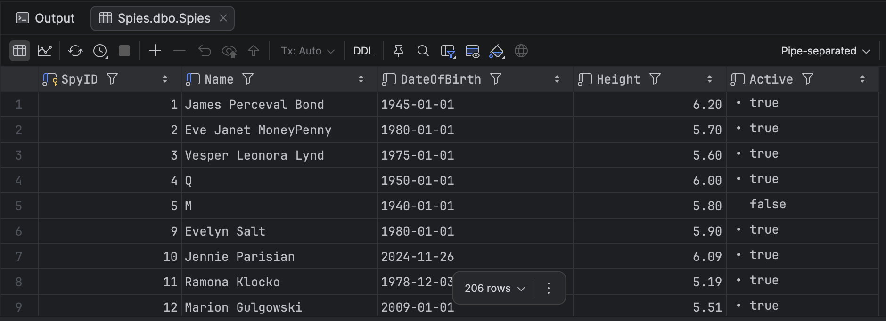
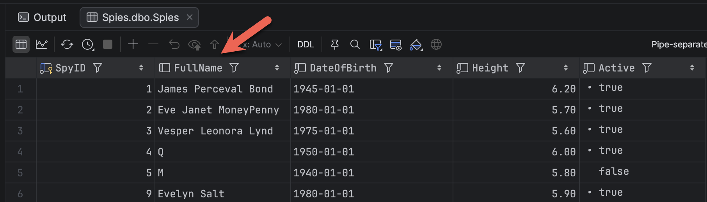
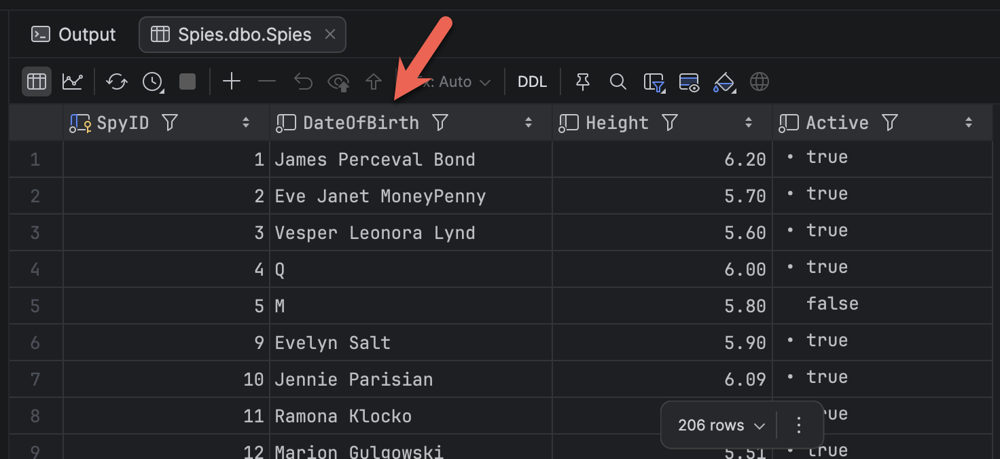
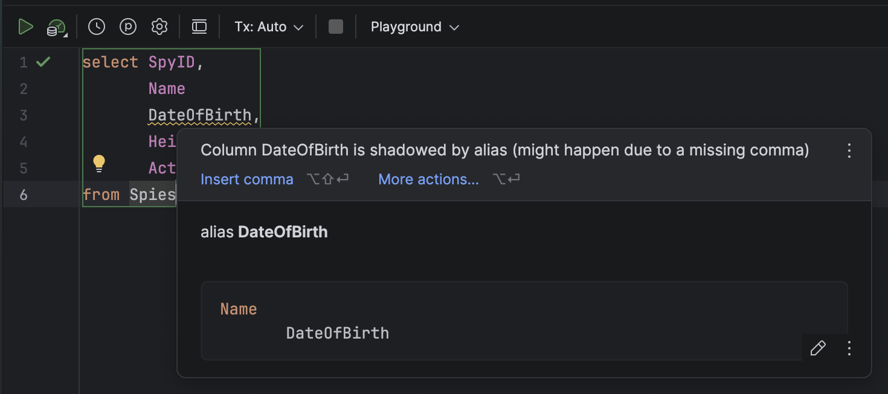

**Code Housekeeping** refers to general rules of thumb that make code easier to **read**, **digest**, and **modify** for other developers, **yourself** included.

In this post we will look at the issue of **database column** [aliases](https://blog.greglow.com/2019/04/29/t-sql-101-15-using-column-and-table-aliases-in-sql-server-queries/).

A typical query would look like this:

```sql
select SpyID,
       Name, 
       DateOfBirth, 
       Height, 
       Active
from Spies
```

This, unsurprisingly, returns the following:



Here, i am using the [Jetbrains](https://www.jetbrains.com/) tool [DataGrip](https://www.jetbrains.com/datagrip/).

Suppose we want, for whatever reason, to **alias** the `Name` as `FullName`.

We would do it like this:

```sql
select SpyID,
       Name FullName,
       DateOfBirth,
       Height,
       Active
from Spies
```

The resutls would change as follows:



Here, we can see our column **name** has **changed**.

The **problem** with aliases in this way is that it is very easy to introduce a very **sublte bug** where you **overwrite a column by mistake**.

It is very easy to do the following:

```
select SpyID,
       Name
       DateOfBirth,
       Height,
       Active
from Spies
```

Note here that there is no **comma** between `Name` and `DateOfBirth`.

The results look as follows:



Here we have inadvertently aliased `Name` as `DateOfBirth`.

A good tool such as `DataGrip` can catch this:



But you will not always have access to a tool.

To avoid possible **confusion** in scenarios like this, it is best to be **explicit** that you are **aliasing** a column by using the [AS](https://www.w3schools.com/sql/sql_ref_as.asp) keyword.

So, rather than this:

```sql
select SpyID,
       Name FullName,
       DateOfBirth,
       Height,
       Active
from Spies
```

We do this:

```c#
select SpyID,
       Name AS FullName,
       DateOfBirth,
       Height,
       Active
from Spies
```

This makes it **clear** to anyone reading your intent.

### TLDR

**Use `AS` when aliasing columns in queries to make clear your intent.**

Happy hacking!
