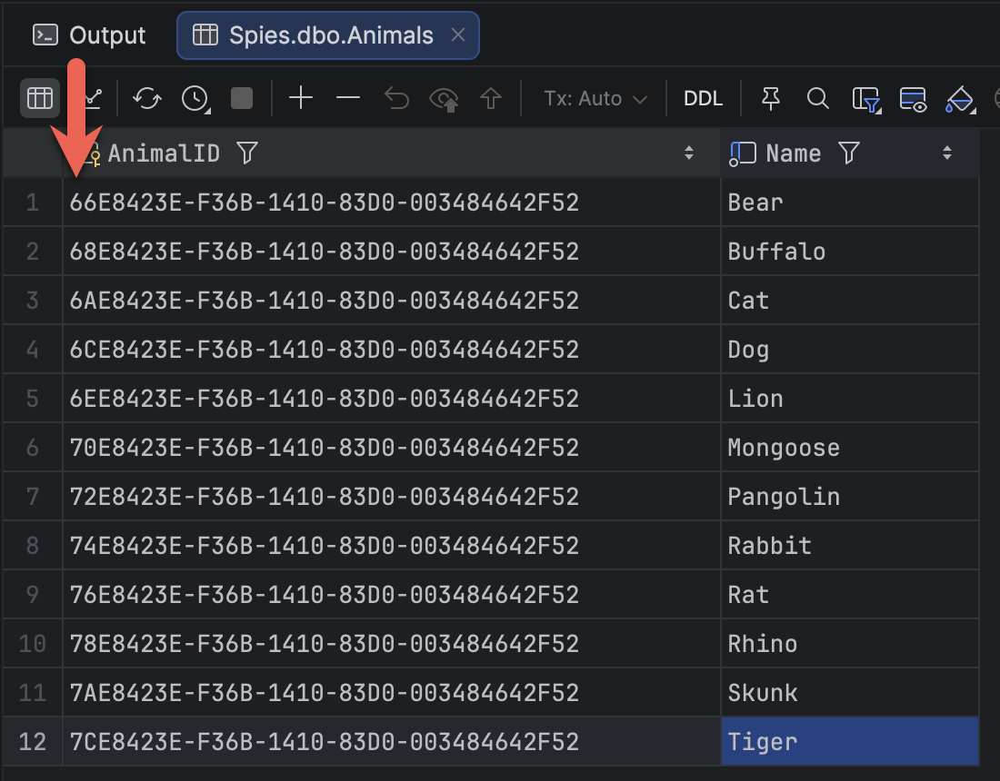

The choice of **data type** for [primary keys](https://learn.microsoft.com/en-us/sql/relational-databases/tables/create-primary-keys?view=sql-server-ver17) is, like many other debates in the space, **polarizing**, with many points **for** and **against** each candidate.

But that is a discussion for **another day**.

Today, we are looking at a situation where you are using [Microsoft SQL Server](https://www.microsoft.com/en-us/sql-server) and have decided to use a [Guid](https://en.wikipedia.org/wiki/Universally_unique_identifier) ([UNIQUEIDENTIFIER](https://learn.microsoft.com/en-us/sql/t-sql/data-types/uniqueidentifier-transact-sql?view=sql-server-ver17) in SQL Server Parlance).

As a reminder, the `table` is created as follows:

```sql
create table Animals
(
    AnimalID uniqueidentifier primary key,
    Name     nvarchar(200) not null unique
)
```

**Insertions** would be as follows:

```sql
insert into Animals(Animalid, Name)
values 
(newid(), 'Dog'),
(newid(), 'Cat')
```

Here we are using the [newid()](https://learn.microsoft.com/en-us/sql/t-sql/functions/newid-transact-sql?view=sql-server-ver17) function.

This works perfectly fine.

The problem arises when the table is busy and has many rows.

```sql
insert into Animals(Animalid, Name)
values 
(newid(), 'Cat'),
(newid(), 'Dog'),
(newid(), 'Rat'),
(newid(), 'Mongoose'),
(newid(), 'Rabbit'),
(newid(), 'Skunk'),
(newid(), 'Lion'),
(newid(), 'Tiger'),
(newid(), 'Bear'),
(newid(), 'Pangolin'),
(newid(), 'Buffalo'),
(newid(), 'Rhino'),

```

If we query the table, the results are like so:

|  AnimalID   |   Name   |
| ---- | ---- |
| F927281D-877A-46C0-B1B4-368BC285297C | Bear |
| 0CB98455-7446-413D-933F-80B5013D98B5 | Buffalo |
| 1A842EFC-061E-46F6-9DC5-39712C3A6706 | Cat |
| 4E8625B2-B3B1-41CC-967D-471AD96D9B85 | Dog |
| 922C7DFA-E462-4709-9B84-45E564C49A80 | Lion |
| 4E4F5C6C-6BCD-4E3C-B4AD-806BAEBE4B08 | Mongoose |
| F588DA54-B7BA-4640-B259-4336DE60AD52 | Pangolin |
| 890FB3CB-7ECC-4314-AF74-7FC838082897 | Rabbit |
| 0EDBFF83-09AB-44EC-A868-00F332F670C3 | Rat |
| BFF5E234-7D1D-4D52-8596-200D06B00A92 | Rhino |
| E5CCCAC3-2FD7-4604-81C4-DFA67BB9761B | Skunk |
| D14AEC1F-FFBE-4071-B82A-DA581679E018 | Tiger |

The challenge is that, if you look at the `Guids` for the `AnimalID`, they are all over the place, given that they are, correctly and effectively, **random**.

This causes the following issues:

1. SQL Server must keep **moving data around** to honor the fact that the primary key is a clustered index
2. **Fragmentation** occurs
3. There is a lot more **I/O**
4. **Inserts** are therefore slower
5. Over time, the **queries using the primary key index get slower** as well

There is a solution to this problem: the [newsequentialid()](https://learn.microsoft.com/en-us/sql/t-sql/functions/newsequentialid-transact-sql?view=sql-server-ver17) function.

We can take the opportunity here to specify the primary key as **database-generated** and use the `newsequentialid()` function as the [column default](https://learn.microsoft.com/en-us/sql/relational-databases/tables/specify-default-values-for-columns?view=sql-server-ver17) for the primary key.

```sql
create table Animals
(
    AnimalID uniqueidentifier primary key default (newsequentialid()),
    Name     nvarchar(200) not null unique
)
```

Our inserts would now look like this:

```sql
insert Animals(name)
values ('Bear'),
       ('Buffalo'),
       ('Cat'),
       ('Dog'),
       ('Lion'),
       ('Mongoose'),
       ('Pangolin'),
       ('Rabbit'),
       ('Rat'),
       ('Rhino'),
       ('Skunk'),
       ('Tiger')

```

If we now query the table:

|  AnimalID   |   Name   |
| ---- | ---- |
| 66E8423E-F36B-1410-83D0-003484642F52 | Bear |
| 68E8423E-F36B-1410-83D0-003484642F52 | Buffalo |
| 6AE8423E-F36B-1410-83D0-003484642F52 | Cat |
| 6CE8423E-F36B-1410-83D0-003484642F52 | Dog |
| 6EE8423E-F36B-1410-83D0-003484642F52 | Lion |
| 70E8423E-F36B-1410-83D0-003484642F52 | Mongoose |
| 72E8423E-F36B-1410-83D0-003484642F52 | Pangolin |
| 74E8423E-F36B-1410-83D0-003484642F52 | Rabbit |
| 76E8423E-F36B-1410-83D0-003484642F52 | Rat |
| 78E8423E-F36B-1410-83D0-003484642F52 | Rhino |
| 7AE8423E-F36B-1410-83D0-003484642F52 | Skunk |
| 7CE8423E-F36B-1410-83D0-003484642F52 | Tiger |

We can see that our primary keys are now **sequential**.



The benefits are:

1. **Faster** inserts
2. Less **fragmentation**
3. **Faster query** performance

There are, however, some issues to be aware of:

1. The generated values are **machine-specific**
2. The values are **predictable**, and this should be factored into the context of the key usage
3. You can only use `newsequentialid()` as a column default - you can't call it directly

### TLDR

**Use newsequentialid() instead of `newid()` to generate primary key values.**

Happy hacking!
