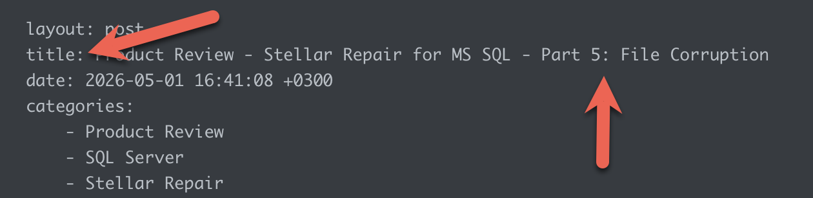
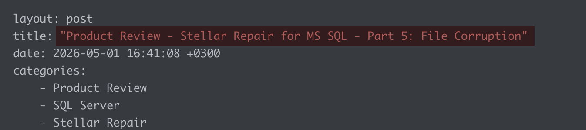

If the **title** of your [Jekyll](https://jekyllrb.com/) post is like this:

```plaintext
title: Product Review - Stellar Repair for MS SQL - Part 5: File Corruption
```

You might get the following **error**:

```plaintext
Error: YAML Exception reading /Users/rad/Projects/blog/Blog/_posts/2026-05-01-product-review-stellar-repair-for-ms-sql-part-5-file-corruption.md: (<unknown>): mapping values are not allowed in this context at line 3 column 59
```

This is because `Jekyll` is not sure of what to make of this situation, where there are **two** colons:



The fix for this is simple - **wrap the entire title in single (or double) quotes**.

```yaml
title: "Product Review - Stellar Repair for MS SQL - Part 5: File Corruption"
```



### TLDR

**If you have a colon or other special characters in your Jekyll title, wrap the entire title in quotes.**

Happy hacking!
