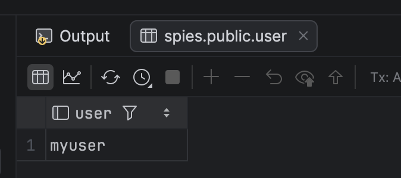
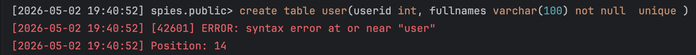
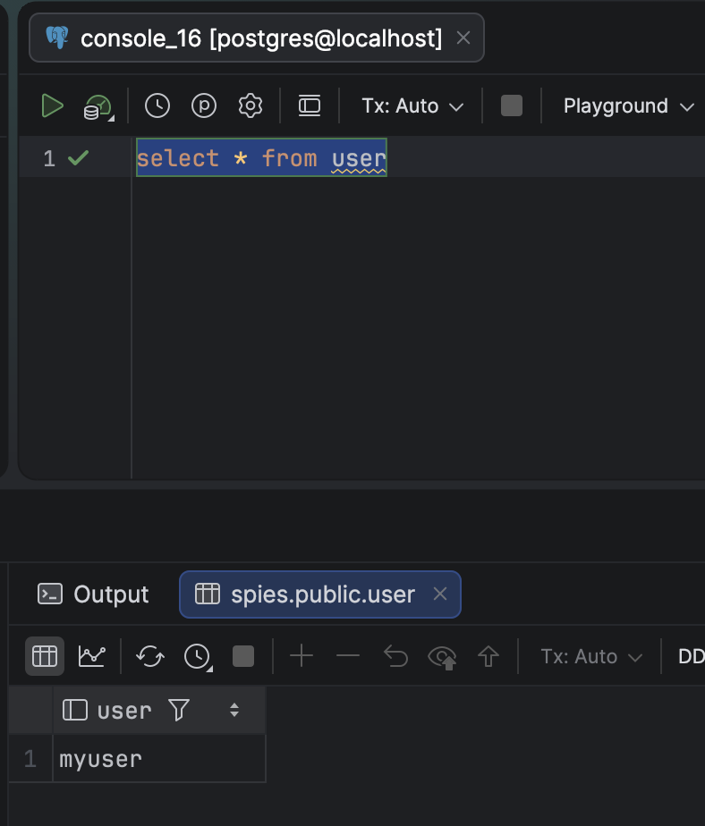
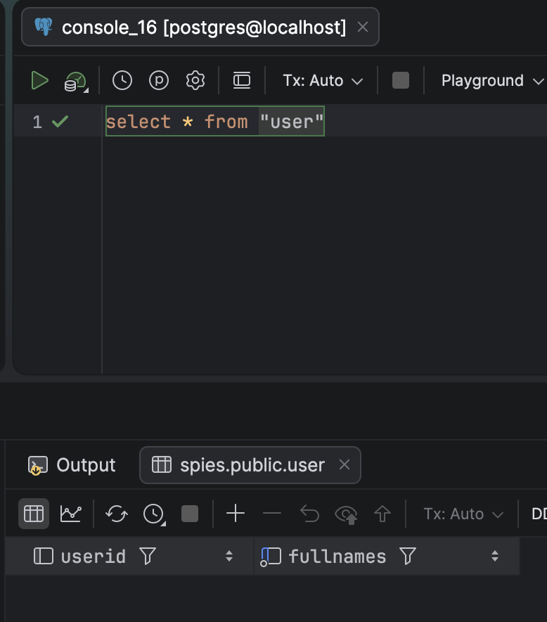
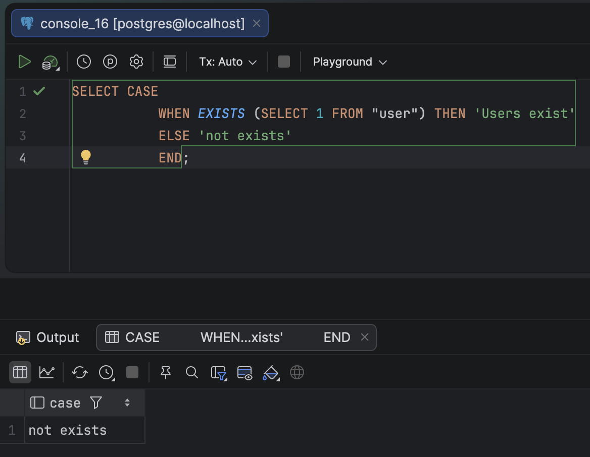
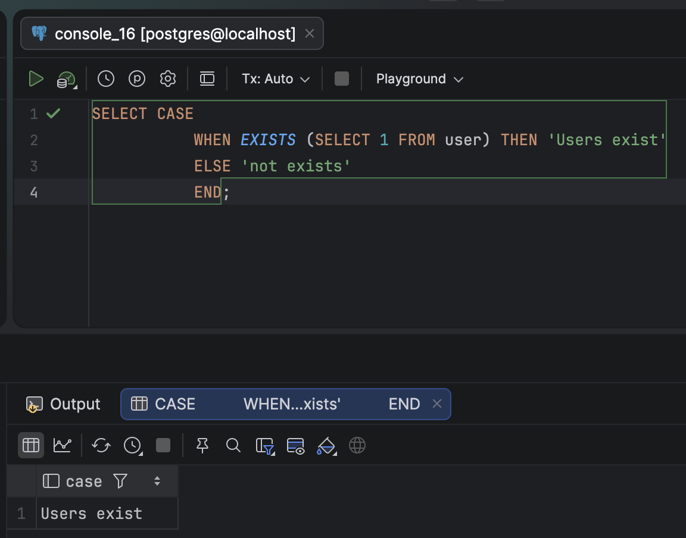

[PostgreSQL](https://www.postgresql.org/) stores its users in a table named `user`, which is visible to all **sessions** and all **tables**.

```sql
SELECT * from user
```

This returns a result set as follows (will be different for you)



You might, for whatever reason, want to store the **users** of your **application** in a table named `user`.

`PostgreSQL` will not let you do this, at least not directly.

```sql
create table user(userid int, fullnames varchar(100) not null  unique )
```

You will get the following error:



If you really want to do this, enclose `user` in **double quotes**.

```sql
create table "user"(userid int, fullnames varchar(100) not null  unique )
```

However, you must be very **careful when querying** this table, as you must always remember to **include the quotes to refer to your table**.

Without the quotes:



With the quotes:



This is **important** because if you have code like this:

```sql
SELECT CASE
           WHEN EXISTS (SELECT 1 FROM "user") THEN 'Users exist'
           ELSE 'not exists'
           END;
```

You can see from the screenshots below you can get unexpected results if you **forget** the quotes.





### TLDR

**If your *users* table is named `user`, you must quote the table name to prevent the system users table from being used instead.**

Happy hacking!
