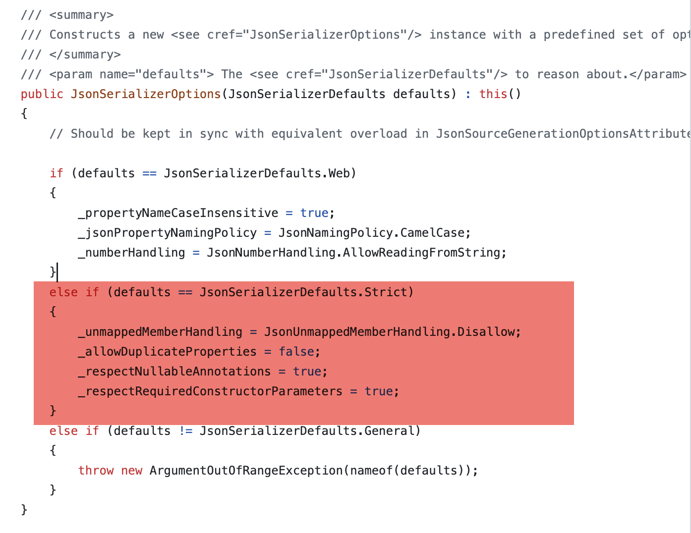

One of the things people quickly discover about the [System.Text.Json](https://learn.microsoft.com/en-us/dotnet/api/system.text.json?view=net-10.0) serializer is that it is fairly **conservative** in its default configuration.

This means that by default, it will process JSON as follows:

1. **Case-sensitive** attributes - `Name` is not the same as `name`
2. **Comments** are disallowed
3. **Trailing commas** are disallowed
4. **Number handling** is strict - `"7"` will not be accepted, but `7` will
5. Properties with `null` values are **written**

Let us demonstrate this using the following `type`:

```c#
public sealed class Spy
{
  public string FirstName { get; set; }
  public string Surname { get; set; }
  public string? MiddleName { get; set; }
  public DateOnly DateOfBirth { get; set; }
}
```

This behavior outlined is what you get when you run the following code:

```c#
var james = new Spy
{
  FirstName = "James",
  Surname = "Bond",
  MiddleName = null,
  DateOfBirth = new DateOnly(1970, 1, 1)
};

var json = JsonSerializer.Serialize(james, JsonSerializerOptions.Default);

Console.WriteLine(json);
```

Here we are setting the options using the singleton [JsonSerializerOptions.Default](https://learn.microsoft.com/en-us/dotnet/api/system.text.json.jsonserializeroptions.default?view=net-10.0)

This will print the following:

```json
{
  "FirstName": "James",
  "Surname": "Bond",
  "MiddleName": null,
  "DateOfBirth": "1970-01-01"
}
```

If used in a context like ASP.NET, the defaults are a bit different:

1. **Case-insensitive** attributes - `name` will be parsed and set for a type with the property `Name`
2. **Number handling** allows reading from **strings**, so both `7` and `"7"` will be accepted"

This is because we must be a bit more **permissive** when consuming `JSON` generated from **other systems**.

The code looks like this:

```c#
var jason = new Spy
{
  FirstName = "Jason",
  Surname = "Bourne",
  MiddleName = null,
  DateOfBirth = new DateOnly(1970, 1, 1)
};

json = JsonSerializer.Serialize(jason, JsonSerializerOptions.Default);

Console.WriteLine(json);
```

Here we are using the settings defined in the singleton [JsonSerializerOptions.Web](https://learn.microsoft.com/en-us/dotnet/api/system.text.json.jsonserializeroptions.web?view=net-10.0)

This produces the following:

```json
{
  "FirstName": "Jason",
  "Surname": "Bourne",
  "MiddleName": null,
  "DateOfBirth": "1970-01-01"
}
```

Note the difference in **casing**.

This is a **feature**, and not a **bug**, being a departure from `Newtonsoft.Json` that generally **transparently figured out what to do**.

**Always be explicit** to prevent surprises downstream.

You can further go ahead to define even more conservative settings, like so:

```c#
var options = new JsonSerializerOptions
{
  AllowDuplicateProperties = false,
  PropertyNameCaseInsensitive = false,
  RespectNullableAnnotations = true,
  RespectRequiredConstructorParameters = true,
  UnmappedMemberHandling = JsonUnmappedMemberHandling.Disallow,
};
```

Your code for reading JSON would look like this:

```c#
var spy = JsonSerializer.Deserialize<Spy>(json, options);
```

You can further eliminate having to keep defining these settings yourself and use the singleton introduced in .NET 10, [JsonSerializerOptions.Strict](https://learn.microsoft.com/en-us/dotnet/api/system.text.json.jsonserializeroptions.strict?view=net-10.0)

At the time of writing this, the documentation is wanting as it does not, in fact, define what **Strict** is, and you have to [read the code yourself](https://github.com/dotnet/dotnet/blob/b0f34d51fccc69fd334253924abd8d6853fad7aa/src/runtime/src/libraries/System.Text.Json/src/System/Text/Json/Serialization/JsonSerializerOptions.cs#L72C20-L72C91) to get it. This, I **suspect**, is because the documentation is **generated**.



### TLDR

**You can configure even stricter JSON handling using the singleton JsonSerializerOptions.Strict**

Happy hacking!
