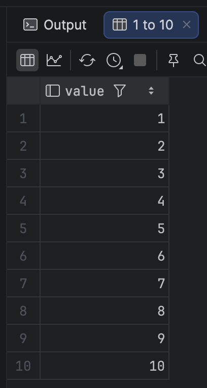
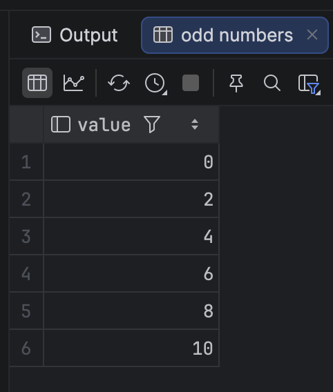
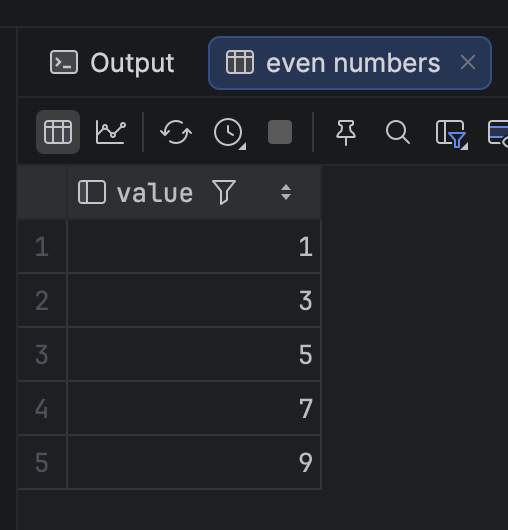
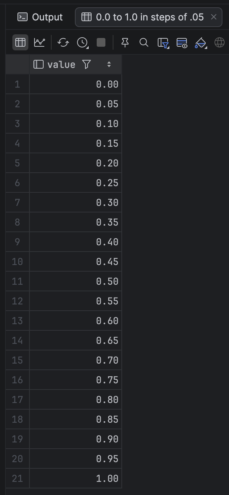
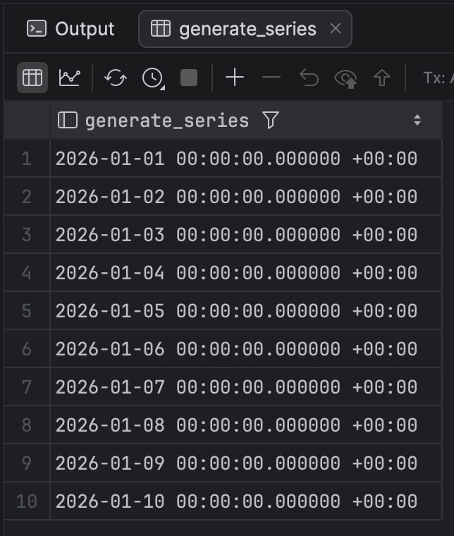
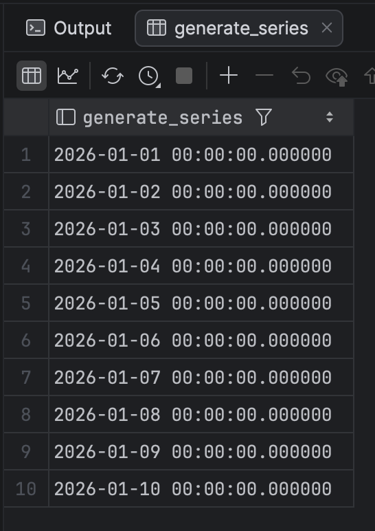

One of the more powerful features of [LINQ](https://learn.microsoft.com/en-us/dotnet/csharp/linq/) is the ability to generate **sequences** of values.

To get a list of number from 1 to 10, we do it like so:

```c#
var numbers = Enumerable.Range(1, 10).ToList();
numbers.ForEach(Console.WriteLine);
```

To get a list of all even number from `1` to `10`, we do it like this:

```c#
var evenNumbers = Enumerable.Range(1, 10).Where(x => x % 2 == 0).ToList();
evenNumbers.ForEach(Console.WriteLine);
```

To get a list of all odd number from `1` to `10`, we do it like this:

```c#
var oddNumbers = Enumerable.Range(1, 10).Where(x => x % 2 != 0).ToList();
oddNumbers.ForEach(Console.WriteLine);
```

You might wonder if it was possible to generate smaller increments, like `0.0` to `1.0` in steps of `.05`.

It is.

```c#
var smallNumbers = Enumerable.Range(0, 20).Select(x => x / 20.0).ToList();
smallNumbers.ForEach(Console.WriteLine);
```

Do you wish there was something similar in [PostgreSQL](https://www.postgresql.org/)?

There is!

You can use the [generate_series](https://www.postgresql.org/docs/current/functions-srf.html) function for such purposes. 

There are two sets of these

1. One that operates on [numbers](https://www.postgresql.org/docs/current/datatype-numeric.html), specifically `integers`, `biginteger` and `numeric`
2. One that operates on [timestamps](https://www.postgresql.org/docs/18/functions-datetime.html), with and without [timezones](https://www.postgresql.org/docs/18/runtime-config-client.html#GUC-TIMEZONE)

## Numeric

The numeric one takes three parameters:

1. **Start**
2. **Stop**
3. An optional **step**, which defaults to `1`

The scenarios above would this be as follows:

```sql
-- 1 to 10
select *
from generate_series(1, 10);
-- odd numbers
select *
from generate_series(0, 10, 2);
-- even numbers
select *
from generate_series(1, 10, 2);
-- 0.0 to 1.0 in steps of .05
select *
from generate_series(0.0, 1.0, 0.05);
```

The results are as we'd expect.









This, we can see, is almost identical to how to tackle this problem in SQL Server, covered in the post "[Generating A Series Of Numbers In SQL Server]()".

## Timestamp

The generate_series functions that operate with timestamps are in two flavours:

1. **Timezone** aware
2. **Non-timezone** aware

The timezone aware version takes:

1. **Start** timestamp with timezone
2. **End** timestamp with timezone
3. **Interval**
4. **Timezone**

In this example we are taking midnight, Nairobi time, and adding a day to that from 1 January 2026 to 10 January 2026. We are further indicating we are using the Nairobi time zone (this matters when doing timezone aware date computations!)

```sql
SELECT *
FROM generate_series('2026-01-01 00:00 +00:00'::timestamptz,
                     '2026-01-10 00:00 +00:00'::timestamptz,
                     '1 day'::interval, 'Africa/Nairobi');
```

This returns the following:



The none-timezone aware version is very similar:

1. **Start** timestamp
2. **End** timestamp
3. **Interval**

It looks like this:

```sql
SELECT *
FROM generate_series('2026-01-01 00:00 +00:00'::timestamp,
                     '2026-01-10 00:00 +00:00'::timestamp,
                     '1 day'::interval);
```

The results are as follows:



Note the difference here - the results do not have any timezone information.

### TLDR

**You can generate any series of numbers, dates and times in PostgreSQL using the `generate_series` function.**

The code is my GitHub.

Happy hacking!
