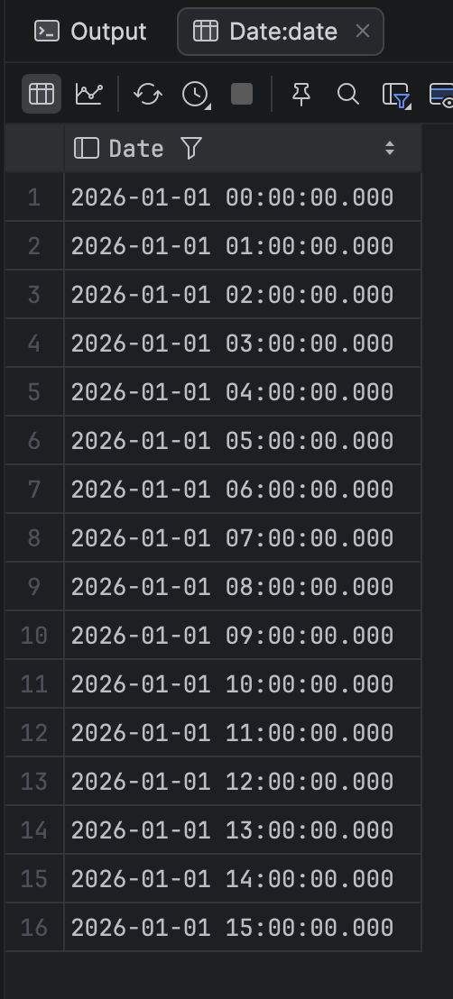
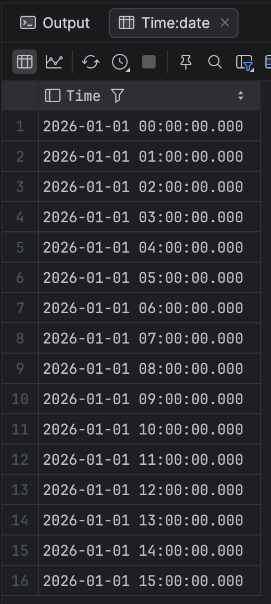

In a previous post, "[Generating A Series Of Numbers In SQL Server]()", we looked at how to **generate a series of numbers** in [Microsoft SQL Server](https://www.microsoft.com/en-us/sql-server) using the `generate_series` function.

In a subsequent post, "[Generating A Series Of Numbers, Dates and Times In PostgreSQL]()", we saw how to do the same thing in [PostgreSQL](https://www.postgresql.org/), and also the fact that the PostgreSQL version of `generate_series` also generates **dates** and **times**.

Given that the **SQL Sever version** cannot generate dates, how do we then generate dates?

Here we can leverage the existing generate_series function as well as some date and time functions.

Suppose we want to generate the first 15 days in January 2026.

We would do it like so:

```sql
select dateadd(day, value, '1jan2026') as Date
from generate_series(0, 15)
```

This would return the following:



The same logic will work with **time**.

```sql
select dateadd(hour, value, '1jan2026') as Time
from generate_series(0, 15)
```



By changing the **interval** and the **direction** (**negative** numbers work perfectly) we can generate any sort of **datetime** sequence that we need.

### TLDR

**You can use `generate_series` to generate date and time sequences in SQL Server.**

Happy hacking!
