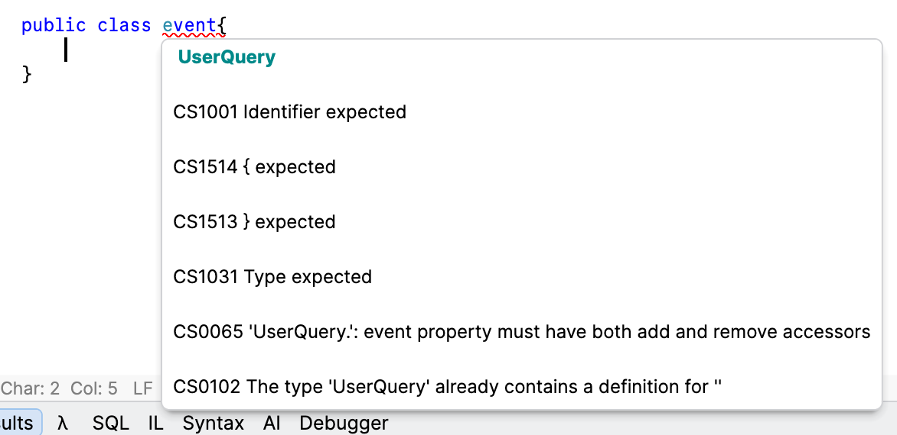
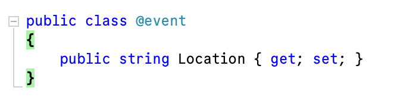

A current system that I am working on has a `type` with the name `event`.

It just so happens that [event](https://learn.microsoft.com/en-us/dotnet/csharp/language-reference/keywords/event) is a C# [keyword](https://learn.microsoft.com/en-us/dotnet/csharp/language-reference/keywords/), and therefore the compiler **will not let you use it** as a `type` name.



However, if you **really, really want to** use the name `event` you can prefix it with the `@` symbol.

```c#
public class @event
{
	public string Location { get; set; }
}
```



The compiler with then **know what you mean** depending on whether you use `event` or `@event`.

### TLDR

**You can use reserved words for type names if you prefix them with the `@` symbol**

Happy hacking!
