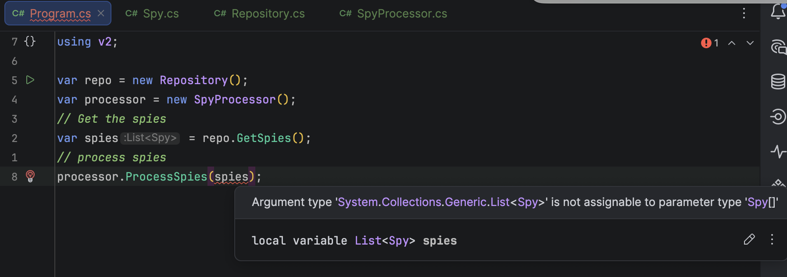

**Code Housekeeping** refers to general rules of thumb that make code easier to **read**, **digest**, and **modify** for other developers, **yourself** included.

In this post, we will look at the possible **friction** from methods that return **collections**.

Take the following `type`:

```c#
public sealed class Spy
{
  public Guid SpyID { get; set; }
  public string FullName { get; set; }
  public DateOnly DateOfBirth { get; set; }
}
```

Let us build a dummy **repository** to simulate a **database**.

```c#
public class Repository
{
    public List<Spy> GetSpies()
    {
        var faker = new Faker<Spy>()
            .RuleFor(s => s.SpyID, Guid.CreateVersion7())
            .RuleFor(s => s.FullName, f => f.Person.FullName)
            .RuleFor(s => s.DateOfBirth, f => DateOnly.FromDateTime(f.Date.Past(10)));
        return faker.Generate(10);
    }
}
```

Here  I am using Bogus to generate `10` `Spy` entities.

Let us now write a small program to **fetch** the `Spy` entities.

```c#
var repo = new Repository();
// Get the spies 
var spies = repo.GetSpies();
```

So far so good.

Now, let us build a **second** type to process these `Spy` objects.

```c#
public sealed class SpyProcessor
{
    public void ProcessSpies(List<Spy> spies)
    {
        foreach (Spy spy in spies)
        {
            Console.WriteLine($"Processing {spy.FullName}...");
        }
    }
}
```

If we look at the `ProcessSpies()` method, we can see that it takes a `List` of `Spy` objects.

This we can use it like this:

```c#
var repo = new Repository();
var processor = new SpyProcessor();
// Get the spies 
var spies = repo.GetSpies();
// process spies
processor.ProcessSpies(spies);
```

This works perfectly, but the issue here is that we should not **constrain** our `SpyProcessor` out of the box to decisions made by **another** `type`.

For example, we should be able to write the `SpyProcessor` like this if we wanted.

```c#
namespace v2
{
    public sealed class SpyProcessor
    {
        public void ProcessSpies(Spy[] spies)
        {
            foreach (Spy spy in spies)
            {
                Console.WriteLine($"Processing {spy.FullName}...");
            }
        }
    }
}
```

Here, our method takes an `array` of `Spy` objects.

This breaks our program code.



We have to resort to this to fix the issue:

```c#
processor.ProcessSpies(spies.ToArray());
```

Rather than do this, we can return something more **generic** from our `Repository`.

```c#
public class Repository
{
  public IEnumerable<Spy> GetSpies()
  {
    var faker = new Faker<Spy>()
      .RuleFor(s => s.SpyID, Guid.CreateVersion7())
      .RuleFor(s => s.FullName, f => f.Person.FullName)
      .RuleFor(s => s.DateOfBirth, f => DateOnly.FromDateTime(f.Date.Past(10)));
    return faker.Generate(10);
  }
}
```

We can then update our `SpyProcessor` as follows:

```c#
public sealed class SpyProcessor
{
  public void ProcessSpies(IEnumerable<Spy> spies)
  {
    foreach (Spy spy in spies)
    {
    	Console.WriteLine($"Processing {spy.FullName}...");
    }
  }
}
```

Our program can now revert as follows:

```c#
processor.ProcessSpies(spies);
```

At first glance, we have **done the same thing as before** - both the **return** and the **user** use the same `type`.

However, upon closer inspection, we have actually **shifted much of the responsibility** to the `Repository`.

Currently, much as the signature is `IEnumerable` of `Spy`, the actual raw implementation is a `List` of `Spy`.

The `SpyProcessor` does not **know** or **care** about this.

We are, in fact, free to change this to an `array` if we want.

```c#
 public IEnumerable<Spy> GetSpies()
{
    var faker = new Faker<Spy>()
        .RuleFor(s => s.SpyID, Guid.CreateVersion7())
        .RuleFor(s => s.FullName, f => f.Person.FullName)
        .RuleFor(s => s.DateOfBirth, f => DateOnly.FromDateTime(f.Date.Past(10)));
    return faker.Generate(10).ToArray();
}
```

The magic here is that neither our program nor the `SpyProcessor` **needs to change** to accommodate this.

Our `types` are thus much more **shielded from downstream changes** that would force us to **manipulate return types** using methods like [ToList()](https://learn.microsoft.com/en-us/dotnet/api/system.linq.enumerable.tolist?view=net-10.0), [ToArray()](https://learn.microsoft.com/en-us/dotnet/api/system.collections.generic.list-1.toarray?view=net-10.0), [ToHashSet()](https://learn.microsoft.com/en-us/dotnet/api/system.linq.enumerable.tohashset?view=net-10.0), etc .

**This is not a silver bullet, as there are times you will need the actual concrete type.**

### TLDR

**Wherever possible, return types as generic as possible.**

The code is in my [GitHub](https://github.com/conradakunga/BlogCode/tree/master/2026-03-30%20-%20CollectionReturnTypes).

Happy hacking!
