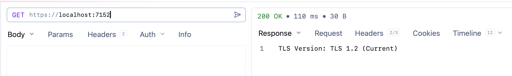

Recently, I needed to know what version of [TLS](https://www.cloudflare.com/learning/ssl/transport-layer-security-tls/) was running on the web server hosting my ASP.NET Web API.

The [current versions](https://en.wikipedia.org/wiki/Transport_Layer_Security) are 1.2 and 1.3.

You can access this information by injecting the [HttpContext](https://learn.microsoft.com/en-us/dotnet/api/microsoft.aspnetcore.http.httpcontext?view=aspnetcore-10.0) and fetching the features we want to examine.

In our case, the feature is [ITlsHandshakeFeature](https://learn.microsoft.com/en-us/dotnet/api/microsoft.aspnetcore.connections.features.itlshandshakefeature?view=aspnetcore-10.0), and what we are interested in examining is the [Protocol](https://learn.microsoft.com/en-us/dotnet/api/microsoft.aspnetcore.connections.features.itlshandshakefeature.protocol?view=aspnetcore-10.0#microsoft-aspnetcore-connections-features-itlshandshakefeature-protocol) property.

This returns one of the following:

| Name    | Value | Description                                                  |
| ------- | ----- | ------------------------------------------------------------ |
| None    | 0     | Allows the operating system to choose the best protocol to use, and to block protocols that are not secure. Unless your app has a specific reason not to, you should use this field. |
| Ssl2    | 12    | Specifies the SSL 2.0 protocol. SSL 2.0 has been superseded by the TLS protocol and is provided for backward compatibility only. |
| Ssl3    | 48    | Specifies the SSL 3.0 protocol. SSL 3.0 has been superseded by the TLS protocol and is provided for backward compatibility only. |
| Tls     | 192   | Specifies the TLS 1.0 security protocol. TLS 1.0 is provided for backward compatibility only. The TLS protocol is defined in IETF RFC 2246. This member is obsolete starting in .NET 7. |
| Default | 240   | Use `None` instead of `Default`. `Default` permits only the Secure Sockets Layer (SSL) 3.0 or Transport Layer Security (TLS) 1.0 protocols to be negotiated, and those options are now considered obsolete. Consequently, `Default` is not allowed in many organizations. Despite the name of this field, [SslStream](https://learn.microsoft.com/en-us/dotnet/api/system.net.security.sslstream?view=net-10.0) does not use it as a default except under special circumstances. |
| Tls11   | 768   | Specifies the TLS 1.1 security protocol. The TLS protocol is defined in IETF RFC 4346. This member is obsolete starting in .NET 7. |
| Tls12   | 3072  | Specifies the TLS 1.2 security protocol. The TLS protocol is defined in IETF RFC 5246. |
| Tls13   | 12288 | Specifies the TLS 1.3 security protocol. The TLS protocol is defined in IETF RFC 8446. |

As outlined before, only `Tls12` and `Tls13` are current.

The code is as follows:

```c#
using System.Security.Authentication;
using Microsoft.AspNetCore.Connections.Features;

var builder = WebApplication.CreateBuilder(args);
var app = builder.Build();

// Setup endpoint
app.MapGet("/", (HttpContext context) =>
{
    // Fetch feature info
    var tlsFeature = context.Features.Get<ITlsHandshakeFeature>();
    // fetch protocol
    var protocol = tlsFeature?.Protocol;
    // build message
    var result = protocol switch
    {
        SslProtocols.Tls12 => "TLS 1.2 (Current)",
        SslProtocols.Tls13 => "TLS 1.3 (Latest",
        _ => "Legacy / Unsupported"
    };

    // Return result
    return $"TLS Version: {result}";
});

await app.RunAsync();
```

If we run this code, we should see something like this:



### TLDR

**You can get the TLS version from the `HttpContext` by getting the `ITlsHandshakeFeature`** 

The code is in my [GitHub](https://github.com/conradakunga/BlogCode/tree/master/2026-03-31%20-%20TLSCheck).

Happy hacking!
