This is **Part 2** of an independent review of a product, [Stellar Repair for MS SQL,](https://www.stellarinfo.com/sql-recovery.php) from the folks at [Stellar Info](https://www.stellarinfo.com/).

The version being reviewed is `11.0.1`

- [Part 1 - Introduction]()
- **Part 2 - (this post)**
- [Part 3 - Backup Data Recovery]()

The previous post, "[Product Review - Stellar Repair for MS SQL - Part 1: Introduction]()" was an introduction and setup of the software.

In this post, we will tackle how to **retrieve a Microsoft SQL Server password**.

My setup is as follows:

| Name                     | Description      |
| ------------------------ | ---------------- |
| Hardware                 | MacBook Pro      |
| Operating System (Host)  | macOS            |
| Operating System (Guest) | Windows 11       |
| Guest environment        | Virtualized      |
| Virtualization Platform  | Parallels 26.3.1 |
| Allocated RAM            | 12GB             |
| Allocated Disk           | 256 GB           |

To simulate a lost password, I will spin up two containers:

1. **SQL 2025**
2. **SQL 2022**

I will randomly **generate two distinct, reasonably complex passwords** and use them to start two containers for different SQL Server versions.

I will then try to recover the passwords from my Windows VM running the software.

I will use the following passwords:

- `yb@U9T9Chy8F2DBR`
- `QTtDo.jZ!npQCaz6`

These are 16-character passwords with a mix of **uppercase** and **lowercase** letters, **numbers**, and **symbols**.

As we will likely need a persistent volume to store the database files, we can create these upfront.

```bash
mkdir containers/Stellar2022
mkdir containers/Stellar2025
```

We will start with **SQL Server 2022**, and run the following command:

```bash
docker run -e "ACCEPT_EULA=Y" -e "MSSQL_SA_PASSWORD=yb@U9T9Chy8F2DBR" -p 1434:1433 --name Stellar2022 -d -v ~/Docker/containers/Stellar2022:/var/opt/mssql mcr.microsoft.com/mssql/server:2022-latest 
```

Here I am mapping port `1434` to the host, as I am already using `1433` for another instance.

We can see here that the container is successfully running.

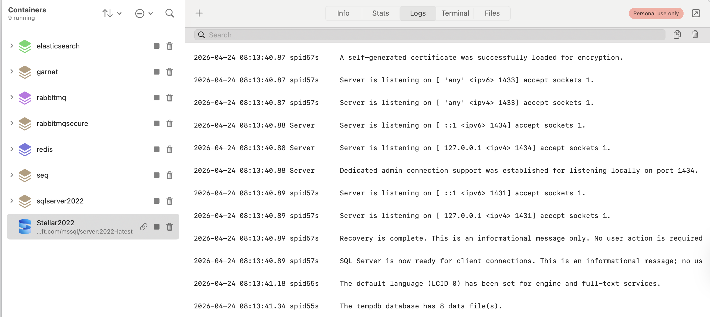

We then quickly verify our new password as follows from a terminal:

```bash
docker exec -it Stellar2022 /opt/mssql-tools18/bin/sqlcmd -S localhost -U sa -P 'QTtDo.jZ!npQCaz6' -No
```

The parameter `-No` here is to bypass certificate validation and enforcement, which we don't need for now.

This should connect us to the database engine.

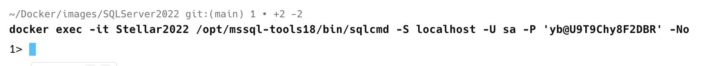

We then verify that everything works by getting the date.

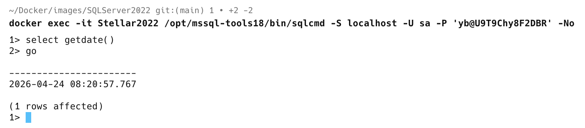

Now, let us try to retrieve the password.

From the console, I click the relevant button:

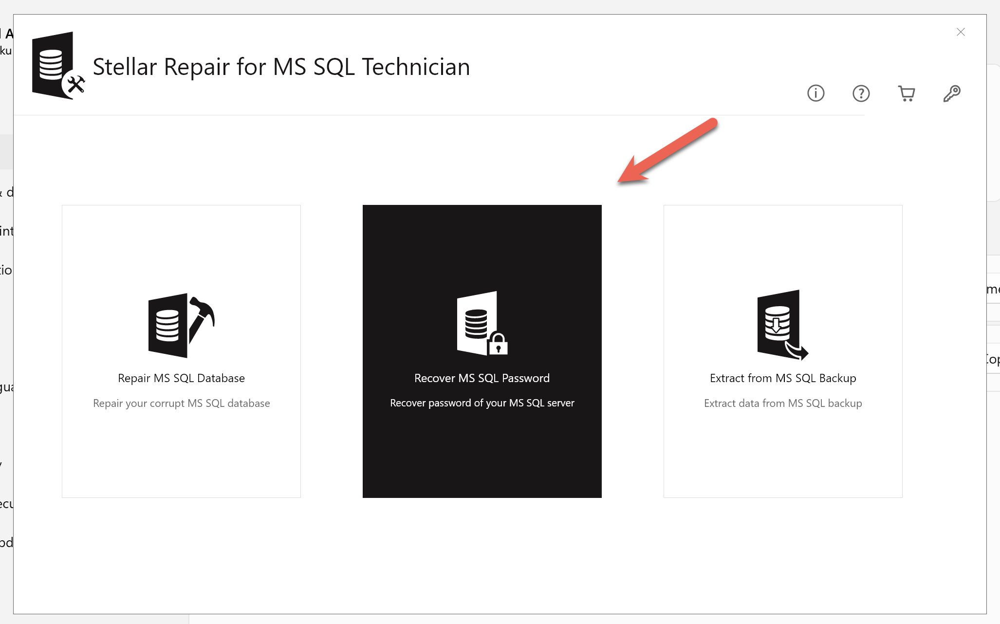

You are then presented with this menu:

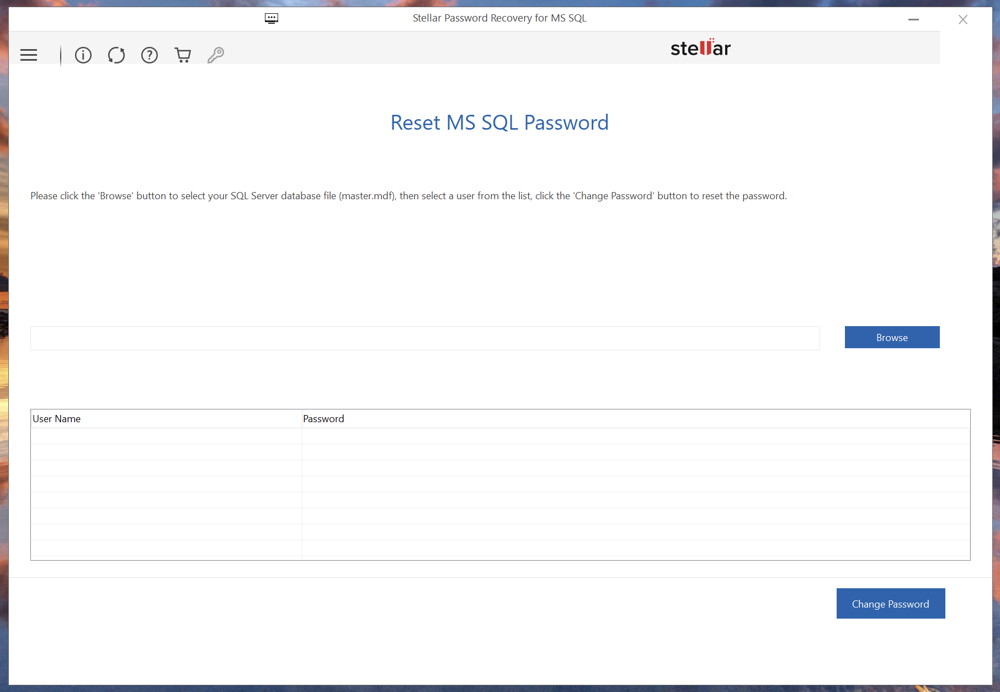

It seems to want access to the `master.mdf` file.

To configure access to the macOS folders in Parallels is very straightforward:

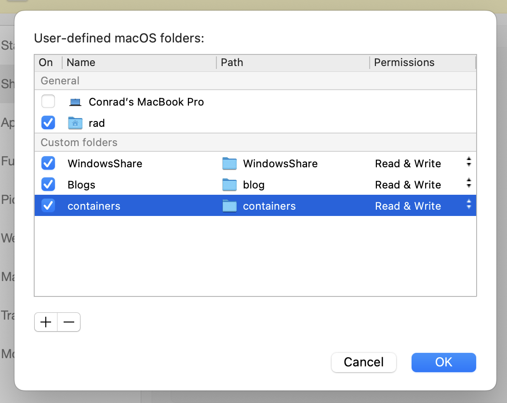

The folder `containers` here is available as a network share:

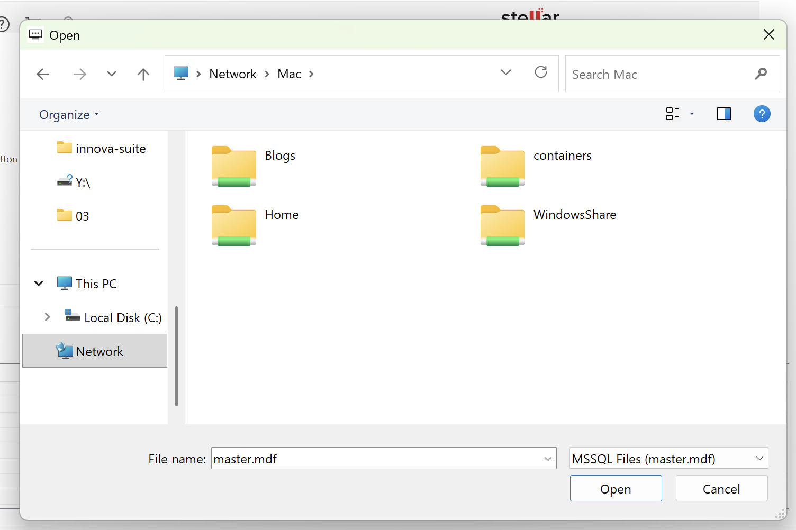

We then navigate to the required file.

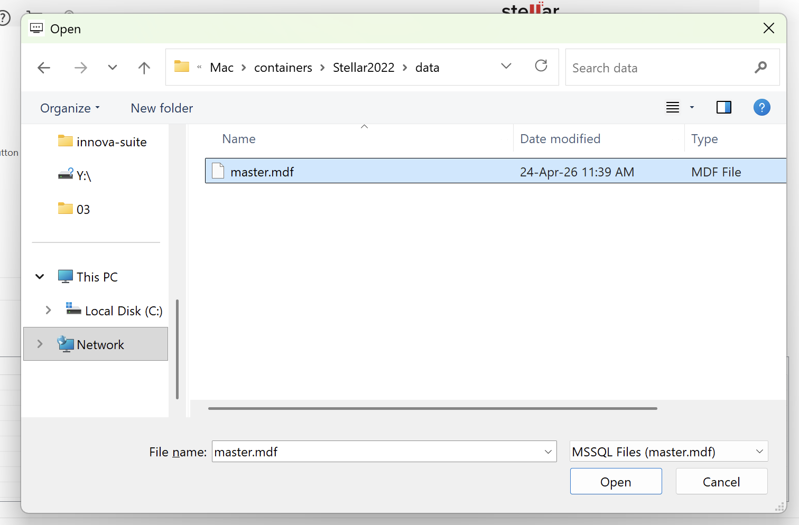

And ... nothing seems to have happened.

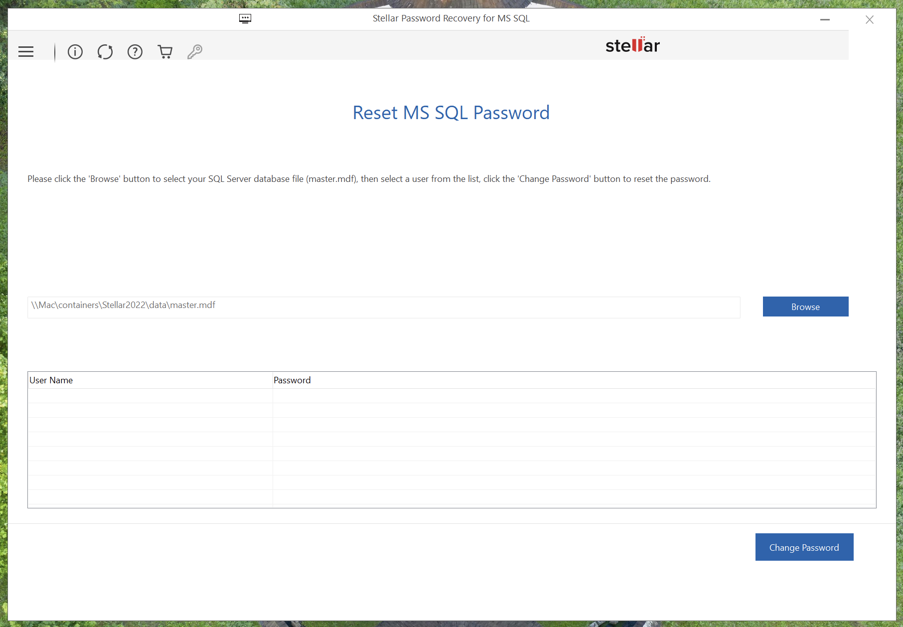

The expectation was that the username(s) would populate on the grid below.

Perhaps the software does not like accessing data via a **share**. So let us shut down the container, **copy the database file** across to the Windows VM, and **try again**.

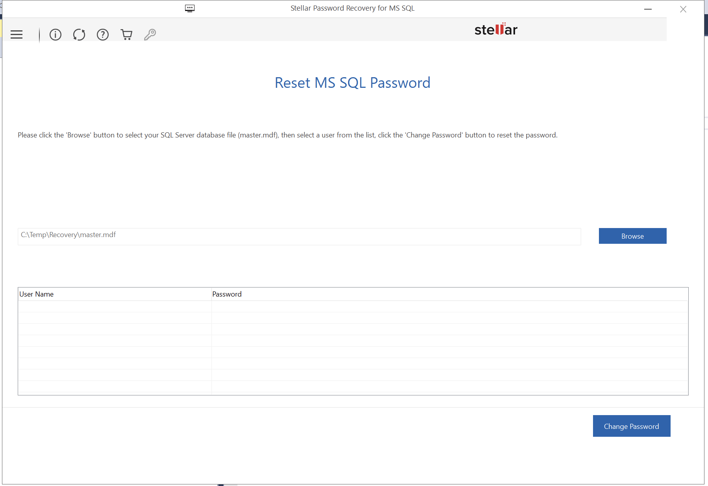

No luck either.

Let us try with the SQL 2025 container.

```bash
docker run -e "ACCEPT_EULA=Y" -e "MSSQL_SA_PASSWORD=yb@U9T9Chy8F2DBR" -p 1435:1433 --name Stellar2025 -d -v ~/Docker/containers/Stellar2025:/var/opt/mssql mcr.microsoft.com/mssql/server:2025-latest 
```

The container should spin up successfully.

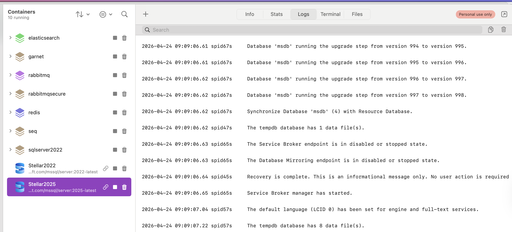

Let us then try to retrieve the `master.mdf`

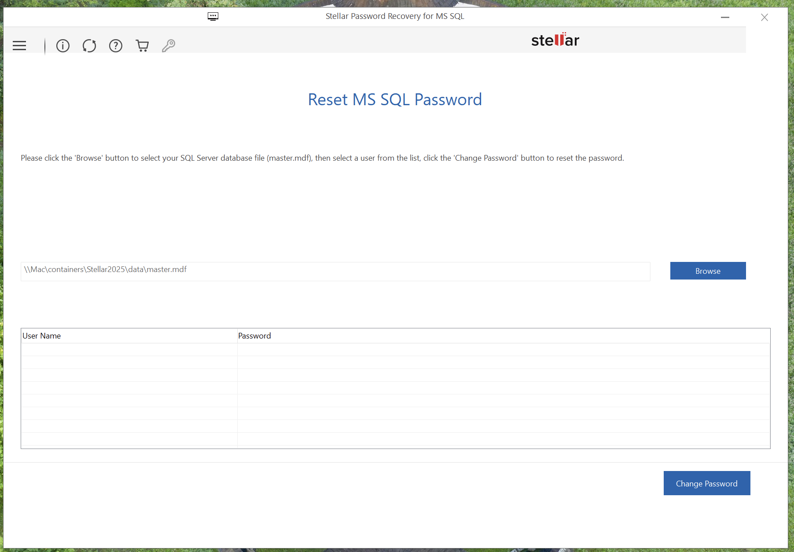

Let us try copying the file across to the Windows VM and see if there is any difference.

There isn't.

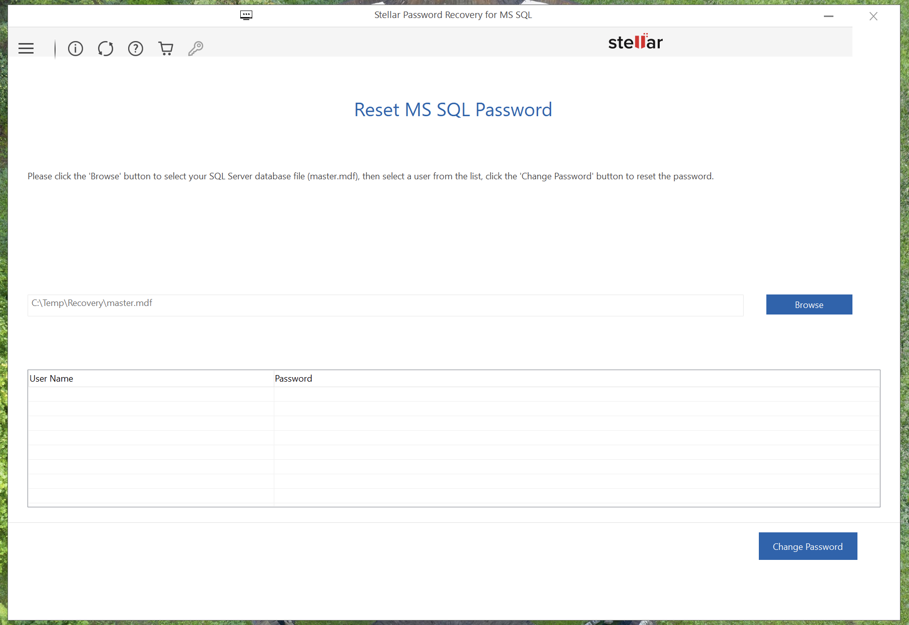

Let us check if the software is the latest version:

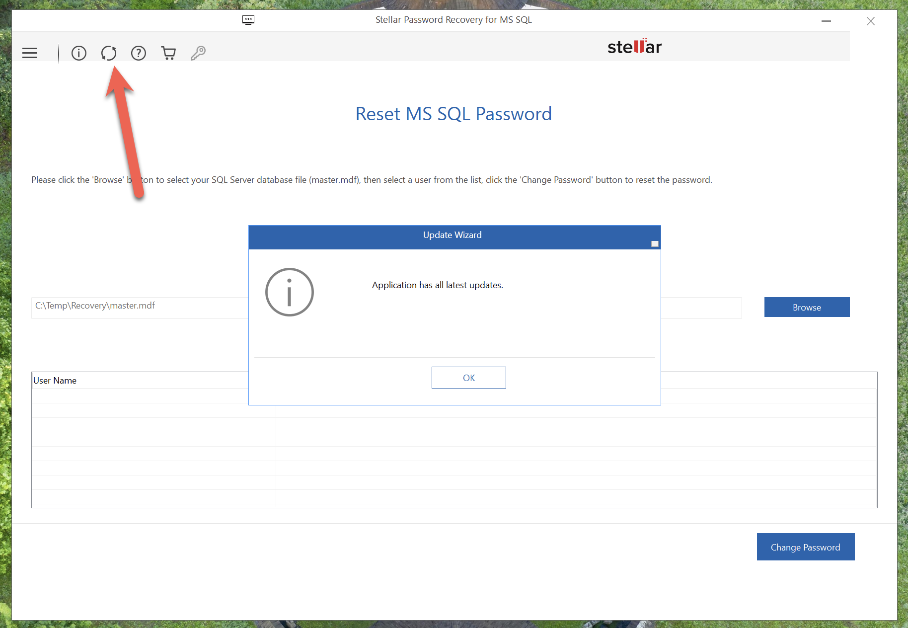

It seems to be.

Perhaps there is some silent error in the event log?

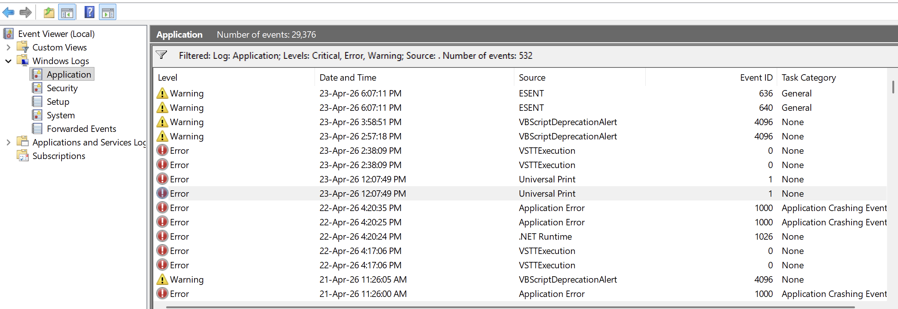

There isn't any sort of a log file in the installed location either.

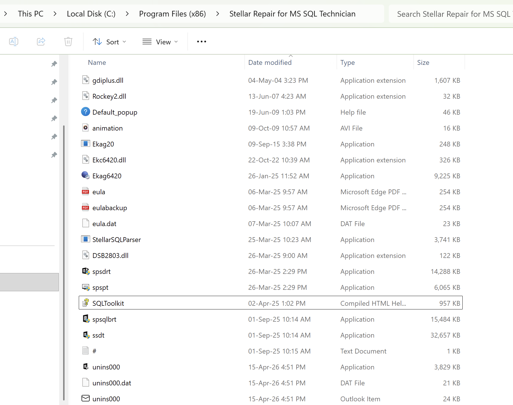

I have not been able to get the password recovery to work. I will revisit this at the end.

In the next post, we will look at how to extract data from a backup.

Happy hacking!
