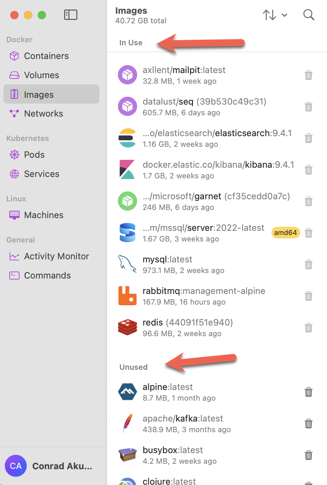
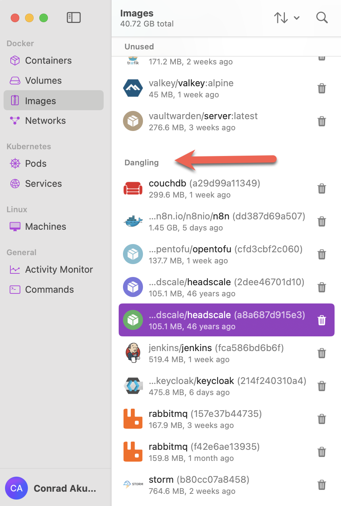
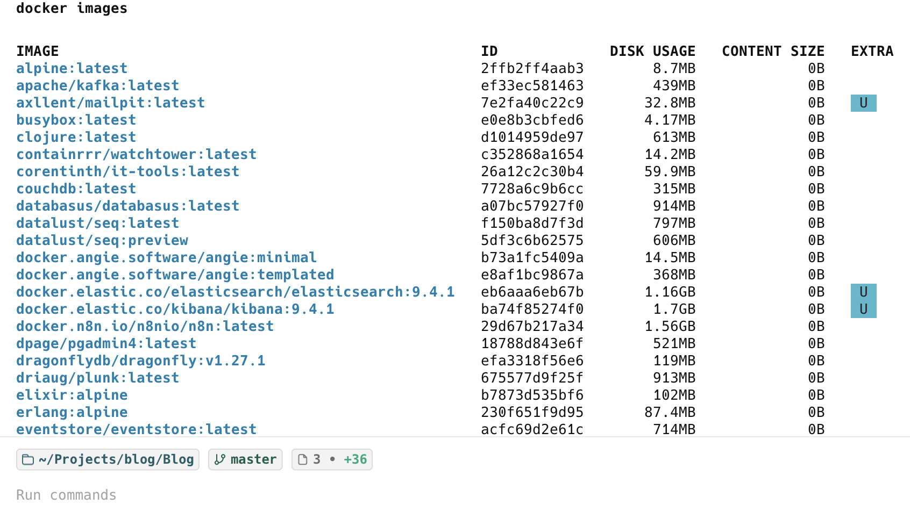
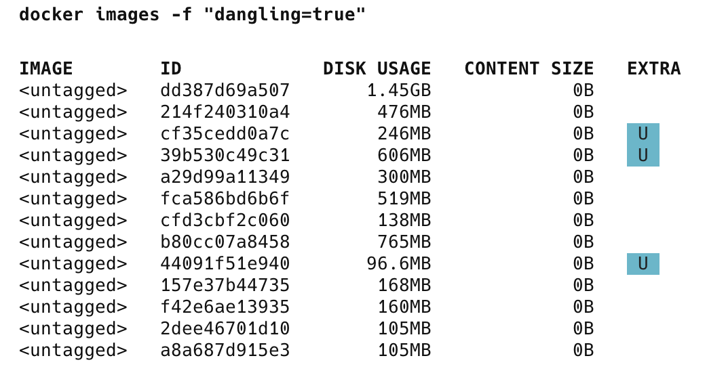

[Docker](https://www.docker.com/) is now an essential tool for software developers, as it allows you to spin up almost any infrastructure you may need.

Ordinarily, you would use a utility to manage your containers and images. This may be Docker Desktop or, if you are on macOS, Orbstack.

On Orbstack, you can view your local images.

Images can be in one of two states:

1. In use - currently in active use for a running container
2. Unused - downloaded to your local cache but not in use
3. Dangling - a newver version of the image has been downloaded



The **dangling** images are listed further down:



You can also get this information via the command line.

The [docker images](https://docs.docker.com/reference/cli/docker/image/ls/) command lists all the images.

```bash
docker images
```

This returns a list like this:



To get a list of the **dangling images**, pass a **filter**, like this:

```bash
docker images -f "dangling=true"
```



### TLDR

**To list dangling Docker images, use the command `docker images -f "dangling=true"`**

Happy hacking!
