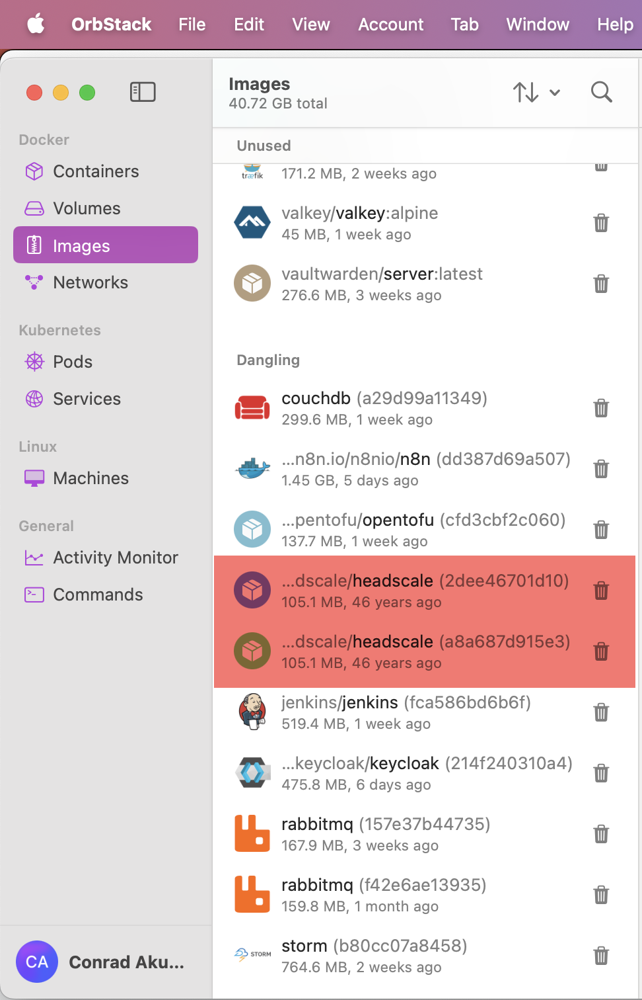
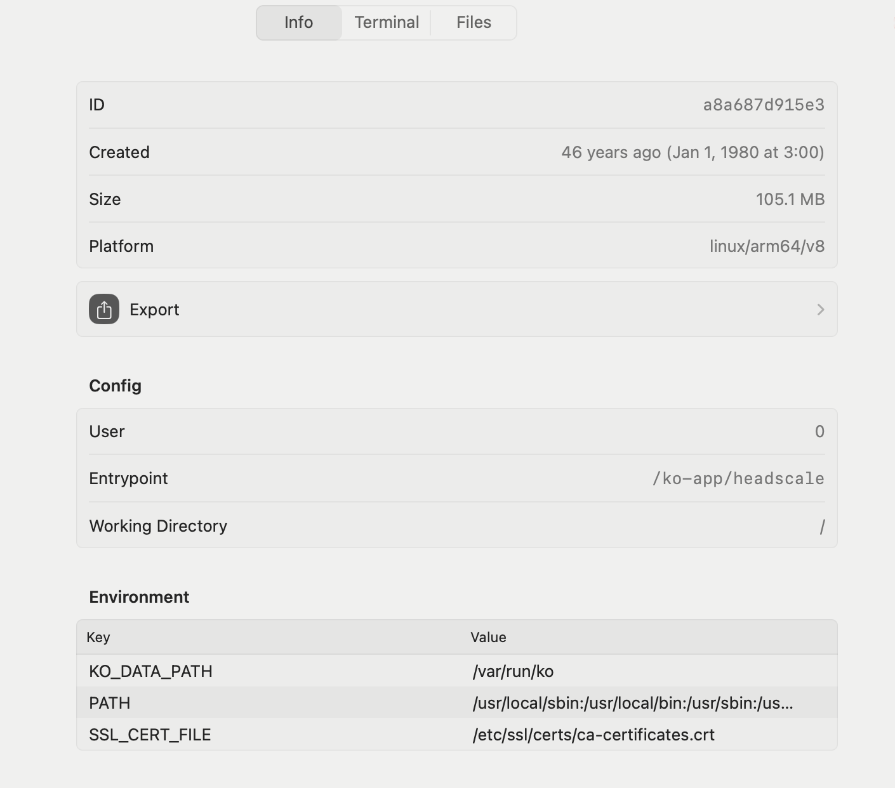

If you are a **serious developer**, you almost certainly must be using [Docker](https://www.docker.com/).

I manage my images and containers on [macOS](https://www.apple.com/os/macos/) using the excellent tool [Orbstack](https://orbstack.dev/).

The other day I was looking at my **images** and noticed something curious:

That is certainly a pretty **ancient image**, certainly older the Docker itself. It's even older than [Linux](https://en.wikipedia.org/wiki/Linux)!

The details told the story:

The creation date is almost certainly **nonsense**, and Orbstack is doing its best to compute the age.

46 years indeed!

Happy hacking!
