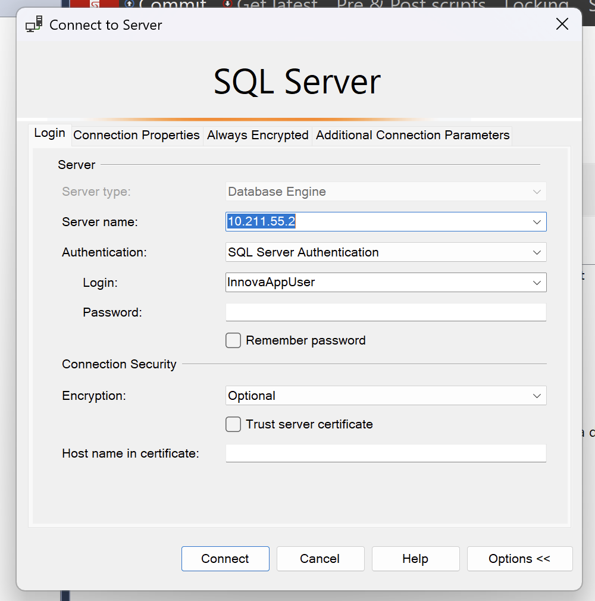
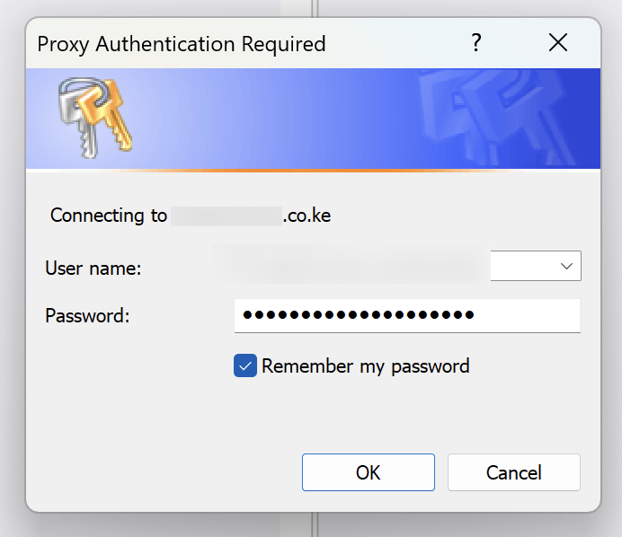

Entering **usernames** and **passwords** is something we are no doubt used to as we ply our daily trades.

This can be **tiresome**.

 Often, the **tools** and **systems** we use try to alleviate this discomfort by providing a mechanism for **remembering** a username and password.

[SQL Server Management Studio](https://learn.microsoft.com/en-us/ssms/sql-server-management-studio-ssms) does this:

As does [Visual Studio](https://visualstudio.microsoft.com/vs/), to remember the credentials to a [Nuget](https://www.nuget.org/) package server (we use [Proget](https://inedo.com/proget)).

Here's the problem - **they never work**.

**Every time** I launch these applications, they ask me **again** for my username and password.

Happy hacking!
