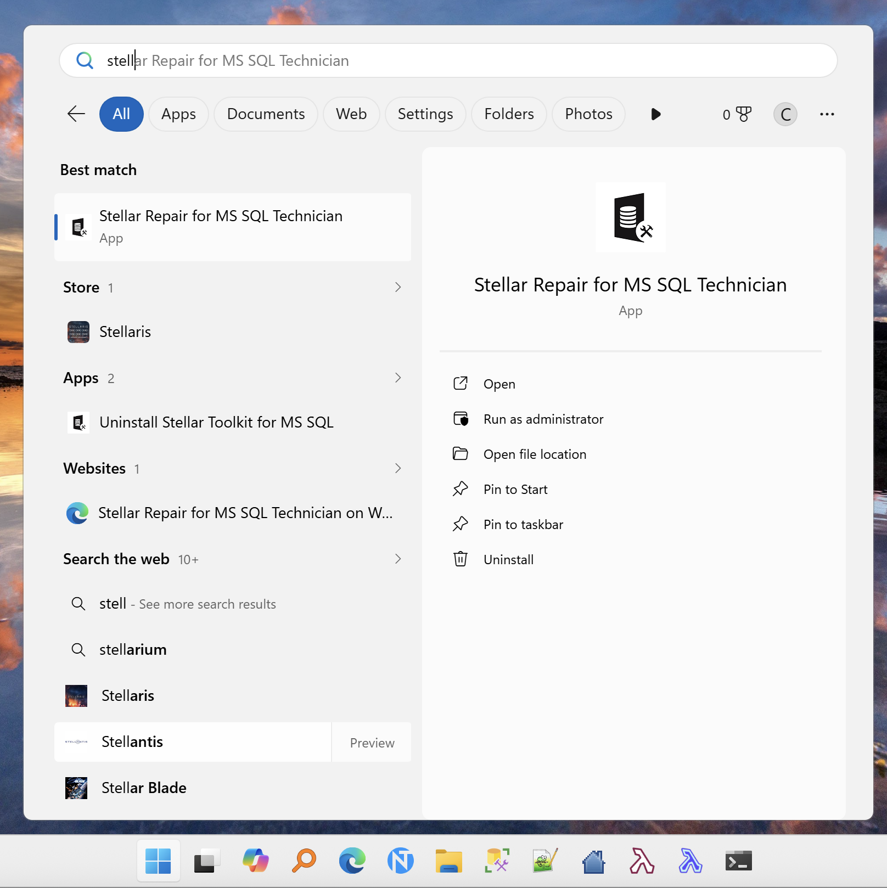
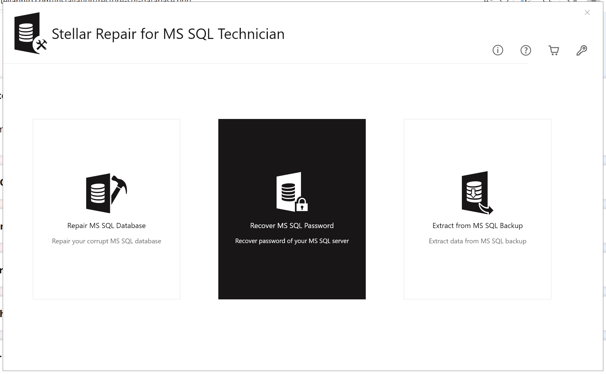
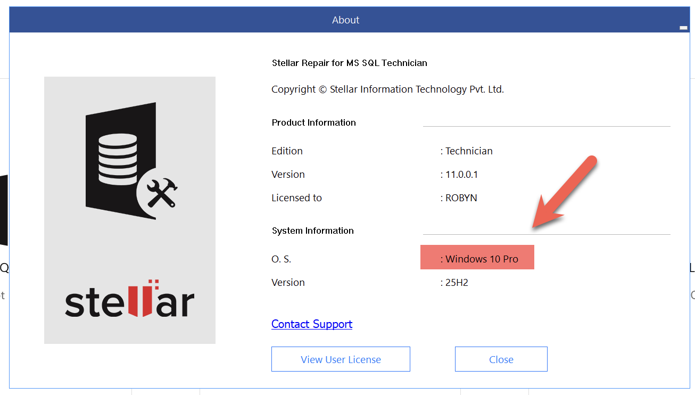
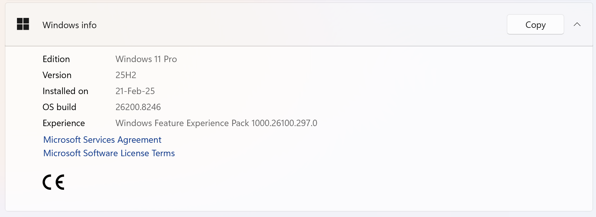

This is **Part 1** of an independent review of a product, [Stellar Repair for MS SQL,](https://www.stellarinfo.com/sql-recovery.php) from the folks at [Stellar Info](https://www.stellarinfo.com/).

It is independent in the sense that I have not been offered, nor accepted, compensation of any kind, nor have I been given any sort of direction or assistance.

The evaluation software has a **3-month NFR (Not for resale) license**.

- **Part 1 - Introduction (this post)**
- Part 2 - SQL Server Password Recovery
- Part 3 - Backup Data Recovery
- Part 4 - Database Recovery
- Part 5 - File corruption
- Part 6 - Conclusion

## Introduction

The software is aimed at solving the following problems for [Microsoft SQL Server](https://www.microsoft.com/en-us/sql-server) database administrators:

1. **Recovery** of **corrupt** database files
2. **Extraction of data** from backups
3. **Recovery** of SQL Server **password**

The product page says it should work for the following SQL Server versions:

- 2025
- 2022
- 2019
- 2017
- 2016

## Setup

The software is available as an MSI **executable** that you **download** and **install** on your Windows PC.

There are also [Linux versions](https://www.stellarinfo.com/database-recovery/sql-recovery-linux/free-download.php) for [Centos](https://cloud.stellarinfo.com/StellarRepairforMSSQL.rpm?_ga=2.234670233.686360559.1777015851-786564358.1776261044&_gac=1.57805400.1777015851.CjwKCAjwqazPBhALEiwAOuXqdN-nBVVgpTAC8Fm6UonrQE1yhbGoA_4UKSTx2PewZPKMlP9kY4BwxRoCDoUQAvD_BwE) and [Ubuntu](https://cloud.stellarinfo.com/StellarRepairforMSSQL.deb?_ga=2.234670233.686360559.1777015851-786564358.1776261044&_gac=1.57805400.1777015851.CjwKCAjwqazPBhALEiwAOuXqdN-nBVVgpTAC8Fm6UonrQE1yhbGoA_4UKSTx2PewZPKMlP9kY4BwxRoCDoUQAvD_BwE).

For the review, I will be using the [Windows](https://www.stellarinfo.com/thankyou/sql-recovery.php) version.

Upon completion, you will get a menu configured in your **start menu**.

Upon launch, you will see the following **dashboard**.

Activation is only via a key that will be generated for you.

The operating system, reported, however, is **incorrect**. I am, in fact, on Windows 11.

However everything seems to be **up and running** in preparation for us to **kick the tyres** of the softare.

In the next post, we will look at **SQL Server password recovery**.

Happy hacking!
