This is **Part 3** of an independent review of a product, [Stellar Repair for MS SQL,](https://www.stellarinfo.com/sql-recovery.php) from the folks at [Stellar Info](https://www.stellarinfo.com/).

The version being reviewed is `11.0.0.1`

- [Part 1 - Introduction]()
- [Part 2 - SQL Server Password Recovery]()
- **Backup Data Recovery (this post)**
- [Part 4 - Database Recovery]()
- Part 5 - File corruption
- Part 6 - Conclusion

In our previous post, "[Product Review - Stellar Repair for MS SQL - Part 2: SQL Server Password Recovery]()", we looked at the functionality of **retrieving a SQL Server password**.

In this post, we will look at how to **recover data from a SQL backup** (.[bak](https://learn.microsoft.com/en-us/sql/relational-databases/backup-restore/back-up-and-restore-of-sql-server-databases?view=sql-server-ver17#creating-backups)), which **may or may not be corrupted**.

In preparation for this will 

1. **Prepare** a database
2. **Seed** it with test data
3. **Backup** the database
4. **Restore** selected data from the backup

For this exercise we will use [SSMS](https://learn.microsoft.com/en-us/ssms/install/install).

First, **connect** to the server:

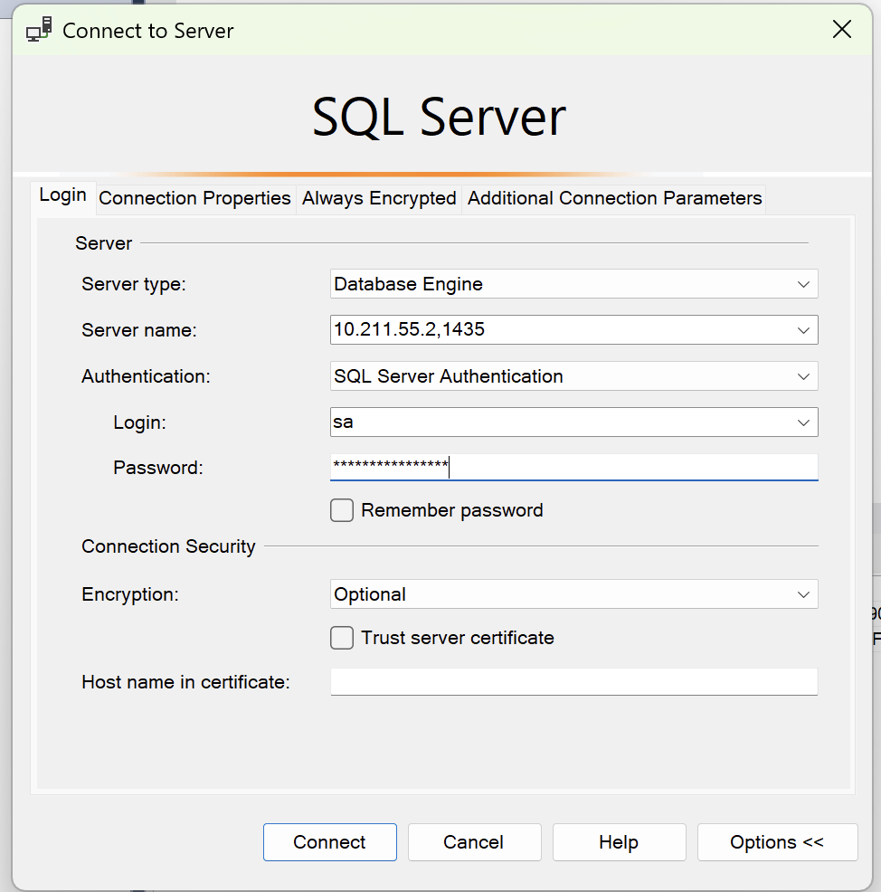

Next, we create a database:

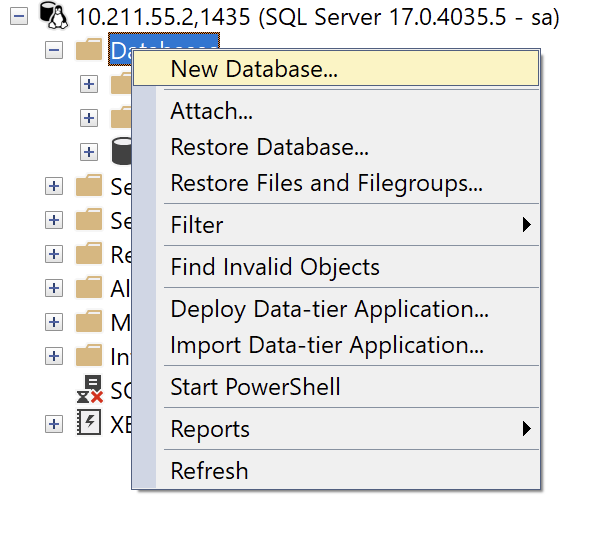

Then we create our database. The name is `Spies`.

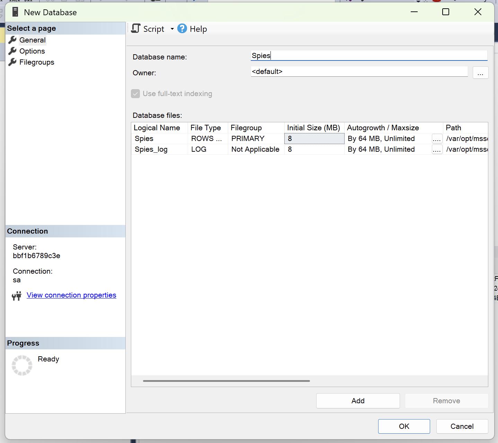

Next, we create a table so store our `Spies`.

```sql
CREATE TABLE Agencies
    (
        AgencyID UNIQUEIDENTIFIER PRIMARY KEY
            DEFAULT NEWSEQUENTIALID(),
        Name     NVARCHAR(250)    NOT NULL
            UNIQUE
    );

CREATE TABLE Spies
    (
        SpyID       uniqueidentifier PRIMARY KEY
            DEFAULT (NEWSEQUENTIALID()),
        AgencyID    uniqueidentifier NOT NULL
            REFERENCES Agencies (AgencyID),
        FullName    nvarchar(250)    NOT NULL,
        DateOfBirth Date             NOT NULL,
        UNIQUE (AgencyID, FullName)
    );
```

Finally, we **seed** the data.

First, we start with the `Agencies`.

```sql
INSERT INTO dbo.Agencies
    (
        AgencyID,
        Name
    )
VALUES
    (
        '{dc34433e-f36b-1410-8ddd-000326cb3e3a}', N'Central Intelligence Agency (United States)'
    ),
    (
        '{dd34433e-f36b-1410-8ddd-000326cb3e3a}', N'Intelligence Directorate (Cuba)'
    ),
    (
        '{db34433e-f36b-1410-8ddd-000326cb3e3a}', N'MI-6 (United Kingdon)'
    ),
    (
        '{da34433e-f36b-1410-8ddd-000326cb3e3a}', N'National Intelligence Service (Kenya)'
    );

```

Next, the `Spies`.

The script looks like this:

```sql
INSERT Spies (AgencyID,Fullname,DateOfBirth)
SELECT 'db34433e-f36b-1410-8ddd-000326cb3e3a','Reanna Runte','1998-05-28'UNION 
SELECT 'dc34433e-f36b-1410-8ddd-000326cb3e3a','Keegan Ullrich','2004-03-15'UNION 
SELECT 'da34433e-f36b-1410-8ddd-000326cb3e3a','Doris Greenholt','2002-12-12'UNION 
SELECT 'db34433e-f36b-1410-8ddd-000326cb3e3a','Janelle Wunsch','2024-10-17'UNION 
SELECT 'da34433e-f36b-1410-8ddd-000326cb3e3a','Zelda Pagac','2010-08-01'UNION 
--- Snipped here ---
```

Once ran, the table will have `6,000` rows.

Next, we **backup** the database.

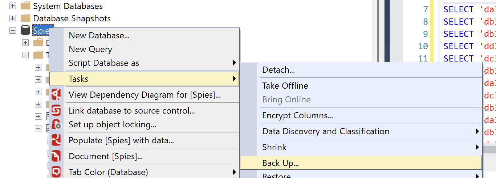

The default options will suffice:

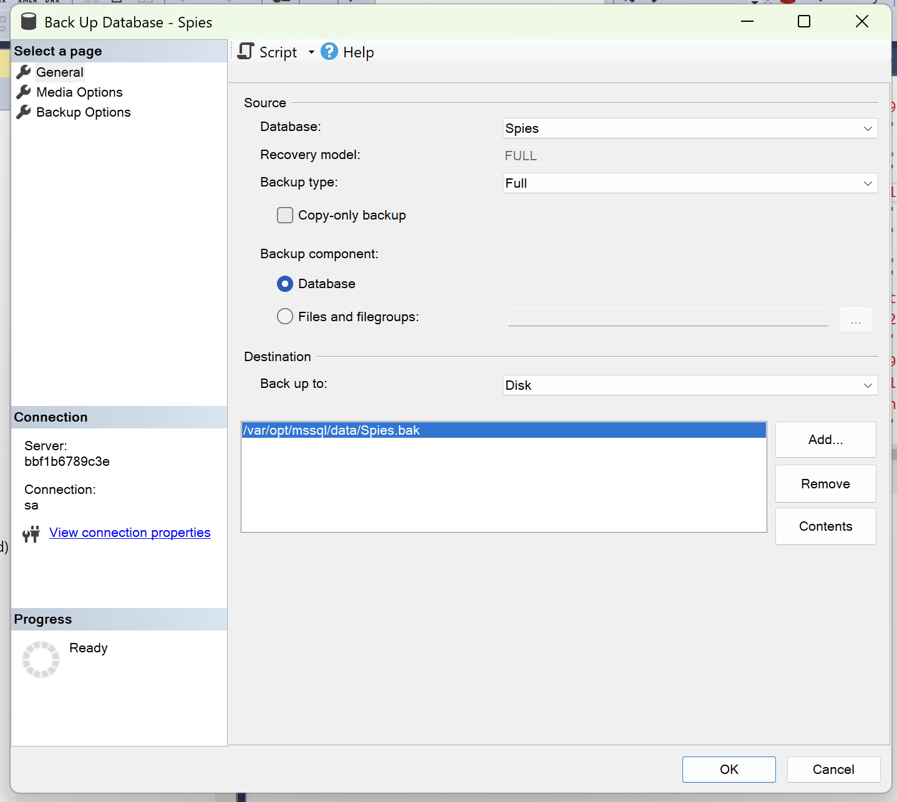

Once done, the backup file should be visible.


Next, we **load the software** to retrieve data from a backup.

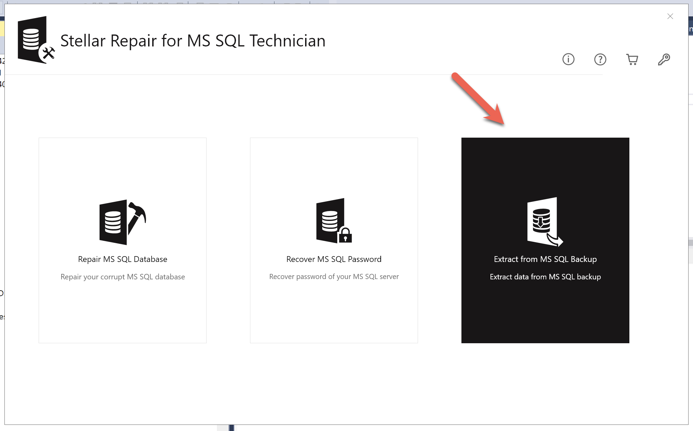

This opens the following screen:

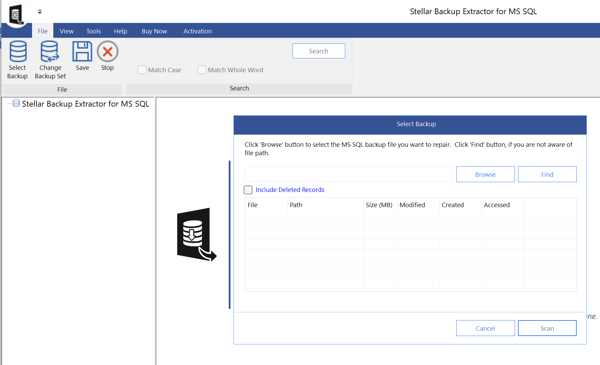

The home screen looks like this:

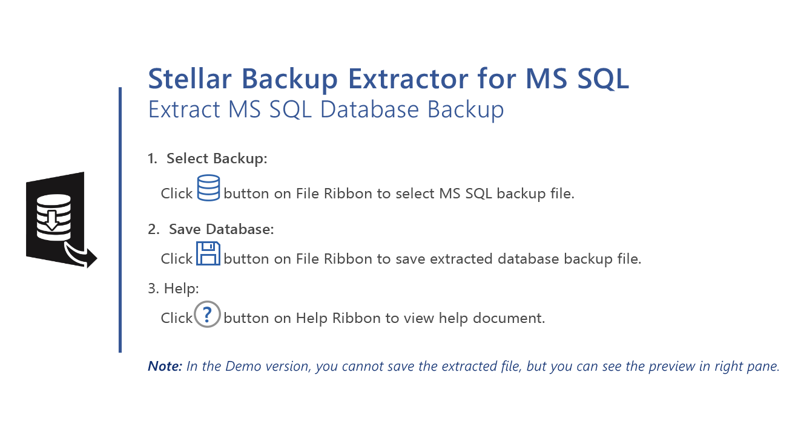

Let us now browse to our backup.

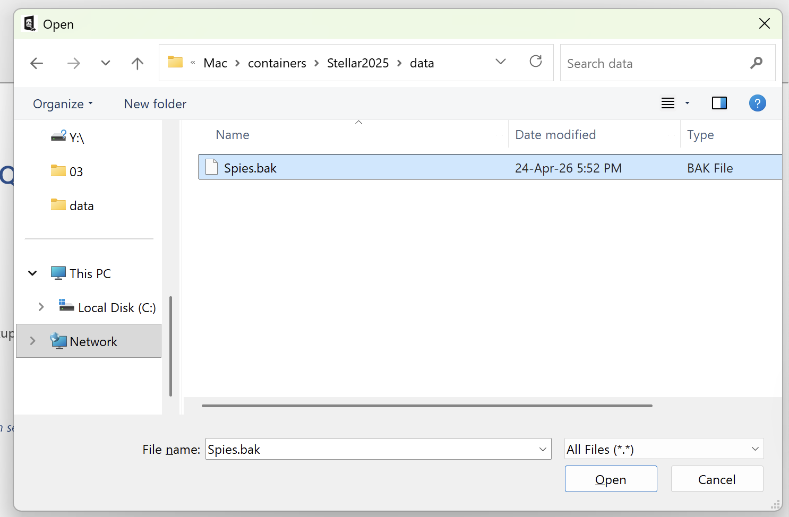

When we select and open the file, we get the following screen:

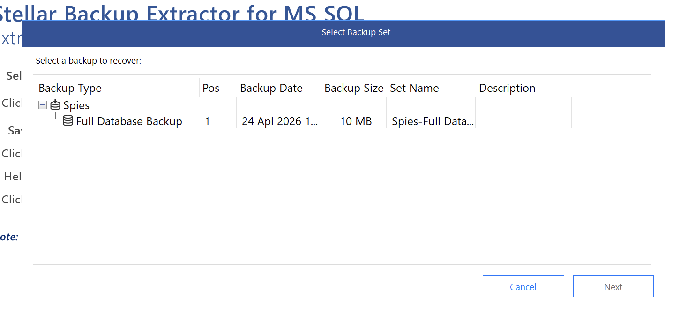

Here we can see our backup file with some basic metadata.

If we click **Next** we proceed to the following screen:

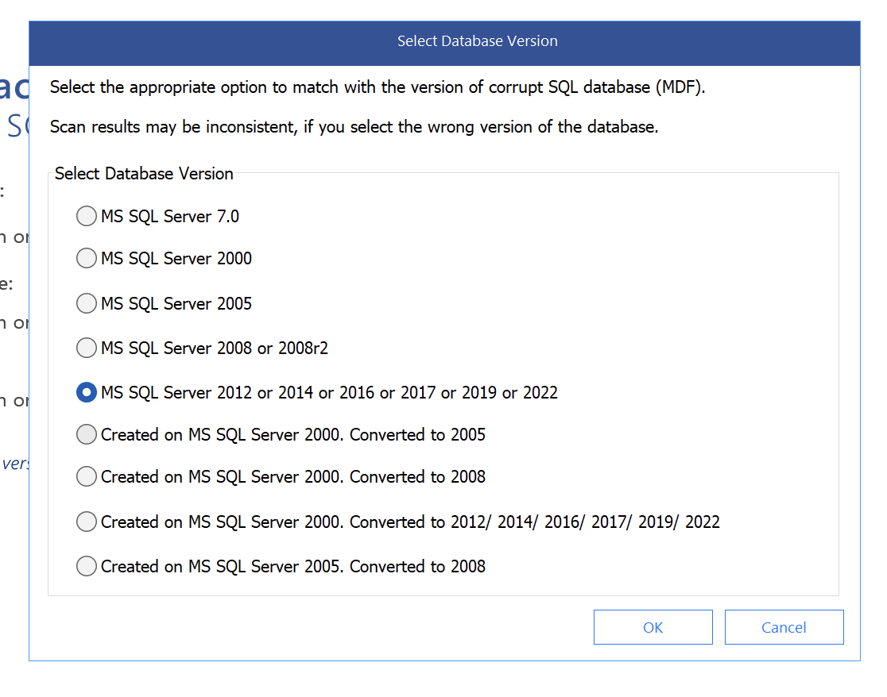

here, it seems you should know a bit about the backup, specifically:

1. The version it was **created** in
2. Whether it was **created originally** in version `2000` or `2005` and subsequently converted to a later version.

Once you select the appropriate version and click **OK**, you should get the following screen:

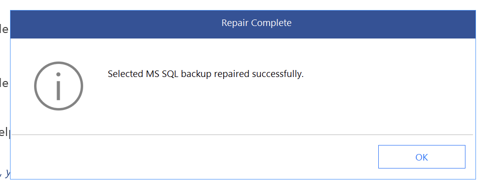

From there, you can now **browse** the database.

You can click on the **table** and the software will **fetch the data** from the backup. At the bottom of the screen you will see a progress bar.

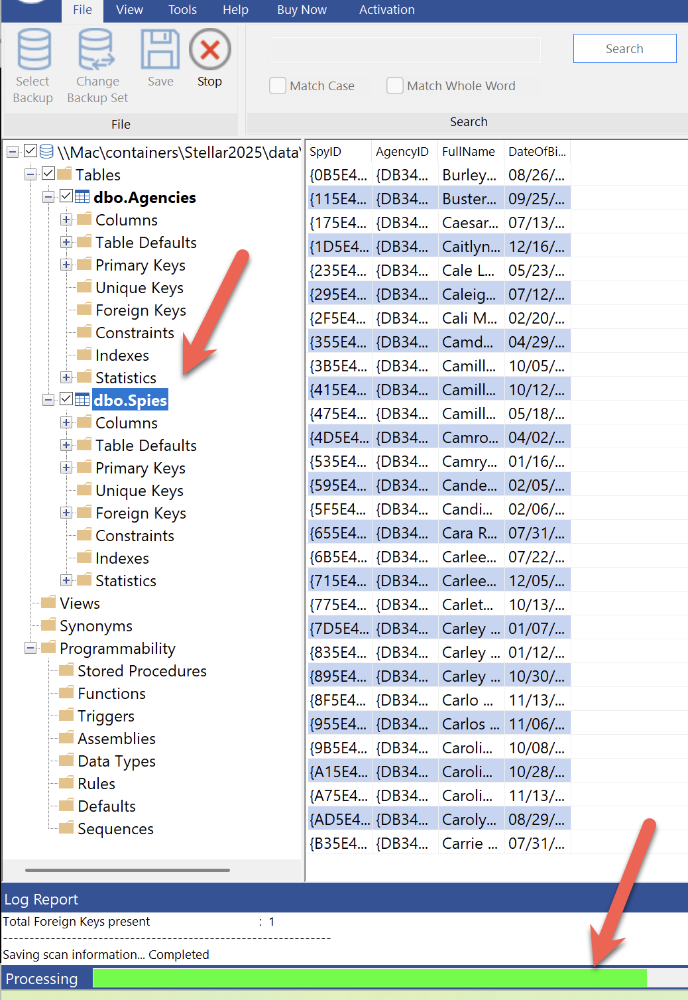

You can also browse the other table objects such as **columns**, **defaults**, **primary keys**, **foreign keys**, **constraints**, **indexes**, and **statistics**.

Similarly, you can also browse other database objects like [views](https://learn.microsoft.com/en-us/sql/relational-databases/views/views?view=sql-server-ver17), [procedures](https://learn.microsoft.com/en-us/sql/relational-databases/stored-procedures/stored-procedures-database-engine?view=sql-server-ver17), [functions](https://learn.microsoft.com/en-us/sql/relational-databases/user-defined-functions/user-defined-functions?view=sql-server-ver17), [triggers](https://learn.microsoft.com/en-us/sql/relational-databases/triggers/ddl-triggers?view=sql-server-ver17), [assemblies](https://learn.microsoft.com/en-us/sql/relational-databases/clr-integration/assemblies-database-engine?view=sql-server-ver17), [data types](https://learn.microsoft.com/en-us/sql/t-sql/data-types/data-types-transact-sql?view=sql-server-ver17), [rules](https://learn.microsoft.com/en-us/sql/t-sql/statements/create-rule-transact-sql?view=sql-server-ver17), [defaults](https://learn.microsoft.com/en-us/sql/relational-databases/tables/specify-default-values-for-columns?view=sql-server-ver17) and sequences.

At this point you have the option to **save** the recovered backup.

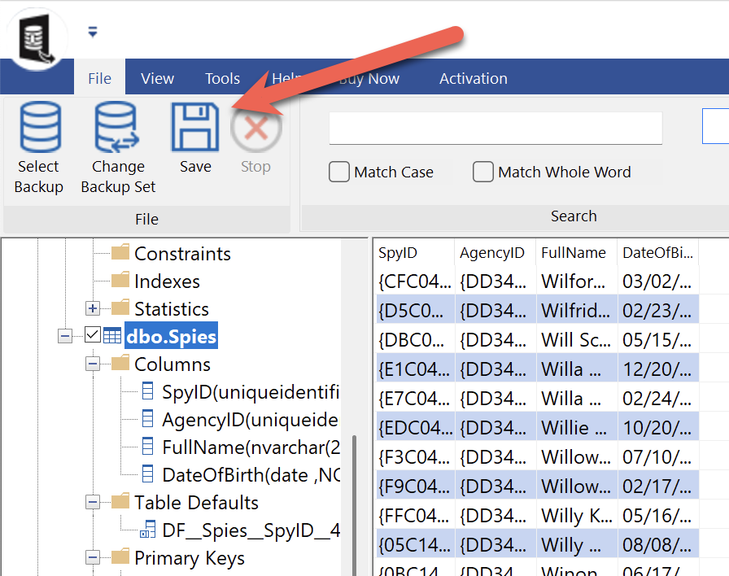

Upon saving you are presented with the following options:

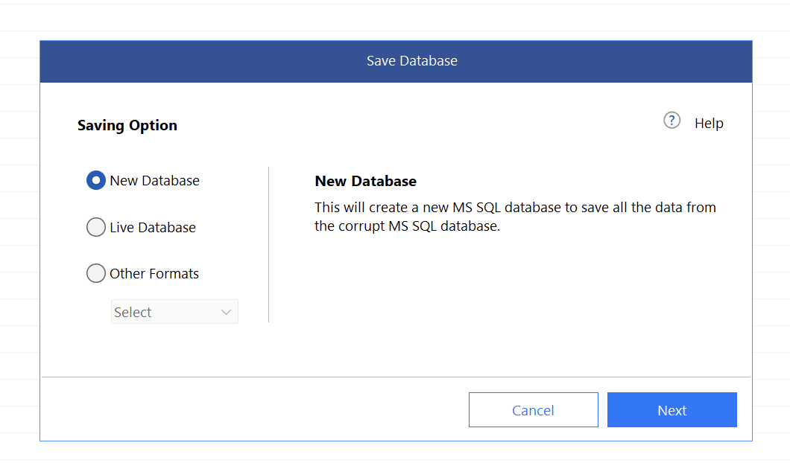

Here you can:

1. Restore to  a completely **new** database
2. Restore to an **existing** database
3. Restore to a different **format**:
    - HTML
    - CSV
    - Excel

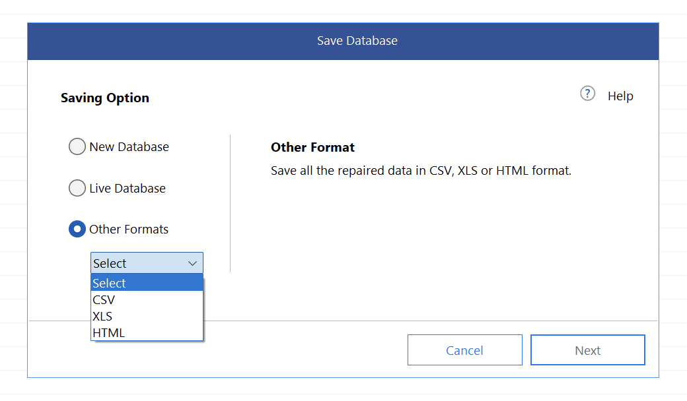. 

Let us try and export the `Spies` table to **XLS**.

I am curious why **XLS** is the supported format at not **XLSX**, given the **XLS** format has a maximum row count of `65,536` rows, whereas **XLSX** has 1,048,576 rows.

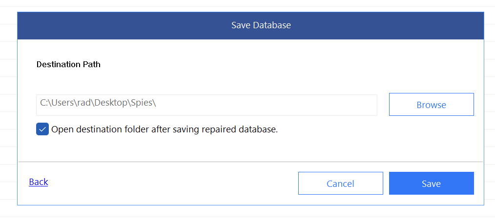

Once we click **Save**, a number of **files** (corresponding to each selected table) are generated in the specified folder.

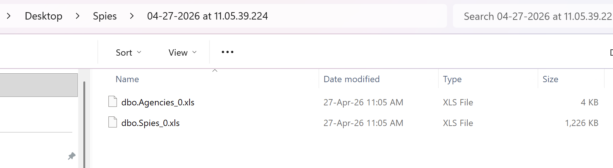

We can now view the data.

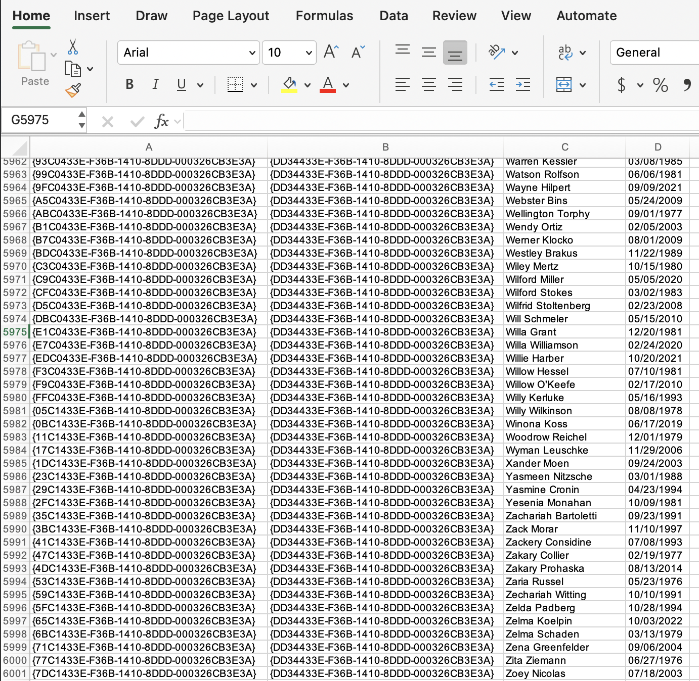

A couple of suggestions:

1. Support export to the latest [Excel](https://www.microsoft.com/en-us/microsoft-365/excel) format, **XLSX**
2. Provide clarity as to what happens if the **number of rows exceeds the selected format** (**XLS** or **XLSX**) capacity.

In a subsequent post, I will attempt to corrupt a backup and see what happens when attempting to access and retrieve data.

In the next post we will look at how to recover data from a SQL Server (**.mdf**) file.

### TLDR

**Stellar Repair allows you to extract data and objects from a backup (`.bak`) file.**

Happy hacking!
