This is **Part 4** of an independent review of a product, [Stellar Repair for MS SQL,](https://www.stellarinfo.com/sql-recovery.php) from the folks at [Stellar Info](https://www.stellarinfo.com/).

The version being reviewed is `11.0.0.1`

- [Part 1 - Introduction]()
- [Part 2 - SQL Server Password Recovery]()
- [Backup Data Recovery]()
- **Part 4 - SQL Server Database Recovery (This post)**
- Part 5 - File corruption
- Part 6 - Conclusion

In our previous post, "[Product Review - Stellar Repair for MS SQL - Part 3: Backup Data Recovery]()", we looked at how to recover data from a backup file (**.bak**).

In this post, we will look at how to recover data from a **potentially corrupted database** file (**.mdf**).

For this, we access the tool from the dashboard.

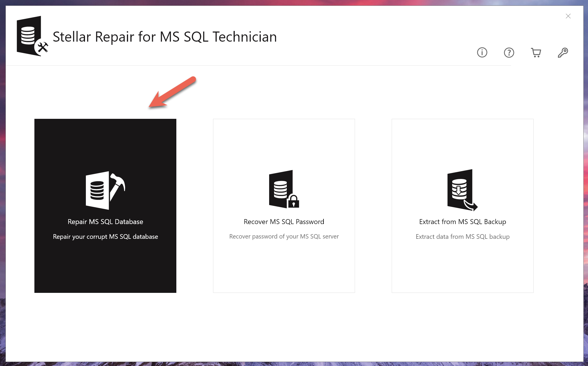

This will launch the tool that will ask the path to the file:

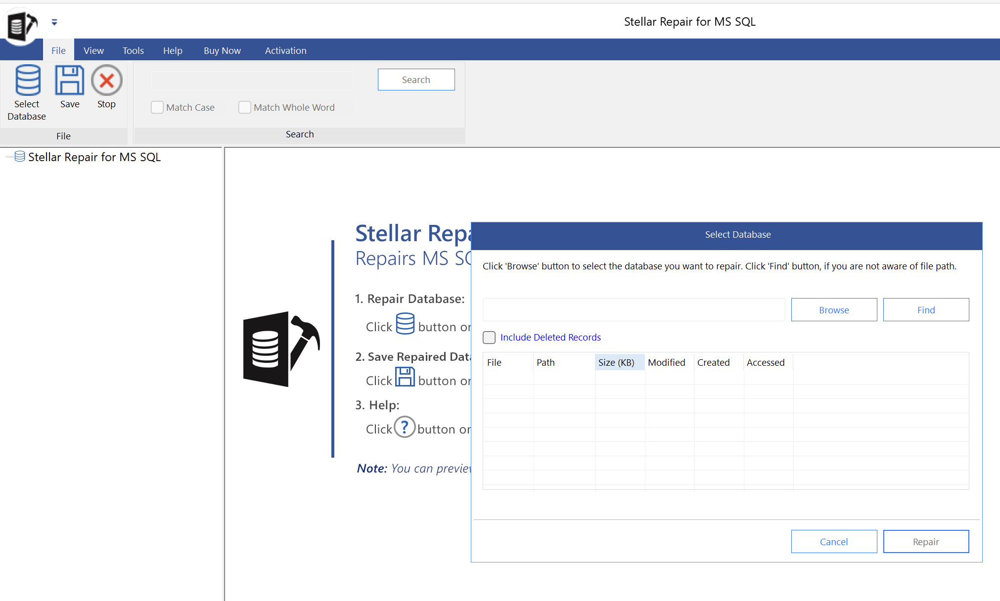

Here we will browse to our test database file, `Spies.mdf`.

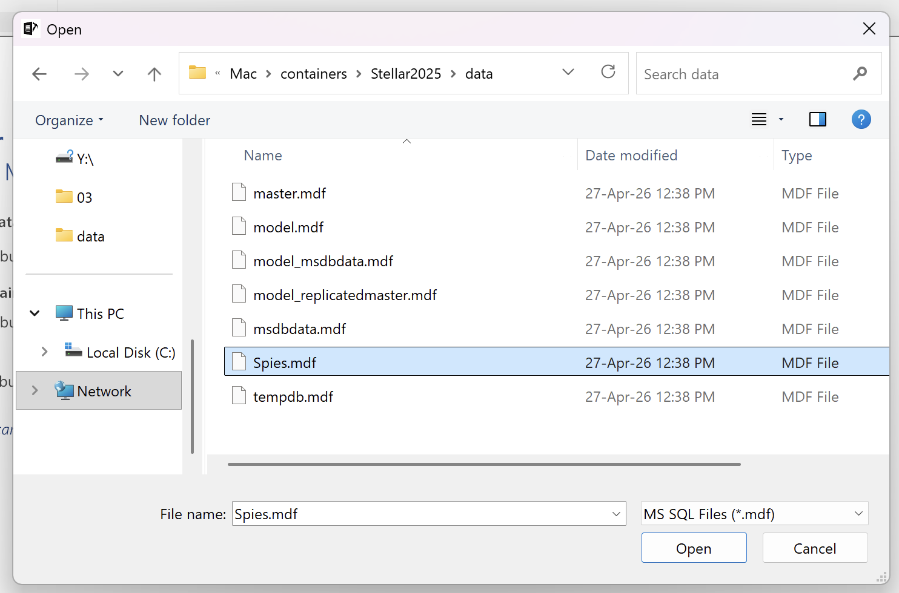

Nothing seems to have changed in the selection UI.

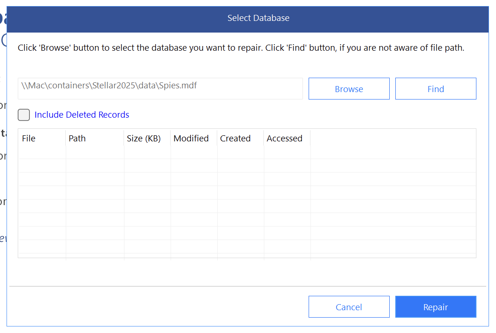

Click **Repair** anyway.

There seems to be a **UI bug** with **loading the metadata** of the selected file.

We are presented with the following dialog:

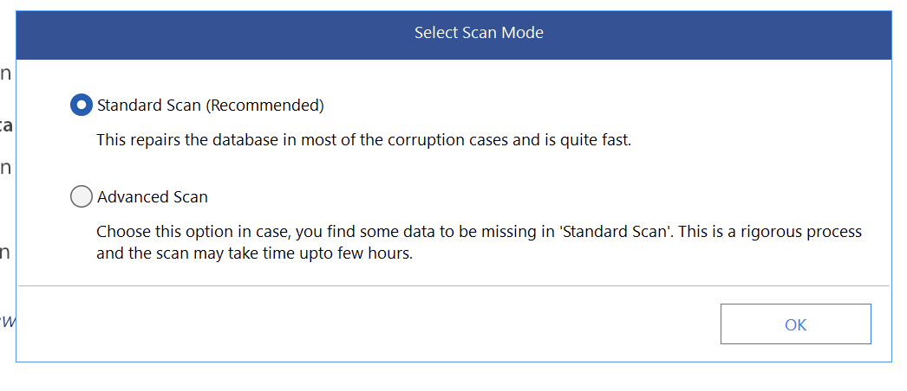

We then get our old friend the version selector:

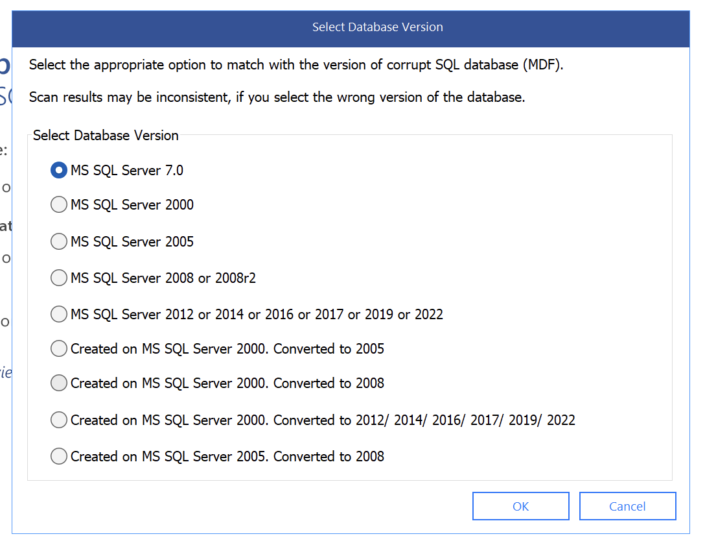

**SQL 2025** is missing from these options, so we will select the option that has all the others.

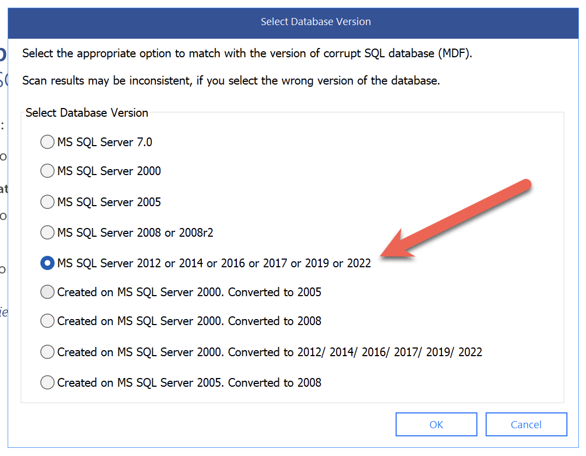

After processing the file we get the following interface, that seems to mirror the one for recovery form a backup.

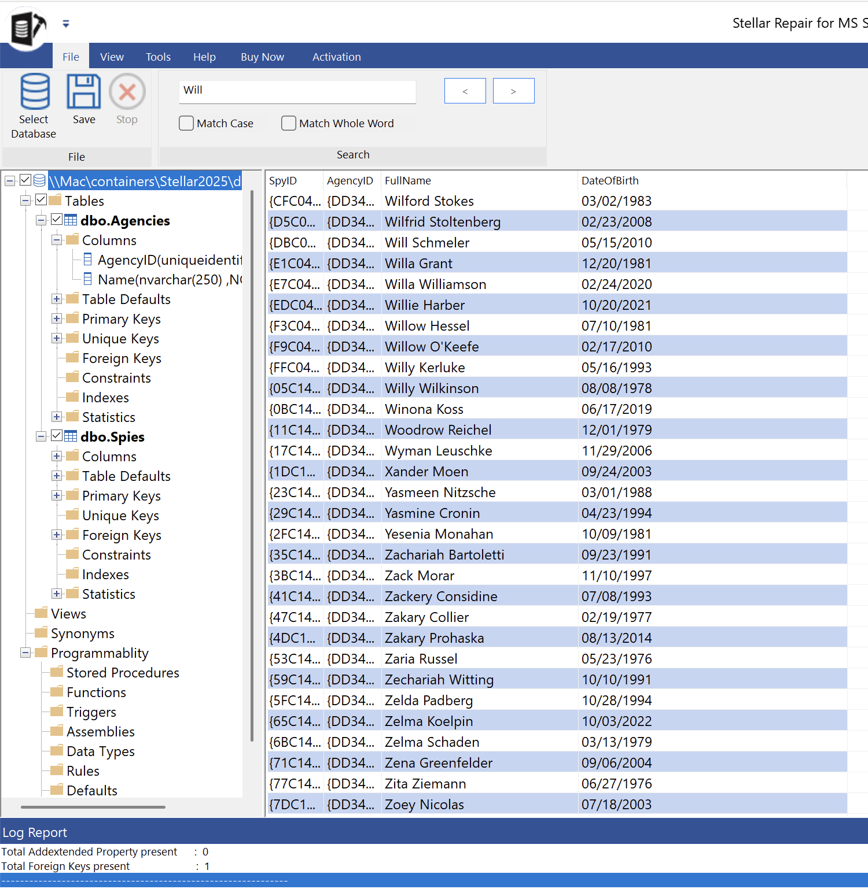

At the bottom is a log report, that you can use to view additional information.

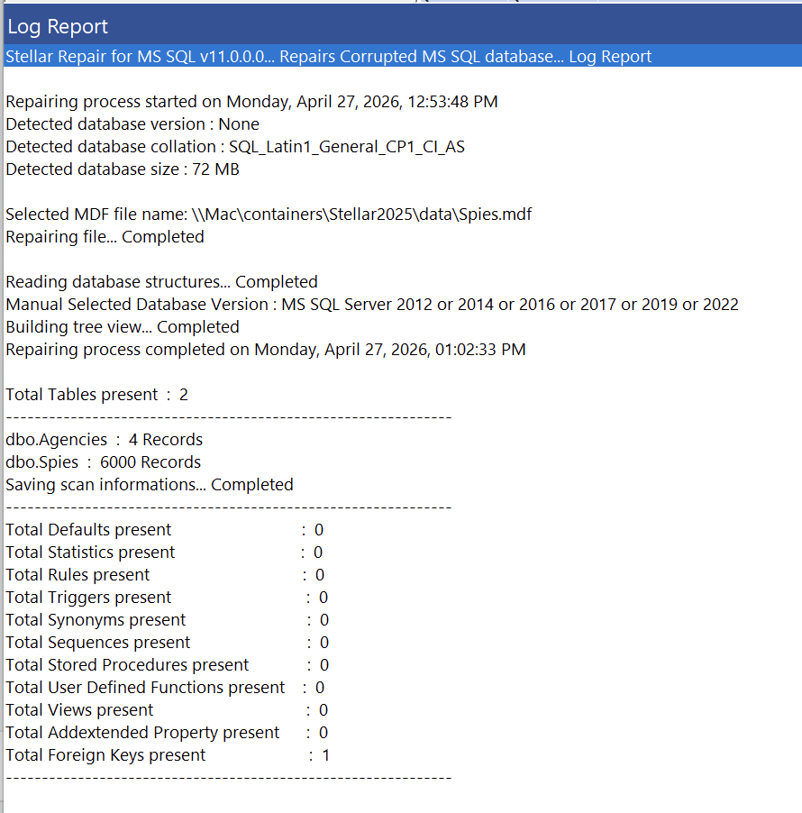

The UI offers a **search** functionality, but it **does not seem to work**.

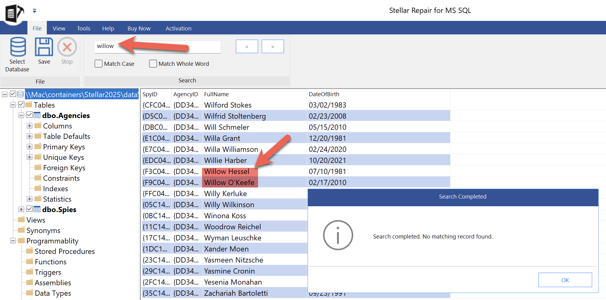

The options to save are the same as for the backup recovery.

## Existing database

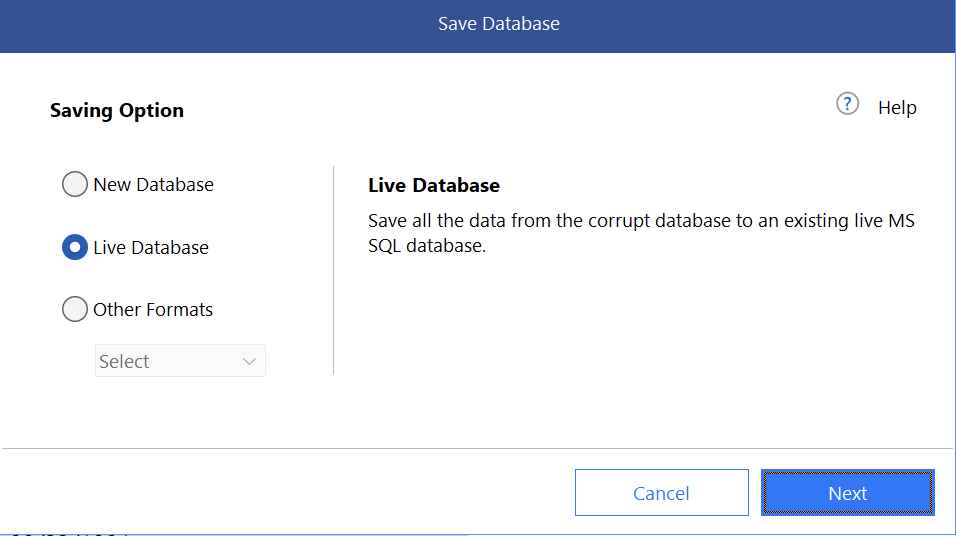

This allows you to connect to an existing database.

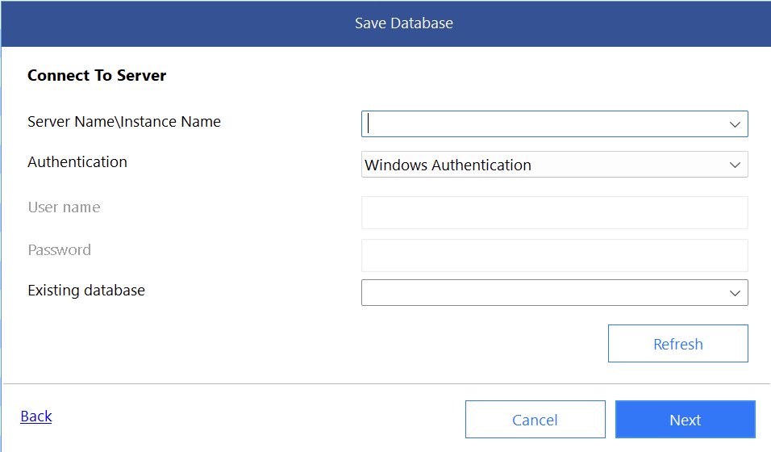

## New Database

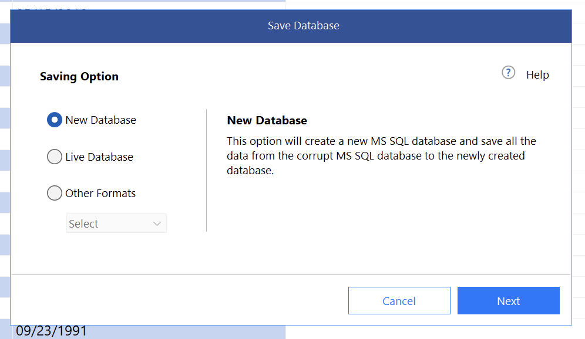

## Other Format

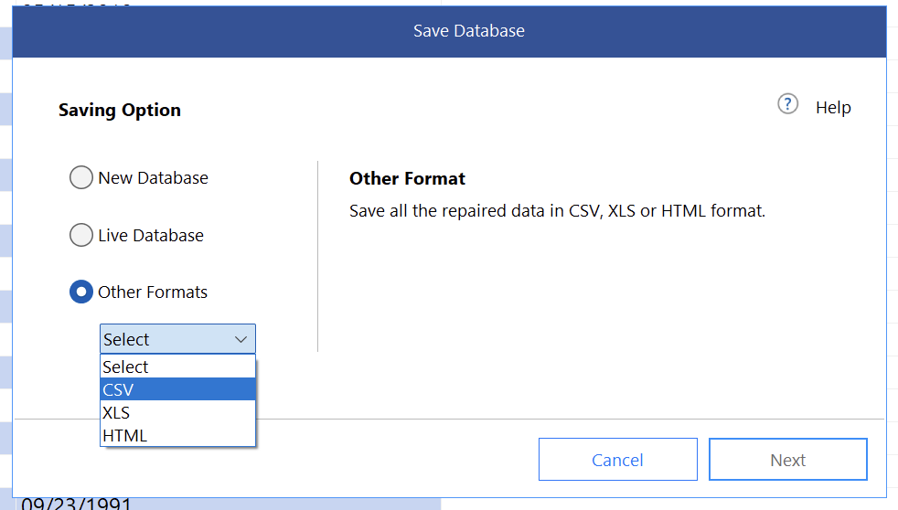

### TLDR

**Stellar Repair allows you to extract data and objects from a database file (`.mdf`).**

Happy hacking!
