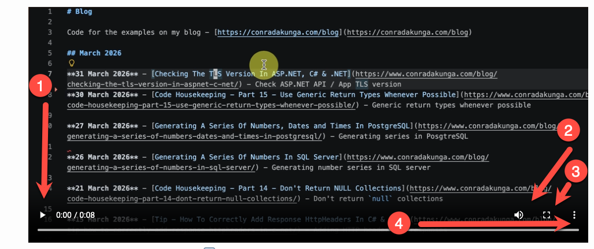
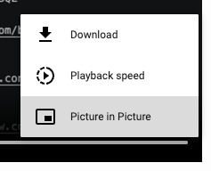

In our previous post, "[Tip - How To Quickly Move Lines In Your .NET IDE]()", we looked at how to move lines of text in your IDE.

At the bottom, I **embedded a video** of the tip.

I had an option to use a [GIF](https://en.wikipedia.org/wiki/GIF), but even after generating one, I decided **against** it for the following reasons:

1. The GIF was of noticeably **lower** quality
2. Video allowed for **better** quality
3. Video allowed configuration of **controls** to **play**/**pause** the content

How do you do it?

Embed video using the [video](https://developer.mozilla.org/en-US/docs/Web/HTML/Reference/Elements/video) tag.

The markup is as follows:

```html
<video controls>
<source src="../images/2026/05/ALTMoveText.mp4"/>
</video>
```

A couple of things to note:

1. The path to the source video is **relative**
2. The `controls` attribute specifies that the browser renders various UI elements to control the video like play/pause toggles.



1. This is the **play** button that **toggles** to **pause**
2. This is the **volume** control
3. This **fills** the screen with the video
4. Additional **options**



I think this gives users a better experience than a plain GIF.

### TLDR

**Use the video tag to embed videos in HTML & Jekyll**

Happy hacking!
