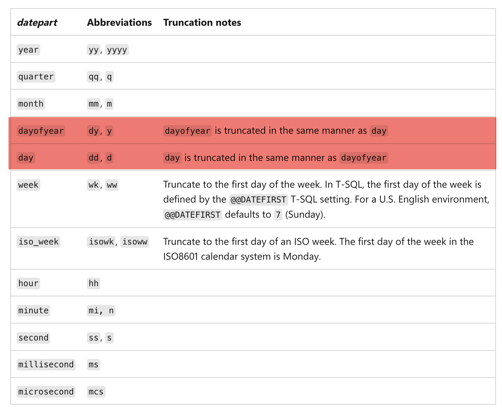

I was recently researching the SQL Server [DATETRUNC](https://learn.microsoft.com/en-us/sql/t-sql/functions/datetrunc-transact-sql?view=sql-server-ver17) function, which returns an **input date** **truncated** to the specified date part.

I was curious what exactly this entails, and the documentation (at least as I write this) has this **helpful** guide about how the `dayofyear` is truncated:

| *datepart*  | Abbreviations | Truncation notes                                     |
| ----------- | ------------- | ---------------------------------------------------- |
| `dayofyear` | `dy`, `y`     | `dayofyear` is truncated in the same manner as `day` |

Ok. Let me go and see what `day` says:

| *datepart* | Abbreviations | Truncation notes                                     |
| ---------- | ------------- | ---------------------------------------------------- |
| `day`      | `dd`, `d`     | `day` is truncated in the same manner as `dayofyear` |

They point to each other.

Ah, the joy of circular references!

Let us immortalize this in a screenshot:

Happy hacking!
