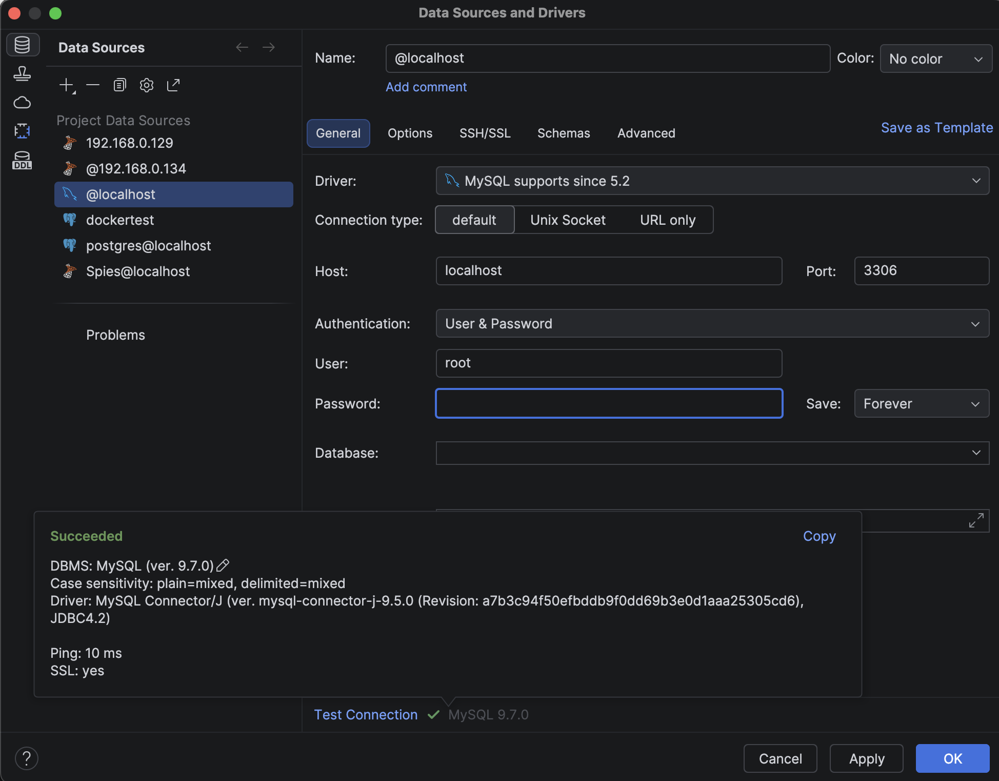
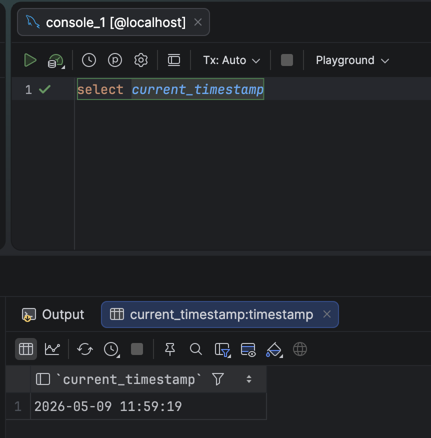

Thanks to the power and flexibility of [Docker](https://www.docker.com/), it is pretty trivial to spin up a [MySQL](https://www.mysql.com/) database instance for **development** and **experimentation**.

The most current version, as I write this, is 9.7.

The simplest way is to use a `docker-compose.yaml` file.

Below is a simple one that will spin up an instance that will always restart unless you explicitly shut it down.

```yaml
services:
  mysql:
    image: mysql:latest
    container_name: mysql
    restart: always
    environment:
      MYSQL_ROOT_PASSWORD: mystrongpassword123
      MYSQL_DATABASE: testdb
```

Once you shut down this instance, its data is lost.

If you want to persist the data, do it like this:

First, decide on a location in your file system where you want the persistent data to remain.

Mine is here - `/Users/rad/Docker/containers/MySQL`

We can update our **Docker Compose** file as follows:

```yaml
services:
  mysql:
    image: mysql:latest
    container_name: mysql
    restart: always
    environment:
      MYSQL_ROOT_PASSWORD: mystrongpassword123
      MYSQL_DATABASE: testdb
    volumes:
      - /Users/rad/Docker/containers/MySQL:/var/lib/mysql
```

As a habit, it is good to be explicit about the timezone.

Our final file looks like this:

```yaml
services:
  mysql:
    image: mysql:latest
    container_name: mysql
    restart: always
    environment:
      MYSQL_ROOT_PASSWORD: mystrongpassword123
      MYSQL_DATABASE: testdb
      TZ: Africa/Nairobi
    ports:
      - "3306:3306"
    volumes:
      - /Users/rad/Docker/containers/MySQL:/var/lib/mysql
```

Using your favourite tool of choice, you can verify that everything is working as expected.



You can then query to verify all is well.



My tool of choice here is [JetBrains](https://www.jetbrains.com/) [DataGrip](https://www.jetbrains.com/datagrip/), but you can use anything else, such as [MySQL Workbench](https://www.mysql.com/products/workbench/).

### TLDR

**Dockerized MySQL is very straightforward to set up.**

Happy hacking!
