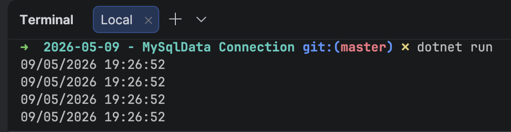

When it comes to working with [MySQL](https://www.mysql.com/) and [MariaDB](https://mariadb.org/) in C# & any of the languages on the .NET platform, the first port of call is which managed drivers to use.

Here, we have a number of choices:

| Driver                                                       | Comments                                                   |
| ------------------------------------------------------------ | ---------------------------------------------------------- |
| [MySqlConnector](https://mysqlconnector.net/)                | De facto standard, officially supporting MySQL and MariaDB |
| [MySql.Data](https://dev.mysql.com/downloads/)               | Official driver maintained by Oracle                       |
| [DevArt.Data.MySQL](https://www.devart.com/dotconnect/mysql/) | Commercial driver                                          |

In our previous post, "[Connecting To MySQL & MariaDB using MySQLConnector in C# & .NET]()", we looked at how to connect to [MySQL](https://www.mysql.com/) or [MariaDB](https://mariadb.org/) database from a .NET application using the [MySQLConnector](https://mysqlconnector.net/) [ADO.NET](https://learn.microsoft.com/en-us/dotnet/framework/data/adonet/) driver

In this post, we will look at how to use the [MySql.Data](https://www.nuget.org/packages/mysql.data/) package, the official driver built and maintained by [Oracle](https://www.oracle.com/).

Create a new project and then add the `MySql.Data` package as follows:

```bash
dotnet add package MySql.Data
```

We then write some code to **connect** to the database and fetch the **current date and time**.

```c#
using System.Data;
using MySql.Data.MySqlClient;

const string connectionString = "Server=localhost;userid=root;password=mystrongpassword123;database=testdb";

using (var cn = new MySqlConnection(connectionString))
{
    // Open the connection
    cn.Open();
    // Create a command object
    using (var cmd = cn.CreateCommand())
    {
        // Query the current date and time
        cmd.CommandText = "Select CURRENT_TIMESTAMP";
        // Get the result from command execution
        DateTime result = (DateTime)cmd.ExecuteScalar()!;
        // Write to console
        Console.WriteLine(result);
    }

    cn.Close();
}
```

You can also do it this way, though it is more **unwieldy**.

```c#
using System.Data;
using MySql.Data.MySqlClient;

const string connectionString = "Server=localhost;userid=root;password=mystrongpassword123;database=testdb";
using (var cn = new MySqlConnection(connectionString))
{
    // Open the connection
    cn.Open();
    // Create a command object
    using (var cmd = cn.CreateCommand())
    {
        // Query the current date and time
        cmd.CommandText = "Select CURRENT_TIMESTAMP";
        // Get a reader, specifying to close the connection when done
        using (var reader = cmd.ExecuteReader(CommandBehavior.CloseConnection))
        {
            // Fetch the date and time
            while (reader.Read())
            {
                // Write to console
                Console.WriteLine(reader.GetDateTime(0));
            }

            // Close the read
            reader.Close();
        }
    }
}
```

A benefit of this package is its support for [asynchronous](https://learn.microsoft.com/en-us/dotnet/csharp/asynchronous-programming/) operation.

So you can rewrite the previous samples.

The **scalar** version:

```c#
await using (var cn = new MySqlConnection(connectionString))
{
    // Open the connection
    await cn.OpenAsync();
    // Create a command object
    await using (var cmd = cn.CreateCommand())
    {
        // Query the current date and time
        cmd.CommandText = "Select CURRENT_TIMESTAMP";
        // Get the result from command execution
        DateTime result = (DateTime)(await cmd.ExecuteScalarAsync())!;
        // Write to console
        Console.WriteLine(result);
    }

    await cn.CloseAsync();
}
```

The **reader** version

```c#
using (var cn = new MySqlConnection(connectionString))
{
    // Open the connection
    await cn.OpenAsync();
    // Create a command object
    using (var cmd = cn.CreateCommand())
    {
        // Query the current date and time
        cmd.CommandText = "Select CURRENT_TIMESTAMP";
        // Get a reader, specifying to close the connection when done
        await using (var reader = await cmd.ExecuteReaderAsync(CommandBehavior.CloseConnection))
        {
            // Fetch the date and time
            while (await reader.ReadAsync())
            {
                // Write to console
                Console.WriteLine(reader.GetDateTime(0));
            }

            // Close the read
            await reader.CloseAsync();
        }
    }
}
```

If we run this program, we should get something like this in the console:



You will note that the code is **identical** to that in the [previous post]().

### TLDR

**You can use the `MySql.Data` to connect to MySQL and MariaDB databases.**

The code is in my [GitHub](https://github.com/conradakunga/BlogCode/tree/master/2026-05-09%20-%20MySqlData%20Connection).

Happy hacking!
