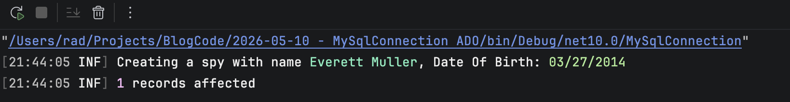
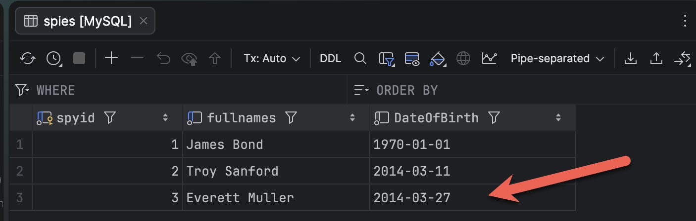
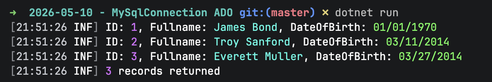
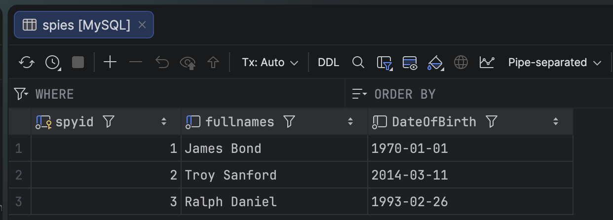
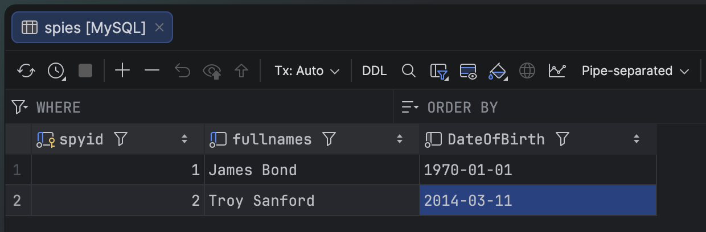

In two prior posts, "[Connecting To MySQL & MariaDB using MySqlConnector in C# & .NET]()" and "[Connecting To MySQL & MariaDB using MySql.Data in C# & .NET]()", we looked at how to connect to a [MySQL](https://www.mysql.com/) and [MariaDB](https://mariadb.org/) databases using two different [ADO.NET](https://learn.microsoft.com/en-us/dotnet/framework/data/adonet/) MySQL **providers**.

In this post we will look at how to work with the ADO.NET primitives to interface with each of the databases and perform the following:

1. Insert
2. List
3. Update
4. Delete

For this set of exercises, we will use a table with the following schema:

```sql
CREATE TABLE spies (
  spyid int NOT NULL AUTO_INCREMENT,
  fullnames varchar(100) not null,
  dateofbirth date not null
  PRIMARY KEY (spyid),
  UNIQUE KEY spies_uq_fullnames (fullnames)
)
```

## Insert

For an **insert** we need to do the following:

1. Create a `MySqlConnection`
2. Create a `MySqlCommand`
3. Create a **parameterized** query
4. **Pass the parameters**, using `MySqlParameter` objects
5. **Execute** the query

The code looks like this:

```c#
using MySqlConnector;
using Serilog;

Log.Logger = new LoggerConfiguration()
    .WriteTo.Console()
    .CreateLogger();

const string connectionString = "Server=localhost;userid=root;password=mystrongpassword123;database=testdb";

await using (var cn = new MySqlConnection(connectionString))
{
    // Open the connection
    await cn.OpenAsync();
    // Create a command object
    await using (var cmd = cn.CreateCommand())
    {
        // Set the command tet
        cmd.CommandText = "INSERT spies(fullnames,dateofbirth) values (@fullnames,@dateofbirth)";
        //
        // Populate the parameters
        //
        var pFullnames = new MySqlParameter("@fullnames", MySqlDbType.VarChar, 100)
        {
            Value = "James Bond"
        };
        var pDateOfBirth = new MySqlParameter("@dateofbirth", MySqlDbType.Date, 16)
        {
            Value = new DateTime(1970, 1, 1)
        };
        // Add parameters to command
        cmd.Parameters.Add(pFullnames);
        cmd.Parameters.Add(pDateOfBirth);
        // Execute query
        var result = await cmd.ExecuteNonQueryAsync();
        Log.Information("{Count} records affected", result);
    }

    await cn.CloseAsync();
}
```

If we run the code we should see the following:



Querying the database should show the data:



## List

For an update, the sequence is as follows:

1. Create a `MySqlConnection`
2. Create a `MySqlCommand`
3. Write a **query** to fetch the data you want
4. **Execute** the `MySqlCommand` to return a `MySqlDataReader` object
5. **Loop** for as long as the `MySqlDataReader` can read and print the result

The code is as follows:

`````c#
await using (var cn = new MySqlConnection(connectionString))
{
    // Open the connection
    await cn.OpenAsync();
    // Create a command object
    await using (var cmd = cn.CreateCommand())
    {
        int counter = 0;
        // Set the command tet
        cmd.CommandText = "SELECT spyid, fullnames,dateofbirth FROM spies";
        // Execute query
        var reader = await cmd.ExecuteReaderAsync(CommandBehavior.CloseConnection);
        while (reader.Read())
        {
            // Get ordinal allows us to use the name to get the ordinal position
            spyID = reader.GetInt32(reader.GetOrdinal("spyid"));
            var fullnames = reader.GetString(reader.GetOrdinal("fullnames"));
            var dateofbirth = reader.GetDateOnly(reader.GetOrdinal("dateofbirth"));
            Log.Information("ID: {ID}, Fullname: {Fullnames}, DateOfBirth: {DateOfBirth}", spyID, fullnames,
                dateofbirth);
            counter++;
        }

        await reader.CloseAsync();

        Log.Information("{Count} records returned", counter);
    }
}
`````

This will return something like the following:



## Update

The steps for an **update** are the same as for an **insert**:

1. Create a `MySqlConnection`
2. Create a `MySqlCommand`
3. Create a **parameterized** query
4. **Pass the parameters**, using `MySqlParameter` objects
5. **Execute** the query

The difference here is the structure of the query.

The code is as follows:

```c#
await using (var cn = new MySqlConnection(connectionString))
{
    // Open the connection
    await cn.OpenAsync();
    // Create a command object
    await using (var cmd = cn.CreateCommand())
    {
        var spy = faker.Generate();
        // Set the command tet
        cmd.CommandText = "UPDATE spies SET fullnames=@fullnames, dateofbirth=@dateofBirth WHERE spyid=@spyid";
        //
        // Populate the parameters
        //
        var pFullnames = new MySqlParameter("@fullnames", MySqlDbType.VarChar, 100)
        {
            Value = spy.Fullnames
        };
        var pDateOfBirth = new MySqlParameter("@dateofbirth", MySqlDbType.Date, 16)
        {
            Value = spy.DateOfBirth
        };
        var pSpyID = new MySqlParameter("@spyid", MySqlDbType.Int16, 16)
        {
            Value = spyID
        };
        // Add parameters to command
        cmd.Parameters.Add(pFullnames);
        cmd.Parameters.Add(pDateOfBirth);
        cmd.Parameters.Add(pSpyID);
        Log.Information("Updating spy fullname and date of birth to {Fullnames} and {DateOfBirth}", spy.Fullnames,
            spy.DateOfBirth);
        // Execute query
        var result = await cmd.ExecuteNonQueryAsync();
        Log.Information("{Count} records affected", result);
    }

    await cn.CloseAsync();
}
```

This will return the following:


And if we check in our database, the last record has changed.



## Delete

The steps for a delete are the same as those for insert and update:

1. Create a `MySqlConnection`
2. Create a `MySqlCommand`
3. Create a **parameterized** query
4. **Pass the parameters**, using `MySqlParameter` objects
5. **Execute** the query

The only parameter we need is **what to delete**, specified by `SpyID`.


If we view our data, the relevant row is gone.



**IMPORTANT: This code will still work regardless of the MySQL ADO.NET provider you use.**

### TLDR

**You can use ADO.NET primitives to fetch and manipulate data from `MySQL` and `MariaDB`.**

The code is in my [GitHub](https://github.com/conradakunga/BlogCode/tree/master/2026-05-10%20-%20MySqlConnection%20ADO).

Happy hacking!
