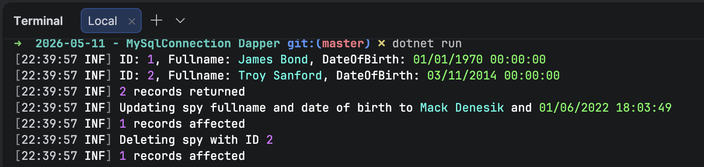

In our previous post, "[Interfacing With MySQL & MariaDB Databases in C# & .NET]()", we looked at how to interface with [MySQL](https://www.mysql.com/) and [MariaDB](https://mariadb.org/) using the [ADO.NET](https://learn.microsoft.com/en-us/dotnet/framework/data/adonet/) primitives - [Connections](https://learn.microsoft.com/en-us/dotnet/api/system.data.common.dbconnection?view=net-10.0), [Commands](https://learn.microsoft.com/en-us/dotnet/api/system.data.common.dbcommand?view=net-10.0) and [Parameters](https://learn.microsoft.com/en-us/dotnet/api/system.data.common.dbparameter?view=net-10.0) using either of the MySQL providers.

In this post we will look at how to realize the same using Dapper, a library we have talked about extensively.

1. **Insert**
2. **List**
3. **Update**
4. **Delete**

For this set of exercises, we will use a table with the following schema:

```sql
CREATE TABLE spies (
  spyid int NOT NULL AUTO_INCREMENT,
  fullnames varchar(100) not null,
  dateofbirth datetime not null
  PRIMARY KEY (spyid),
  UNIQUE KEY spies_uq_fullnames (fullnames)
)
```

We will use the following type:

```c#
public sealed class Spy
{
    public required int spyID { get; init; }
    public required string Fullnames { get; init; }
    public required DateOnly DateOfBirth { get; init; }
}
```

## Insert

The process here is:

1. Create a `MySqlConnection`
2. Create a `DynamicParameters` object, specifying the **insert values**
3. Run `ExecuteAsync` on the `MySqlConnection`, providing a **query** and the `DynamicParameters` object.

The code is as follows:

```c#
// Configure a faker
var faker = new Faker<Spy>()
    .RuleFor(f => f.Fullnames, f => f.Person.FullName)
    .RuleFor(f => f.DateOfBirth, f => f.Date.Past(50));

await using (var cn = new MySqlConnection(connectionString))
{
    // Generate a new spy
    var spy = faker.Generate();
    // Create the Dapper dynamic parameters
    var param = new DynamicParameters();
    param.Add("fullnames", spy.Fullnames);
    param.Add("dateofbirth", spy.DateOfBirth);

    Log.Information("Creating a spy with name {Fullnames}, Date Of Birth: {DateOfBirth}", spy.Fullnames,
        spy.DateOfBirth);
    // Execute query
    const string query = "INSERT spies (fullnames,dateofbirth) values (@fullnames,@dateofbirth)";
    var result = await cn.ExecuteAsync(query, param);
    Log.Information("{Count} records affected", result);
}
```

## List

For the **list** process:

1. Create a `MySqlConnection`
2. Run the generic`QueryAsync` on the `MySqlConnection`, providing a **query**

This code will return a list of `Spy` objects.

```c#
var spies = new List<Spy>();

await using (var cn = new MySqlConnection(connectionString))
{
    spies = (await cn.QueryAsync<Spy>("SELECT spyid, fullnames,dateofbirth FROM spies")).AsList();
    spies.ForEach(spy =>
        Log.Information("ID: {ID}, Fullname: {Fullnames}, DateOfBirth: {DateOfBirth}",
            spy.spyID, spy.Fullnames,
            spy.DateOfBirth));
}

Log.Information("{Count} records returned", spies.Count);
```

## Update

The process here is the same as that for **Insert**:

1. Create a `MySqlConnection`
2. Create a `DynamicParameters` object, specifying the **insert values**
3. Run `ExecuteAsync` on the `MySqlConnection`, providing a **query** and the `DynamicParameters` object.

The code is as follows:

```c#
await using (var cn = new MySqlConnection(connectionString))
{
    // Generate a new spy
    var spy = faker.Generate();
    //Create the Dapper dynamic parameters
    var param = new DynamicParameters();
    param.Add("fullnames", spy.Fullnames);
    param.Add("dateofbirth", spy.DateOfBirth);
    param.Add("spyid", spyID);
    const string query = "UPDATE spies SET fullnames=@fullnames, dateofbirth=@dateofBirth WHERE spyid=@spyid";
    Log.Information("Updating spy fullname and date of birth to {Fullnames} and {DateOfBirth}", spy.Fullnames,
        spy.DateOfBirth);
    // Execute the query
    var result = await cn.ExecuteAsync(query, param);
    Log.Information("{Count} records affected", result);

```

## Delete

The process here is the same as that for **Insert** and **Update**:

1. Create a `MySqlConnection`
2. Create a `DynamicParameters` object, specifying the `SpyID` to delete
3. Run `ExecuteAsync` on the `MySqlConnection`, providing a **query** and the `DynamicParameters` object.

```c#
await using (var cn = new MySqlConnection(connectionString))
{
    var param = new DynamicParameters();
    param.Add("spyid", spyID);
    const string query = "DELETE from spies WHERE spyid=@spyid";
    Log.Information("Deleting spy with ID {ID}", spyID);
    // Execute query
    var result = await cn.ExecuteAsync(query, param);
    Log.Information("{Count} records affected", result);
}
```

Running the entire program yields the following:



We can see here that there is **considerably less code**, making it **easier to maintain**.

### TLDR

**Dapper can drastically simplify working with `MySQL` and `MariaDB`.**

The code is in my GitHub.

Happy hacking!
