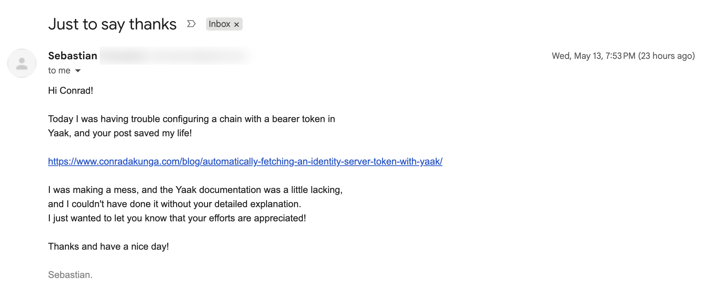
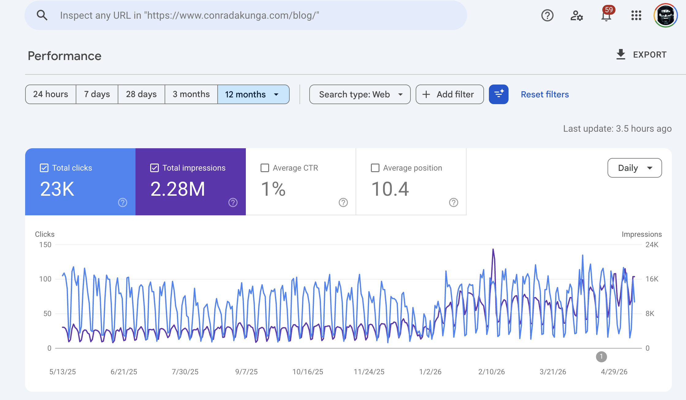

A question I occasionally get is, "Why do you put so much work into this blog?"

And my answer has been this:

1. It is a **reference** source for me
2. It helps me **think** through and understand some concepts
3. I **prove a point to myself** and to others that it is possible to dive deeply into a technical topic and write regularly about it
4. If I have had a problem, chances are **someone else has had the same problem and can benefit** from my writing
5. There are a lot of **novice and junior developers** who would benefit from my writing
6. Sample code and practical demonstrations **will likely be useful** to many

Occasionally, I get email from readers, like this one I received today:

Thank you, Sebastian!

On a whim, I went to check the statistics on [Google Analytics](https://developers.google.com/analytics).

This is much higher than I expected, in an age where writing (and reading) seem to be falling out of fashion.

But it is the feedback from readers who have benefited from the blog that makes me happiest.

Happy hacking!
