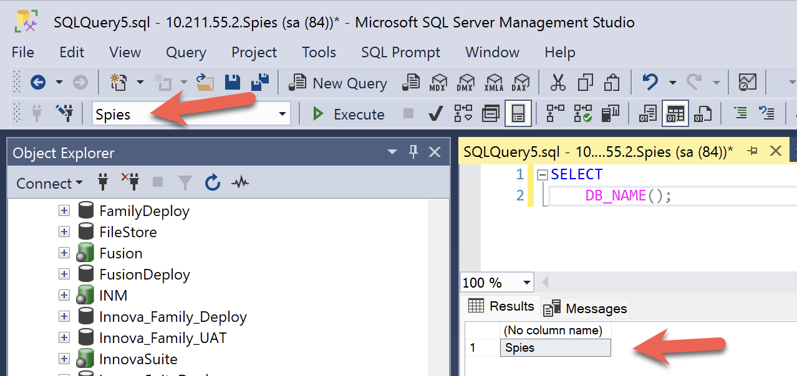
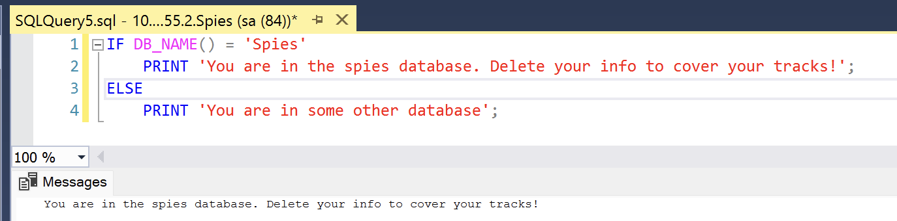

Sometimes, while writing a [stored procedure](https://learn.microsoft.com/en-us/sql/relational-databases/stored-procedures/stored-procedures-database-engine?view=sql-server-ver17) or a [function](https://learn.microsoft.com/en-us/sql/relational-databases/user-defined-functions/user-defined-functions?view=sql-server-ver17) in [Microsoft SQL Server](https://www.microsoft.com/en-us/sql-server), you might want to access the **current database**. Either for **information** purposes or for conditional, database-specific **logic**.

The solution to this is the system function [DB_NAME()](https://learn.microsoft.com/en-us/sql/t-sql/functions/db-name-transact-sql?view=sql-server-ver17)

```sql
SELECT DB_NAME()
```

This will return a result like this:



You can use this for database-specific logic:

```sql
IF DB_NAME() = 'Spies'
    PRINT 'You are in the spies database. Delete your info to cover your tracks!';
ELSE
    PRINT 'You are in some other database';
```

This will return something like this:



### TLDR

**You can use the `DB_NAME()` function to find out which database you are currently using.**

Happy hacking!
