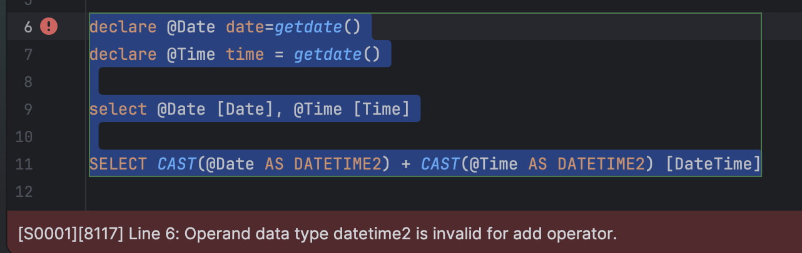

Yesterday's post, "[Combining A Date and a Time into a DateTime in SQL Server]()", looked at how to combine a `date` and a `time` into a `datetime` in [Microsoft SQL Server](https://www.microsoft.com/en-us/sql-server).

In this post, we will look at how to do the same, but into a [DateTime2](https://learn.microsoft.com/en-us/sql/t-sql/data-types/datetime2-transact-sql?view=sql-server-ver17).

In the previous post, I noted that this would fail:

```sql
declare @Date date=getdate()
declare @Time time = getdate()

select @Date [Date], @Time [Time]

SELECT CAST(@Date AS DATETIME2) + CAST(@Time AS DATETIME2) [DateTime]
```

Which it does:



We will have to take a different approach here - using the [dateadd](https://learn.microsoft.com/en-us/sql/t-sql/functions/dateadd-transact-sql?view=sql-server-ver17) function.

```c#
SELECT DATEADD(SECOND, DATEDIFF(SECOND, '00:00:00', @Time), CAST(@Date AS DATETIME2)) [DateTime2]
```

This will give us our expected result:


### TLDR

**You can use the `dateadd` function to combine a `date` and a `time` into a `datetime2`.**

Happy hacking!
