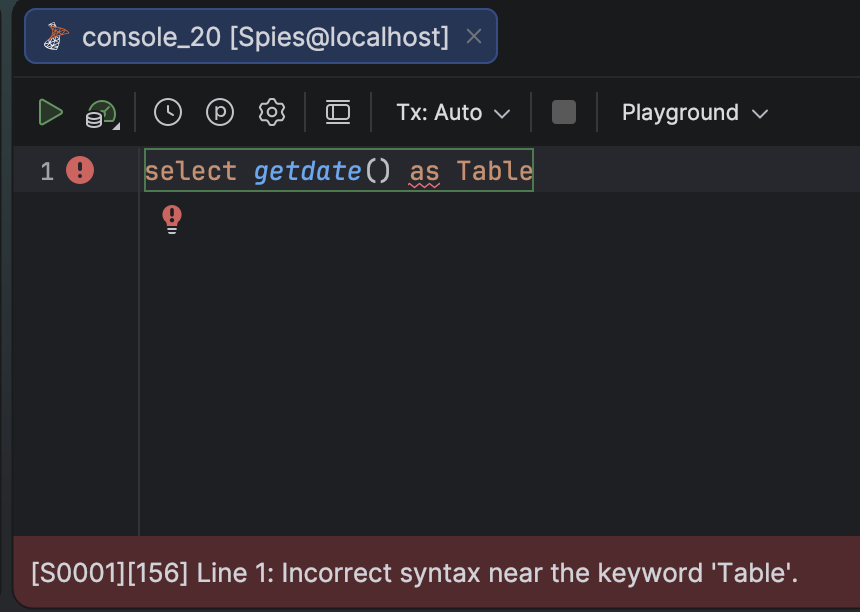
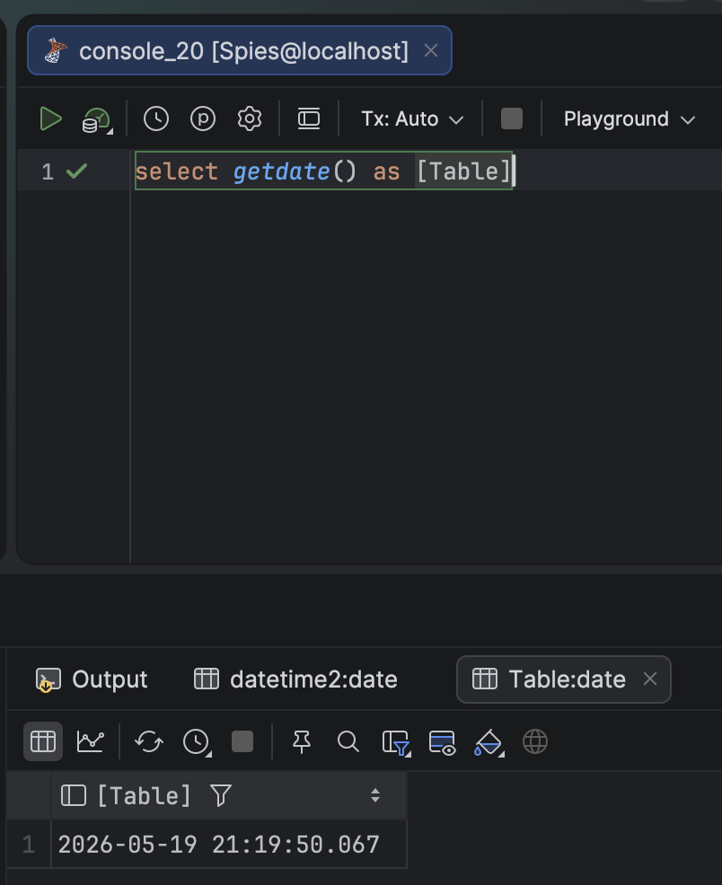

Generally, it is advisable **not** to use [reserved words](https://learn.microsoft.com/en-us/sql/t-sql/language-elements/reserved-keywords-transact-sql?view=sql-server-ver17) for your column names in [Microsoft SQL Server](https://www.microsoft.com/en-us/sql-server). Or, for that matter, **any other database**.

Take this example:

```sql
select getdate() as Table
```

This will return an error:



If, however, you **really, really** want to use the name `Table`, you do it like this:

```sql
select getdate() as [Table]
```

This will work:



This relies on enclosing the name in **square brackets** - `[` and `]`

You can also use **double quotes**:

```sql
select getdate() as "Table"
```

As well as **single quotes**:

```sql
select getdate() as 'Table'
```

### TLDR

**To use reversed words as column names in Microsoft SQL Server, enclose the name in one of the following - brackets `[]`, single quotes `''` or double quotes `""`.**

Happy hacking!
