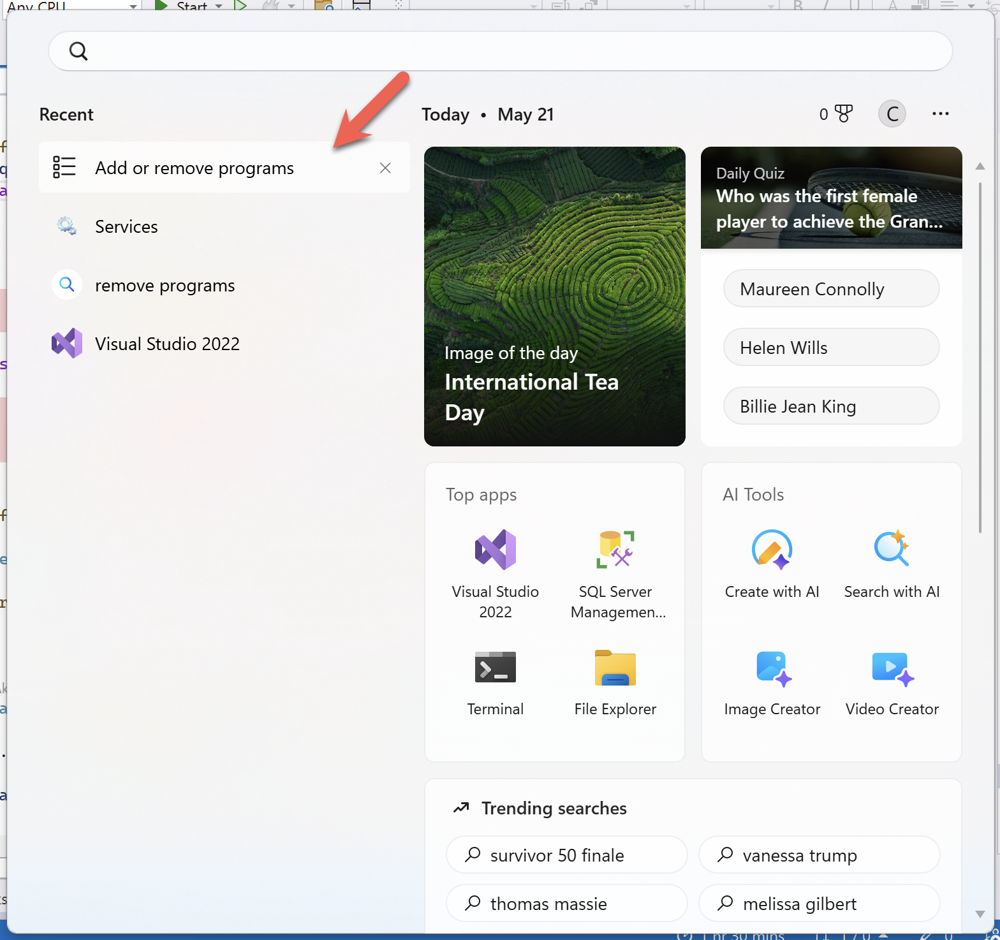
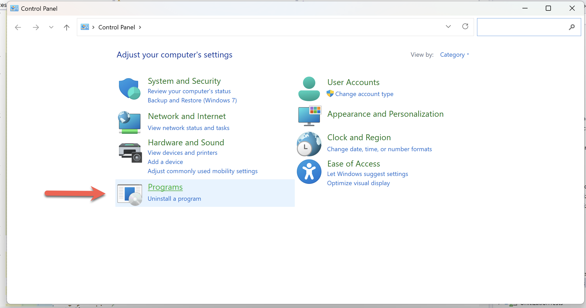
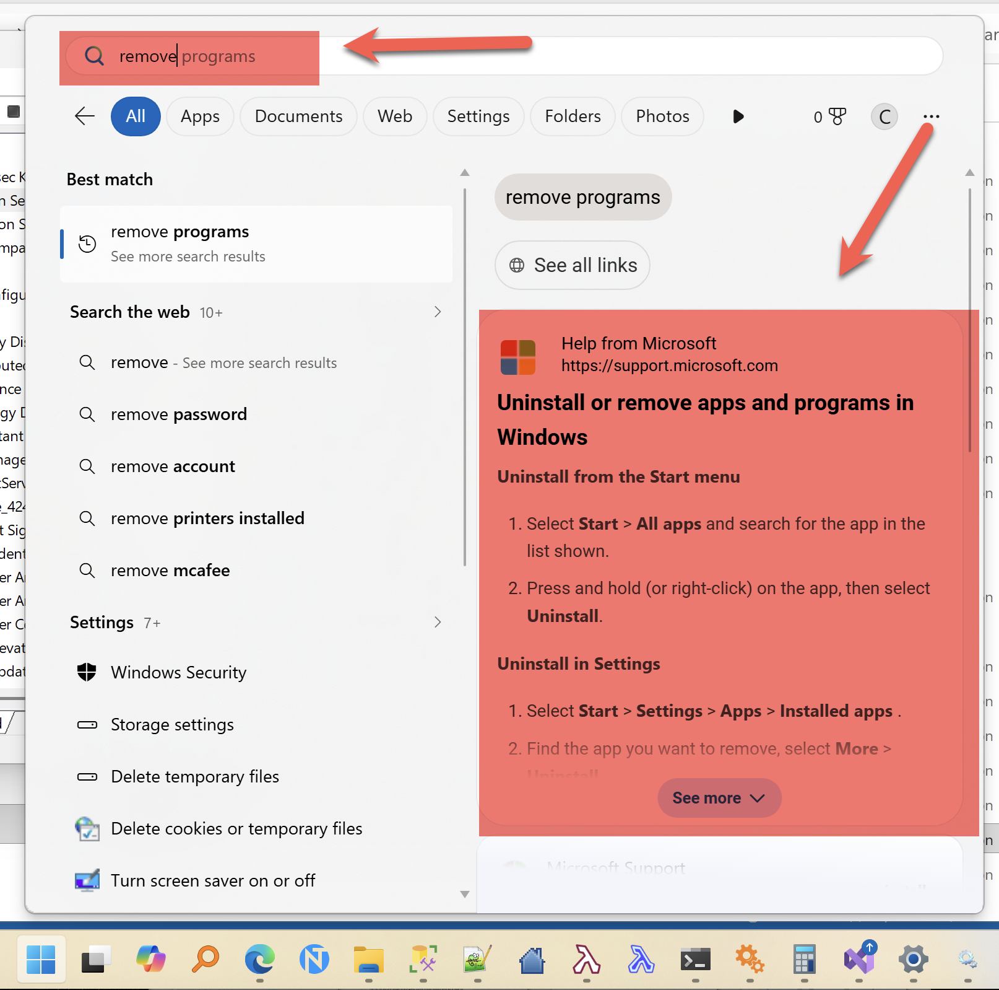

An activity you will occasionally have to carry out is **maintenance** of the **software** on your machine. This will typically involve **adding** and / or **removing** software.

In [Windows 11](https://en.wikipedia.org/wiki/Microsoft_Windows), this is done using the [Add Remove Programs](https://support.microsoft.com/en-us/windows/uninstall-or-remove-apps-and-programs-in-windows-4b55f974-2cc6-2d2b-d092-5905080eaf98) applet.

This is actually a **shortcut** to the actual applet that is in the [Control Panel](https://www.computerhope.com/issues/control-panel.htm).

You'd think it would be easy to find this using search on the [Start Menu](https://www.microsoft.com/en-us/windows/tips/start-menu).

You would be wrong.

It has searched **everywhere else**, including **online**, but where the applet ought to be - **locally**!

### TLDR

**Search on Windows 11 start menu is broken.**
