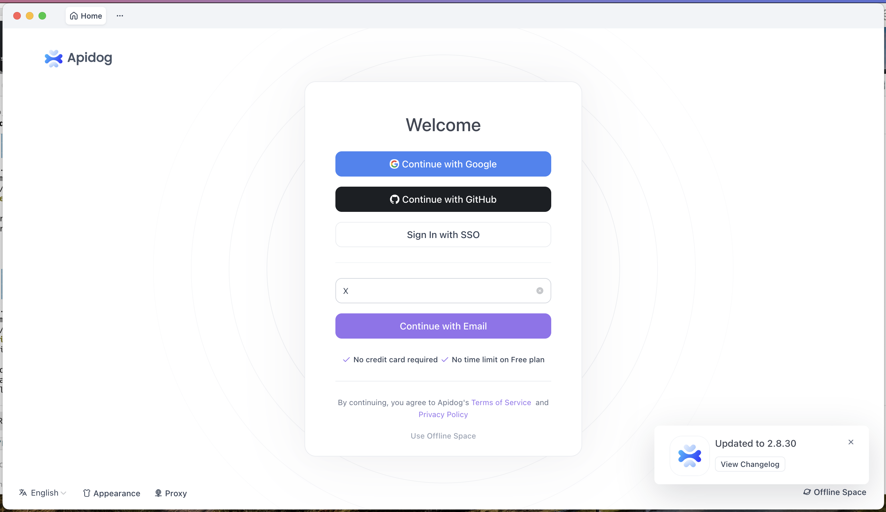

As I've mentioned before, for many years I was a keen user of [Insomnia](https://insomnia.rest/) as a tool for testing APIs.

Until the unfortunate process of [enshittification]() caught up with it. Which, as a software developer, I **totally understand**.

But it still **sucks**.

The same has caught up with [APIDog](https://apidog.com/).

### TLDR

Alas! Many previously free tools eventually succumb to the pull of [enshittification](https://en.wikipedia.org/wiki/Enshittification).
