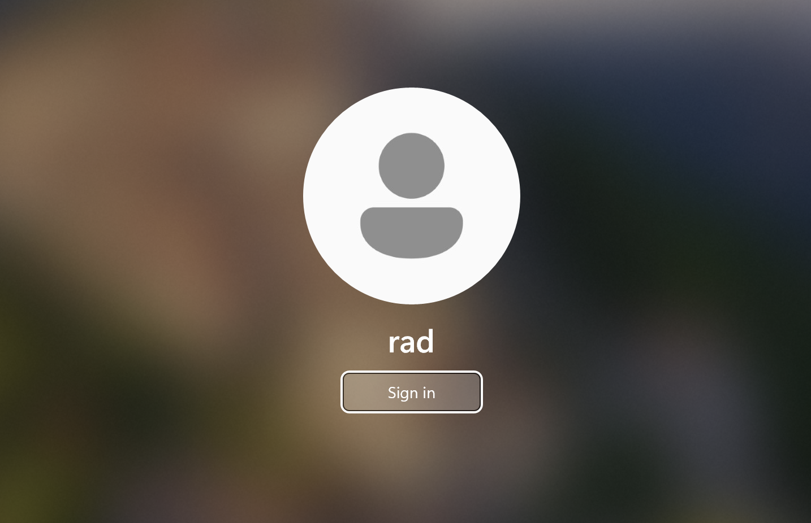

This is my current Windows 11 lock screen.


From this screen, you cannot use the computer until you enter your password, PIN or fingerprint.



I wanted to add functionality to an application that I am maintaining that would lock your computer once you logged out of it.

This turns out to be pretty trivial.

We need the magic of [interop](https://learn.microsoft.com/en-us/dotnet/api/system.runtime.interopservices.dllimportattribute?view=netframework-4.8.1) where we access the Windows API from C# and reference the [LockWorkStation()](https://learn.microsoft.com/en-us/windows/win32/api/winuser/nf-winuser-lockworkstation) method.

```c#
[DllImport("user32")]
public static extern void LockWorkStation()
```

We can then call this method from our code.

```c#
//
// Your code here
//
LockWorkStation()
```

### TLDR

**You can lock your Windows computer by calling the `LockWorkStation()` method from the Windows API**

Happy hacking!
