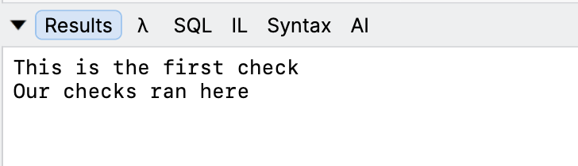
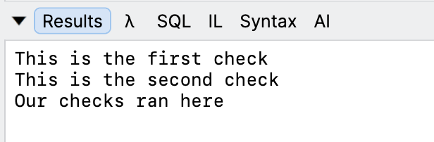

Some years back, in the post "[A Rose By Any Other Name - Short Circuiting]()", we looked at how [Visual Basic .NET](https://learn.microsoft.com/en-us/dotnet/visual-basic/) **does not** do [short-circuit evaluation](https://en.wikipedia.org/wiki/Short-circuit_evaluation) when evaluating an `AND` condition.

In this post, we will look at a **similar** scenario, but with the `OR` condition.

Take this [C#](https://learn.microsoft.com/en-us/dotnet/csharp/) code, where we have two methods:

```c#
public bool FirstCheck()
{
	Console.WriteLine("This is the first check");
	return true;
}


public bool SecondCheck()
{
	Console.WriteLine("This is the second check");
	return true;
}
```

We then call these methods as follows:

```c#
if (FirstCheck() || SecondCheck())
{
	Console.WriteLine("Our checks ran here");
}
```

The following will be printed on your console:



Here we can see that the second method, `SecondCheck()`, **never ran**.

This is **short-circuit behavior**, meaning the **runtime decides there is no point in evaluating the second condition**, given the **first** is **true**.

Let us mirror this code in `VB.NET`.

First, our methods:

```vb
Public Function FirstCheck() As Boolean
	Console.WriteLine("This is the first check")
	Return True
End Function

Public Function SecondCheck() As Boolean
	Console.WriteLine("This is the second check")
	Return True
End Function
```

Next, the invocation:

```vb
If FirstCheck() Or SecondCheck() Then
	Console.WriteLine("Our checks ran here")
End If
```

This will print the following:



Of interest here is that both methods have ran, as **VB.NET does not short circuit**.

If you **want short circuit behaviour**, you can use the [OrElse](https://learn.microsoft.com/en-us/dotnet/visual-basic/language-reference/operators/orelse-operator) operator, like so:

```vb
If FirstCheck() OrElse SecondCheck() Then
	Console.WriteLine("Our checks ran here")
End If
```

This will print the expected:


### TLDR

**VB.NET does not short-circuit `OR` evaluation. To get that behaviour, use the `OrElse` operator.**

Happy hacking!
