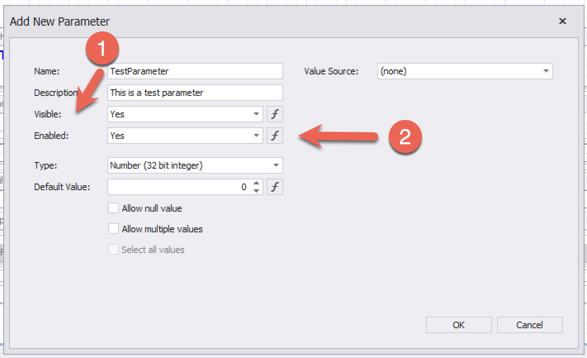

When creating a parameter object for a [DevExpress](https://www.devexpress.com/) [XtraReport](https://docs.devexpress.com/XtraReports/DevExpress.XtraReports.UI.XtraReport), the screen for creating [parameters](https://docs.devexpress.com/CoreLibraries/DevExpress.XtraReports.Parameters.Parameter) looks like this:

You might wonder what the difference is between `Visible` and `Enabled`.

[Enabled](https://docs.devexpress.com/CoreLibraries/DevExpress.XtraReports.Parameters.Parameter.Enabled) controls whether the parameter allows the **user to edit its value** at runtime.

[Visible](https://docs.devexpress.com/CoreLibraries/DevExpress.XtraReports.Parameters.Parameter.Visible) controls whether the parameter is **shown** in the parameters panel UI.

If you are providing the parameter value programmatically in your code, you typically want **both** to be `false`.

Happy hacking!
