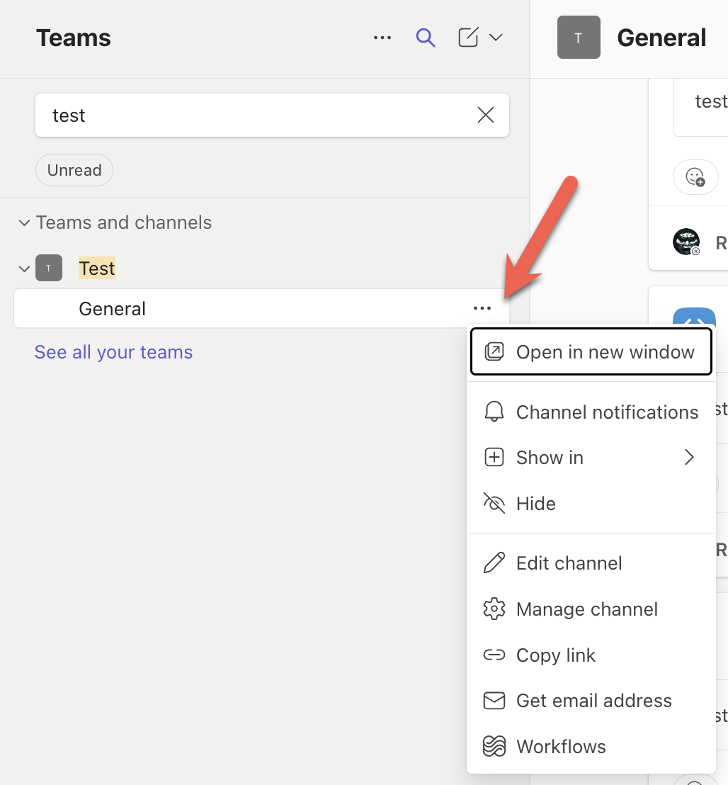
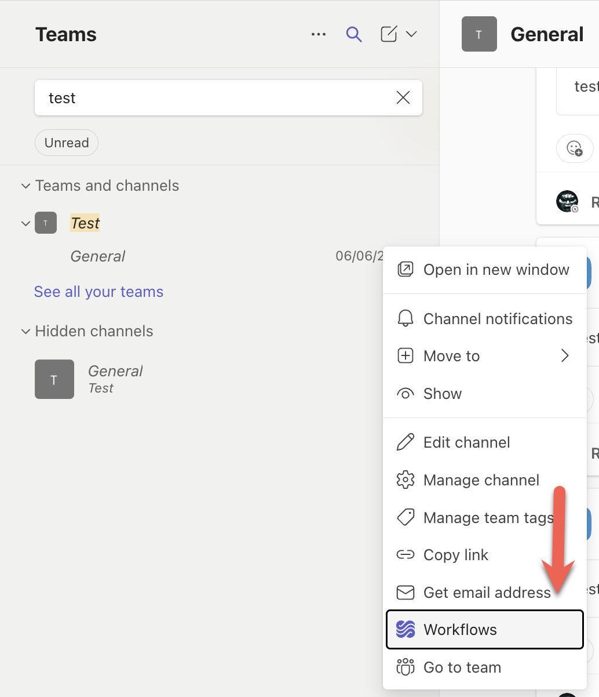
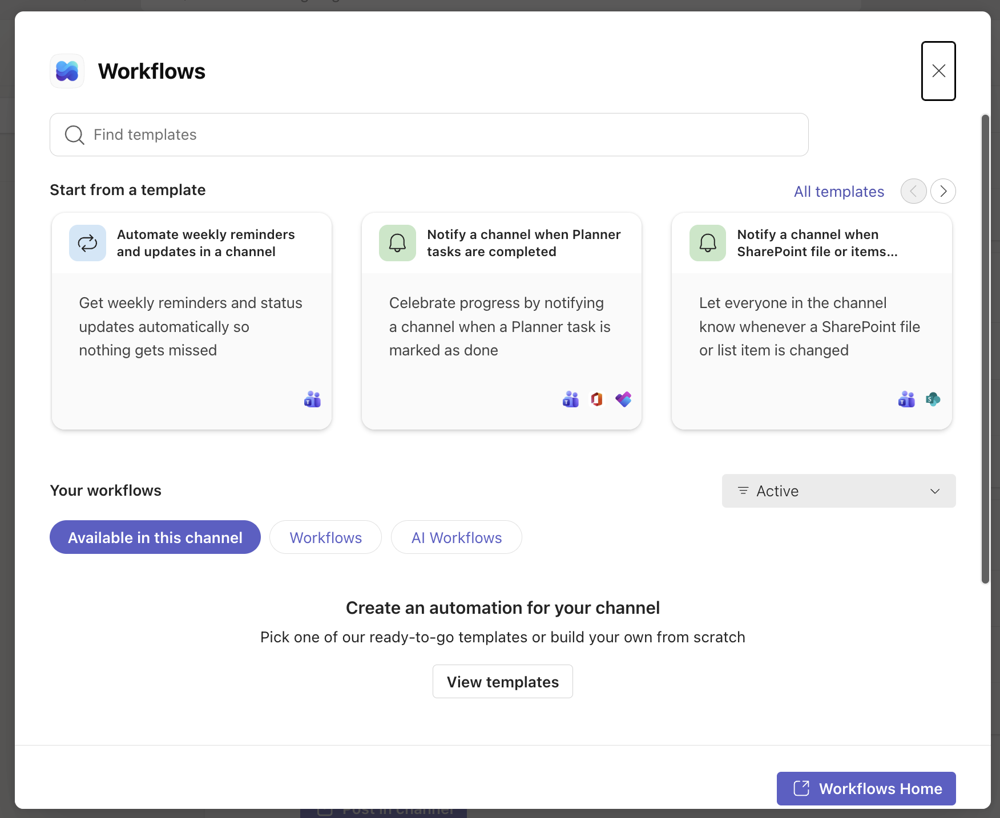
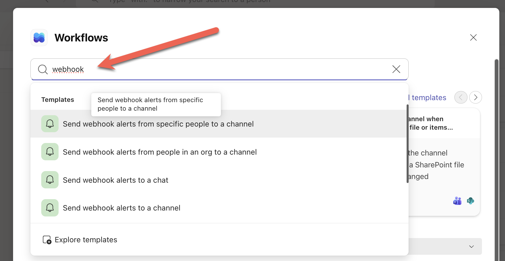
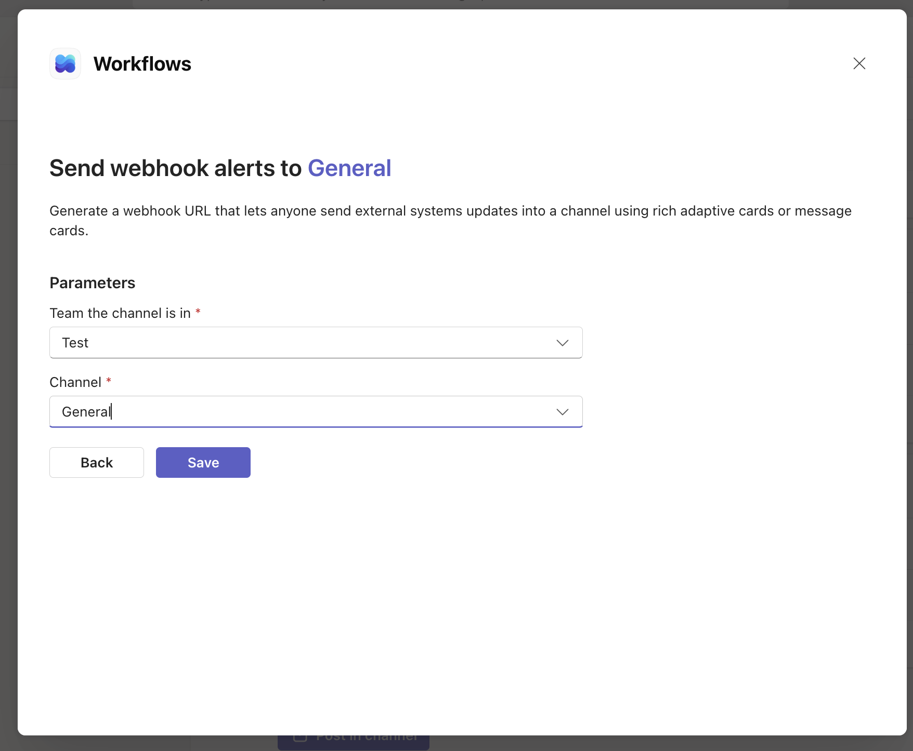
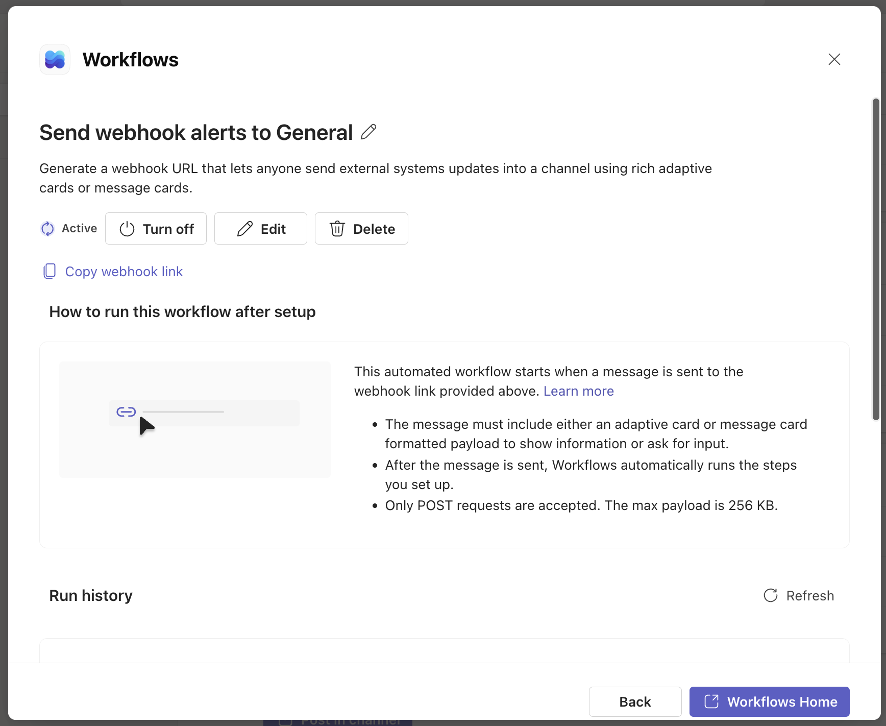
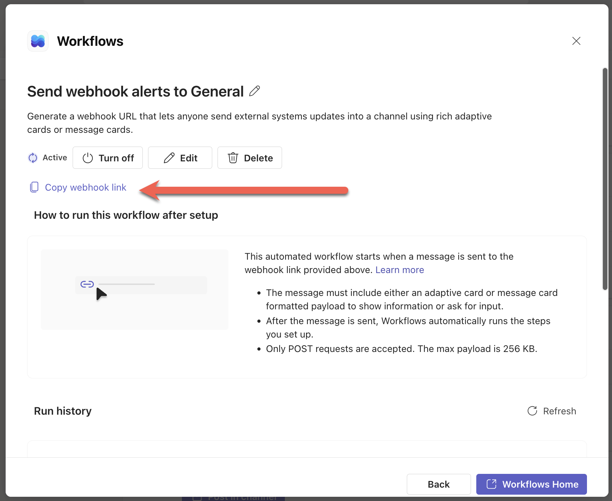

In a previous post, some 6 years ago, "[Posting Messages To Microsoft Teams With Code]()", we looked at how to configure a [Microsoft Teams](https://www.microsoft.com/en-us/microsoft-teams/group-chat-software) channel to receive and process [webhooks](https://en.wikipedia.org/wiki/Webhook), typically for **posting messages** from third-party applications or a script.

Unsurprisingly, things are very **different** now, and [some features have been deprecated](https://devblogs.microsoft.com/microsoft365dev/retirement-of-office-365-connectors-within-microsoft-teams/).

This is the **current** way to achieve the same as of the time of writing this post.

First, **identify the team** you would like to receive the webhook for, then click the **ellipsis** to open the **menu**.

The new menu item is named **Workflows**. (It was **Connectors** before)

This will take you to a screen where you can choose from a list of **available workflows**.

Rather than scroll, we can **search** for what we want:

We want the last item, "**Send webhook alerts to a channel**".

Next, we get taken to a screen to **choose the channel.**

Once you save, you are taken to the **final** screen.

From here, we can access our **webhook** link.

**Copy** this for subsequent use.

In our next post, we will look at **how to post a message to a Teams Channel from cod**e.

Happy hacking!
