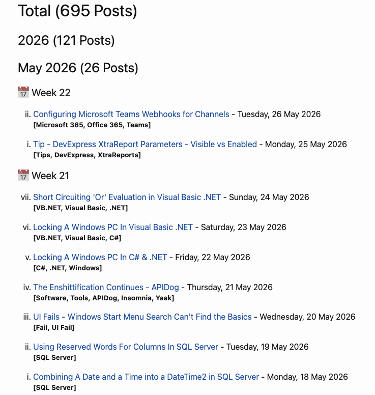
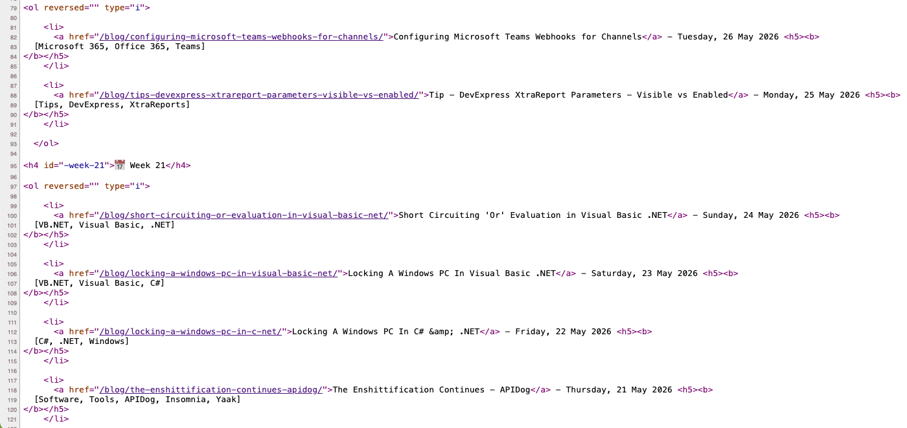
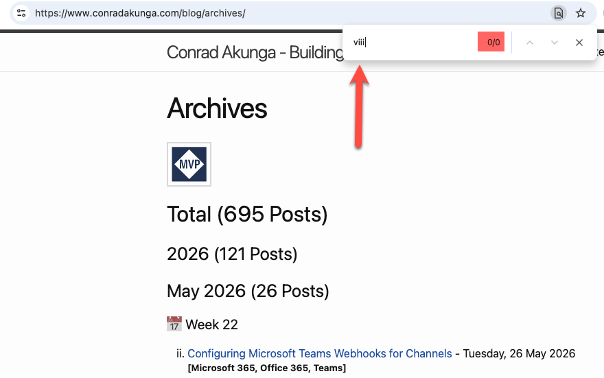
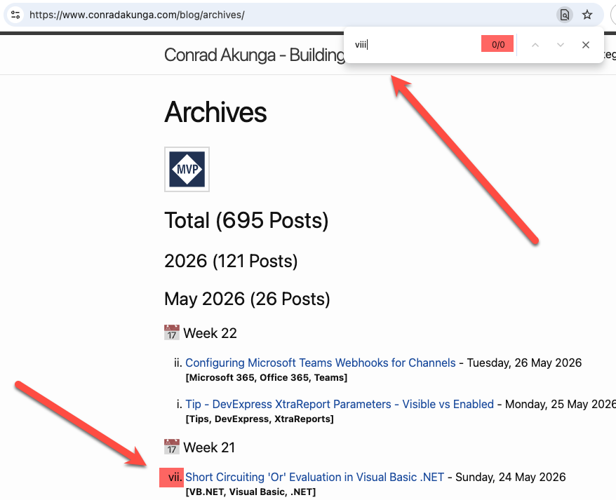
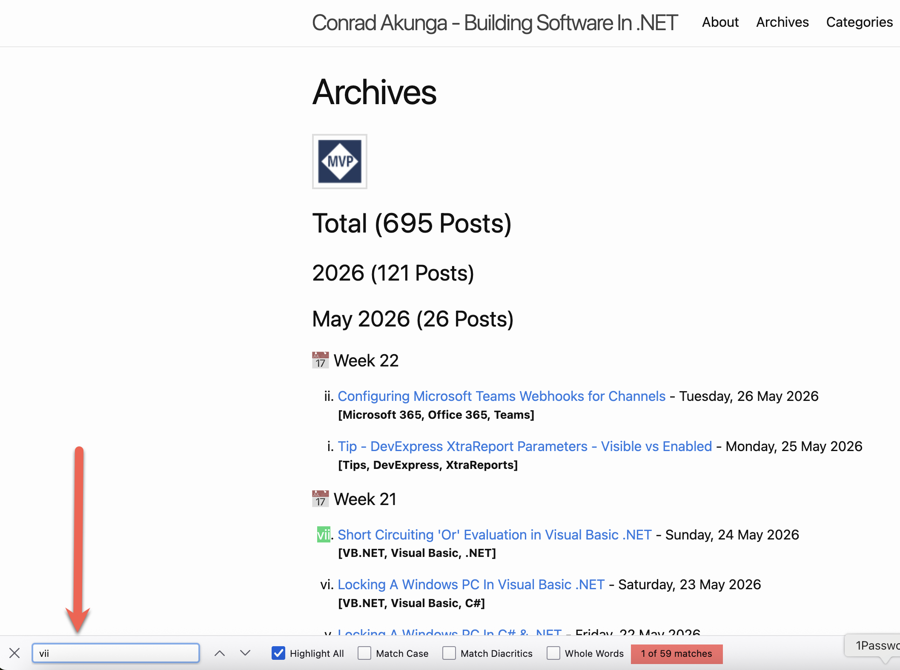

The archives for this blog look like this:

You can see that **every wee**k the blog entries are numbered from `1` to 7, in [Roman numerals](https://en.wikipedia.org/wiki/Roman_numerals).

This is actually an [ordered list](https://www.w3schools.com/hTml/html_lists_ordered.asp) , as you can tell from the source.

The blog itself is generated using [Jekyll](https://jekyllrb.com/), and the **source code** and **posts** of this blog, as a reminder, is available [here](https://github.com/conradakunga/Blog).

I wanted to check whether I had ever accidentally posted **more** than `7` times in a week.

A quick way to do so is to search for the text `viii`.

This found **nothing**, to my satisfaction.

But, on a whim, I searched for what **I know exists** - `vii`.

**This still found nothing!**

Which, technically, is **accurate** - that `viii` text **does not actually exist on the page** and, it is the **browser responsible** for **computing** and **presenting** it.

The same happens for [Safari](https://www.apple.com/safari/), [Microsoft Edge](https://www.microsoft.com/en-us/edge), as well as [Vivaldi](https://vivaldi.com/).

As far as I can tell, all [Chromium](https://www.chromium.org/) based browsers probably have this **issue**.

[Firefox](https://www.firefox.com/en-US/), however, does not!

### TLDR

**You cannot search for bullet numbers on *Chrome*, *Edge*, *Safari* and most *Chromium* based browsers. However, you can on *Firefox*.**

Happy hacking!
