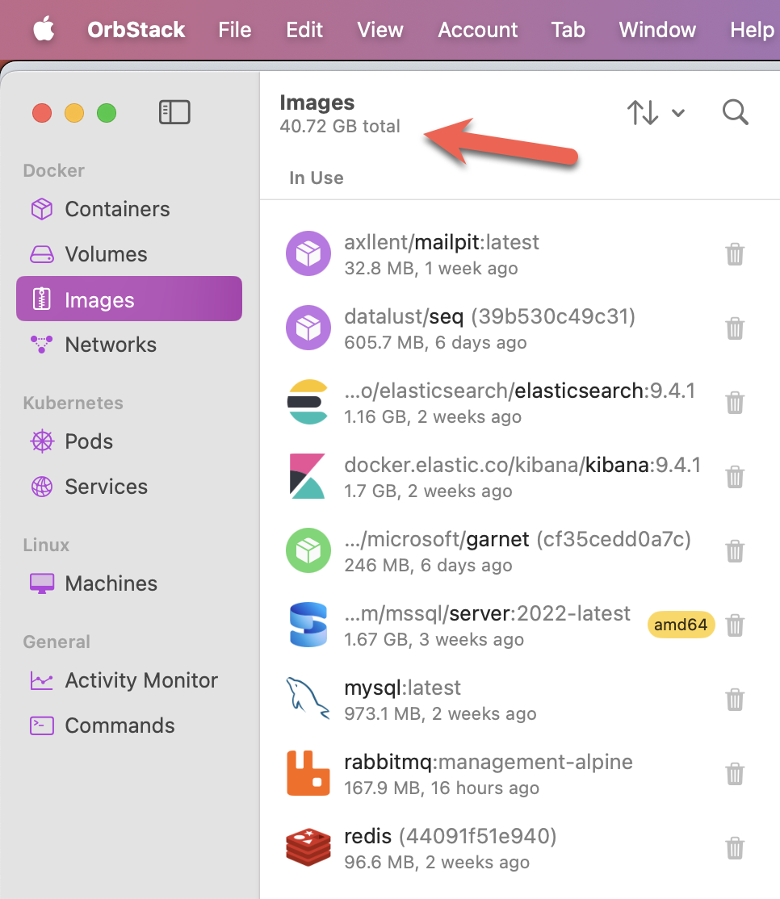
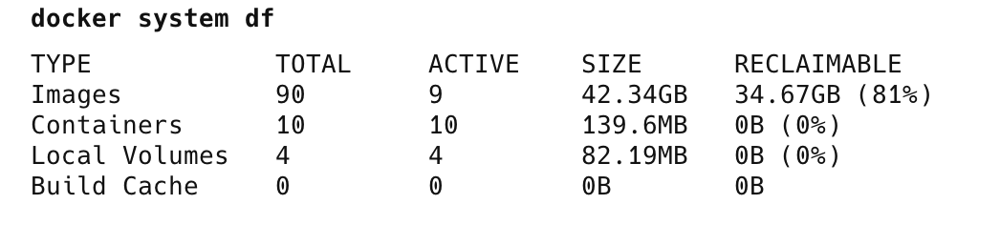

[Docker](https://www.docker.com/) is now an **essential** tool for software developers, as it allows you to spin up almost any infrastructure you may need.

Ordinarily, you would use a utility to manage your containers and images. This may be [Docker Desktop](https://docs.docker.com/desktop/) or, on [macOS](https://www.apple.com/os/macos/), [Orbstack](https://orbstack.dev/).

With a large number of images (currently, I have about 90), you may be curious to know how much disk space your **images** and **containers** are using.

For the usage of the images themselves, **Orbstack** can help with this.



For the **containers** themselves, there is **no obvious way** to get that information directly from **OrbStack**.

However, the [Docker command-line tools](https://docs.docker.com/reference/cli/docker/) can assist with this, using the Docker [system df](https://docs.docker.com/reference/cli/docker/system/df/) command 

```bash
docker system df
```

This will print the following:



The key information here is:

1. Count, state, and disk usage of **downloaded images**
2. Count, state, and disk usage of **running containers**
3. Count, state, and disk usage of **local volumes**

As you can see, **your images can consume quite a bit of disk space.**

### TLDR

**The `docker system df` command prints information about your Docker images, containers, volumes, and disk usage.**

Happy hacking!
