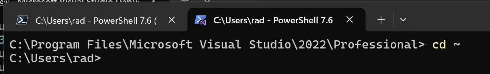
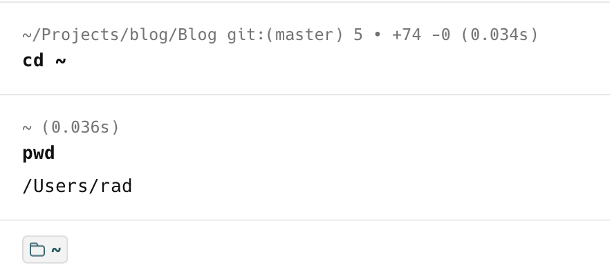
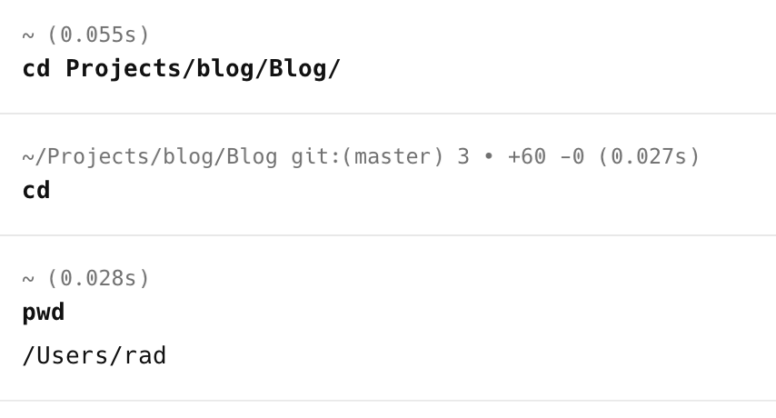
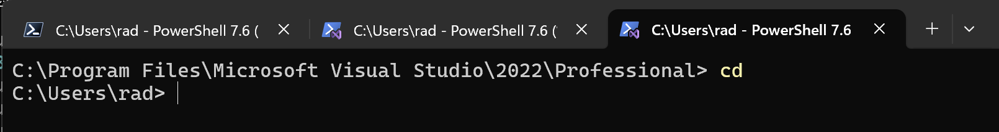

Frequently, when in your [terminal,](https://uwconnect.uw.edu/it?id=kb_article_view&sysparm_article=KB0034768) you will want to go to your [home directory](https://uwconnect.uw.edu/it?id=kb_article_view&sysparm_article=KB0034768).

Your home directory is where, by default, **most software and operating systems will place files and settings specific to the user**.

On [Linux,](https://en.wikipedia.org/wiki/Linux) this is typically

```bash
/home/rad
```

On [macOS,](https://en.wikipedia.org/wiki/MacOS) this is typically

```bash
/Users/rad
```

On [Windows](https://en.wikipedia.org/wiki/Microsoft_Windows), this is typically

```bash
C:\Users\rad>
```

You **do not need to remember** the actual location.

You can go to your **home** directory using the following command:

```bash
cd ~
```

The magic is the tilde character "`~`"

For many years, I have been using that.

On **Windows**:



On **macOS** / **Linux**:



I am **embarrassed** to say that it has taken me a **lifetime** to stumble upon an even **easier** way. Simply do this:

```bash
cd
```

This is just the command `cd`.

That will take you directly to your home directory.

On **macOS** / **Linux**:



On **Windows**:



### TLDR

**In the terminal, the command `cd` will take you to your home directory.**

Happy hacking!
