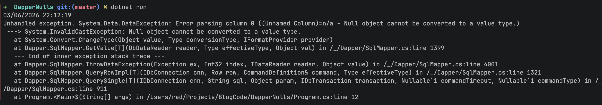

I have [extensively discussed]() the use of the excellent library [Dapper](https://github.com/DapperLib/Dapper) for **database access** with most database engines.

Today we will look at a potential problem you can run into unless you understand how to use [nullable value](https://learn.microsoft.com/en-us/dotnet/csharp/language-reference/builtin-types/nullable-value-types) types.

Take a common scenario where you need to retrieve the **time** in the database server.

The code is as simple at this:

```c#
using (var cn = new SqlConnection("data source=;;uid=sa;pwd=YourStrongPassword123;TrustServerCertificate=true"))
{
  var date = cn.QuerySingle<DateTime>("SELECT GetDate()");
  Console.WriteLine(date);
}
```

This will print the following:

```plaintext
03/06/2026 22:08:25
```

Now suppose the query returned a `NULL`

```c#
using (var cn = new SqlConnection("data source=;;uid=sa;pwd=YourStrongPassword123;TrustServerCertificate=true"))
{
  var date = cn.QuerySingle<DateTime>("SELECT NULL");
  Console.WriteLine(date);
}
```

This will throw an [exception](https://learn.microsoft.com/en-us/dotnet/csharp/fundamentals/exceptions/).

```plaintext
Unhandled exception. System.Data.DataException: Error parsing column 0 ((Unnamed Column)=n/a - Null object cannot be converted to a value type.)
 ---> System.InvalidCastException: Null object cannot be converted to a value type.
   at System.Convert.ChangeType(Object value, Type conversionType, IFormatProvider provider)
   at Dapper.SqlMapper.GetValue[T](DbDataReader reader, Type effectiveType, Object val) in /_/Dapper/SqlMapper.cs:line 1399
   --- End of inner exception stack trace ---
   at Dapper.SqlMapper.ThrowDataException(Exception ex, Int32 index, IDataReader reader, Object value) in /_/Dapper/SqlMapper.cs:line 4001
   at Dapper.SqlMapper.QueryRowImpl[T](IDbConnection cnn, Row row, CommandDefinition& command, Type effectiveType) in /_/Dapper/SqlMapper.cs:line 1321
   at Dapper.SqlMapper.QuerySingle[T](IDbConnection cnn, String sql, Object param, IDbTransaction transaction, Nullable`1 commandTimeout, Nullable`1 commandType) in /_/Dapper/SqlMapper.cs:line 911
   at Program.<Main>$(String[] args) in /Users/rad/Projects/BlogCode/DapperNulls/Program.cs:line 12
```



This is because `NULL` cannot be converted to a [DateTime](https://learn.microsoft.com/en-us/dotnet/api/system.datetime?view=net-10.0).

Which is as expected.

Technically, this code is **not correct**. If there is a chance that we **might not get a result**, we should be using `QuerySingleOrDefault`, rather than `QuerySingle`.

```c#
using (var cn = new SqlConnection("data source=;;uid=sa;pwd=YourStrongPassword123;TrustServerCertificate=true"))
{
    var date = cn.QuerySingleOrDefault<DateTime>("SELECT NULL");
    Console.WriteLine(date);
}
```

This **still throws the error**, but the **semantics** are **clear**.

The **proper** way to address this is to tell `Dapper` that the result is a **nullable** `DateTime`.

The final code is as follows:

```c#
using (var cn = new SqlConnection("data source=;;uid=sa;pwd=YourStrongPassword123;TrustServerCertificate=true"))
{
    var date = cn.QuerySingle<DateTime?>("SELECT NULL");
    if (date.HasValue)
        Console.WriteLine(date);
    else
        Console.WriteLine("A NULL was returned");
}
```

We have to address the **two** scenarios - when a `NULL` returns, or when a valid `DateTime` returns, achieved by checking the [HasValue](https://learn.microsoft.com/en-us/dotnet/api/system.nullable-1.hasvalue?view=net-10.0) property.

### TLDR

**When a NULL is a possible return value, ensure you are using *nullable types* for value types.**

Happy hacking!
