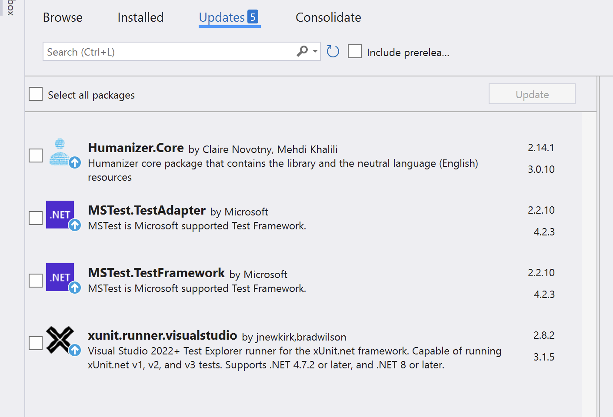
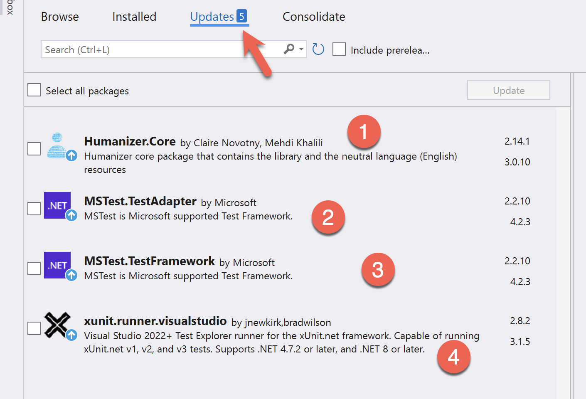

Quick, what's **wrong** with this?

This is the [Visual Studio](https://visualstudio.microsoft.com/) [Nuget](https://nuget.org) [package manager](https://en.wikipedia.org/wiki/Package_manager), that shows you which Nuget packages have updates.

In case you haven't noticed, this is the problem:

The **count** of updated **Nuget** packages is **not congruent** with their actual display.

Having been a software developer for a very long time, my first instinct when I see things like these is to empathize with my fellows, because [writing software is hard]().

There are a number of possible **explanations** for this:

1. The **count** of updates may be fetched separately** from the list, so a change may have happened as both calls were running
2. The **list** of packages requires **fetching of additional informatio**n - version number, icon, description, etc. Perhaps one of them **timed out**
3. There is a **threading issue** in the code that renders the list of packages, and it is behind the code that renders the count
4. An edge case bug, as I have never notices this problem before

Who knows?

Happy hacking!
