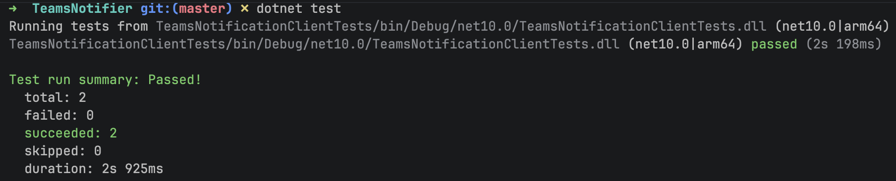
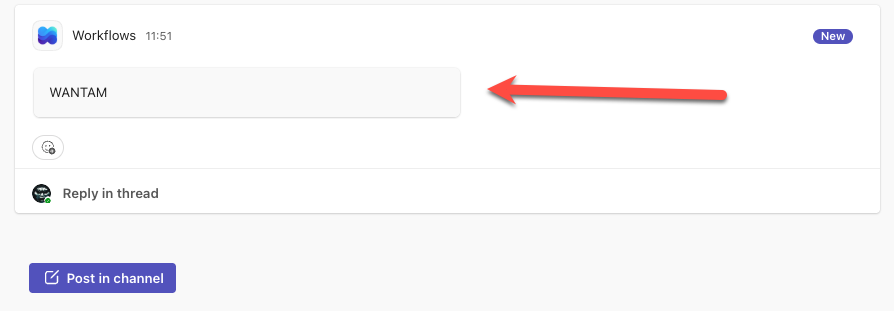

In a previous post, "[Posting Messages To Microsoft Teams With Code]()", we looked at how to post a message to [Microsoft Teams](https://www.microsoft.com/en-us/microsoft-teams/group-chat-software) in [C#](https://learn.microsoft.com/en-us/dotnet/csharp/).

However, as outlined in this post, "[Configuring Microsoft Teams Webhooks for Channels]()", **significant changes** have occurred in the architecture and model of Microsoft Teams integration, and not it is powered by [PowerAutomate](https://www.microsoft.com/en-us/power-platform/products/power-automate).

In this post we will look at how to **programmatically** post a message to Microsoft Teams via webhooks.

The first order of business is to identify the [channel](https://en.wikipedia.org/wiki/Webhook) that we want to post the message to, and setup the integration as outlined in [this post]().

Once done you should have a [webhook](https://en.wikipedia.org/wiki/Webhook).

It should look something like this:

```plaintext
https://default66d2057410b440c188d6fd84b570a9.g6.environment.api.powerplatform.com:443/powerautomate/automations/direct/workflows/8b149c7870eb402c9963df1bcbd62fc4/triggers/manual/paths/invoke?api-version=1&sp=%2Ftriggers%2Fmanual%2Frun&sv=1.0&sig=PV1Nt2_F8gQxLWIUSjaSMoCM6Lw5JTGPvyR4VYCRZvs
```

The next order of business is to understand the **payload** that the webhook expects.

The simplest model is a [textblock](https://learn.microsoft.com/en-us/adaptive-cards/schema-explorer/text-block), whose simplest payload looks like this:

```json
{
  "type": "message",
  "attachments": [
    {
      "contentType": "application/vnd.microsoft.card.adaptive",
      "content": {
        "type": "AdaptiveCard",
        "version": "1.2",
        "body": [
          {
            "type": "TextBlock",
            "text": "WANTAM!"
          }
        ]
      }
    }
  ]
}
```

Rather than manipulate this **unwieldy text**, you can use [anonymous types](https://learn.microsoft.com/en-us/dotnet/csharp/programming-guide/classes-and-structs/anonymous-types) and some [constants](https://learn.microsoft.com/en-us/dotnet/csharp/programming-guide/classes-and-structs/constants) to get the same effect:

First, we define our **constants**;

```c#
const string MessageType = "message";
const string CardContentType = "application/vnd.microsoft.card.adaptive";
const string CardType = "AdaptiveCard";
const string CardVersion = "1.2";
const string CardBodyType = "TextBlock";
```

Then we build our **anonymous type**.

```c#
var request = new
{
	type = MessageType,
	attachments = new[]
	{
		new
		{
			contentType = CardContentType,
			content = new
			{
				type = CardType,
				version = CardVersion,
				body = new[]
				{
					new
					{
						type = CardBodyType,
						text = $"{message}"
					}
				}
			}
		}
	}
};
```

This request is then posted via a [HttpClient](https://learn.microsoft.com/en-us/dotnet/api/system.net.http.httpclient?view=net-10.0) to Microsoft Teams.

We can wrap everything into a tidy `class` as follows:

```c#
public sealed class TextNotifier
{
    private const string MessageType = "message";
    private const string CardContentType = "application/vnd.microsoft.card.adaptive";
    private const string CardType = "AdaptiveCard";
    private const string CardVersion = "1.2";
    private const string CardBodyType = "TextBlock";

    private readonly string webhook;

    public TextNotifier(string webhook)
    {
        this.webhook = webhook;
    }

    public async Task<bool> Post(string message)
    {
        var request = new
        {
            type = MessageType,
            attachments = new[]
            {
                new
                {
                    contentType = CardContentType,
                    content = new
                    {
                        type = CardType,
                        version = CardVersion,
                        body = new[]
                        {
                            new
                            {
                                type = CardBodyType,
                                text = $"{message}"
                            }
                        }
                    }
                }
            }
        };

        var client = new HttpClient();
        // Set our headers
        client.DefaultRequestHeaders.Accept.Add(new MediaTypeWithQualityHeaderValue(MediaTypeNames.Application.Json));
        // Serialize anonymous type to JSON	
        var adaptiveCardJson = JsonSerializer.Serialize(request);
        // Create content for posting
        var content = new StringContent(adaptiveCardJson, System.Text.Encoding.UTF8, MediaTypeNames.Application.Json);
        // Post
        var response = await client.PostAsync(webhook, content);
        // Return success
        return response.IsSuccessStatusCode;
    }
}
```

Here we can see a couple of things:

1. We create our request as an **anonymous type**
2. We create a `HttpClient` and set some default headers
3. We **serialize** our request to `json`
4. We create [StringContent](https://learn.microsoft.com/en-us/dotnet/api/system.net.http.stringcontent?view=net-10.0) from our json
5. We **post** to the **webhook**
6. We **check** if the result is a **success**

We then write tests for this:

```c#
public class TextNotifierTests
{
    [Fact]
    public async Task Teams_Client_Should_Post_With_Valid_WebHook()
    {
        var client = new TextNotifier(Constants.ValidTeamsWebHook);
        var result = await client.Post("WANTAM");
        result.Should().BeTrue();
    }

    [Fact]
    public async Task Teams_Client_Should_Fail_With_InValid_WebHook()
    {
        var client = new TextNotifier(Constants.InValidTeamsWebHook);
        var result = await client.Post("WANTAM");
        result.Should().BeFalse();
    }
}
```

Our tests should **succeed**.



Finally, we can invoke this as follows:

```c#
const string TestWebHook = "INSERT YOUR WEBHOOK FROM TEAMS HERE";
var client = new TextNotifier(TestWebHook);
var result = await client.Post("WANTAM");
```

The variable `result` will be `true` for success, and `false` otherwise.

If all goes well, we should see the following in the Microsoft Teams channel.



### TLDR

**You can programmatically post to Microsoft Teams Channels via webhook using *anonymous types* and a *HttpClient***

The code is in my GitHub.

Happy hacking!
