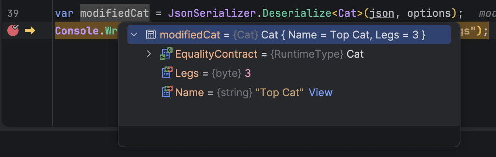

Over the years, we have extensively discussed the use of the native .NET `JSON` **parser**, [System.Text.Json](https://learn.microsoft.com/en-us/dotnet/api/system.text.json?view=net-11.0-pp).

Almost always, we are **reading** and **writing** `JSON` (**deserializing** and **serializing**).

If you want to **modify** the `JSON`, you **modify the object** first, and then **serialize** it.

For example, take this `type`:

```c#
public record Cat(string Name, byte Legs);
```

We would **create** and **serialize** a `Cat` as follows:

```c#
var cat = new Cat("Tom", 4);
var options = new JsonSerializerOptions() { WriteIndented = true };
var json = JsonSerializer.Serialize(cat, options);
Console.WriteLine(json);
```

This would print the following:

```json
{
  "Name": "Tom",
  "Legs": 4
}
```

Now, suppose you wanted to **change** the `Legs` of this cat.

Technically, this is **not possible** as a [record](https://learn.microsoft.com/en-us/dotnet/csharp/language-reference/builtin-types/record) type is [immutable](https://www.daveabrock.com/2020/11/02/csharp-9-records-immutable-default/).

You would have to create **another** `Cat` like this:

```c#
var amputee = cat with { Legs = 3 };
json = JsonSerializer.Serialize(amputee, options);
Console.WriteLine(json);
```

This will print the following:

```json
{
  "Name": "Tom",
  "Legs": 3
}
```

Suppose, for whatever reason, **this was not an option**, and you wanted to **manipulate** the `JSON` **directly**. Perhaps the `JSON` is being fetched from an **external system**.

Rather than manipulating the `string` directly, a far better approach is to use the [JsonNode](https://learn.microsoft.com/en-us/dotnet/api/system.text.json.nodes.jsonnode?view=net-11.0-pp) object. This creates a **mutable object model** that you can **manipulate** to your heart's content.

Going back to our previous example, we can do something like this:

```c#
// Create a JonNode
var node = JsonNode.Parse(json);
if (node is null)
    return;
// Read the properties we're interested in
var legs = node["Legs"]?.GetValue<int>();
var name = node["Name"]?.GetValue<string>();
// Output
Console.WriteLine($"{name} has {legs} Legs");
```

We can see here in the code that we are free to **fetch strongly typed values** from the `JsonNode` with type safety using the **generic** [GetValue](https://learn.microsoft.com/en-us/dotnet/api/system.text.json.nodes.jsonnode.getvalue?view=net-10.0) method.

I am using the `?` [conditional access operand](https://medium.com/geekculture/null-conditional-member-access-operators-in-c-60c79ce5f226) because I am sure that `node` is not `null`, and neither are the values I am fetching.

As a `JsonNode` is mutable, we can **mutate** the JSON and do something like this:

```c#
// Mutate some properties
node["Legs"] = 3;
node["Name"] = "Top Cat";
```

We can then get our `JSON` from the node object as follows:

```c#
// Get the json from the node
json = node.ToJsonString(options);
// Output
Console.WriteLine(json);
```

Here we are using the [ToJsonString](https://learn.microsoft.com/en-us/dotnet/api/system.text.json.nodes.jsonnode.tojsonstring?view=net-10.0) method, passing our [JsonSerializer](https://learn.microsoft.com/en-us/dotnet/api/system.text.json.jsonserializeroptions?view=net-11.0-pp) options that we had created earlier.

This will print the following:

```json
{
  "Name": "Top Cat",
  "Legs": 3
}
```

This `JSON` can now be used to **construct an instance** of the `Cat` type.

```c#
var modifiedCat = JsonSerializer.Deserialize<Cat>(json, options);
Console.WriteLine($"{modifiedCat.Name} has {modifiedCat.Legs} Legs");
```

This will look like this:



### TLDR

**You can use the `JsonNode` object for strongly typed access to `JSON`, as well as to manipulate `JSON`.**

The code is in my [GitHub](https://github.com/conradakunga/BlogCode/tree/master/2026-06-06%20-%20ManipulateJson).

Happy hacking!
