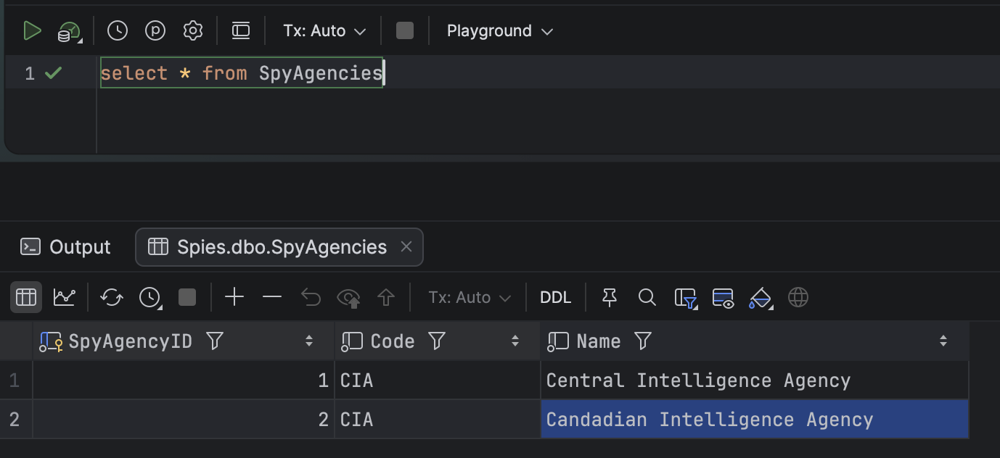
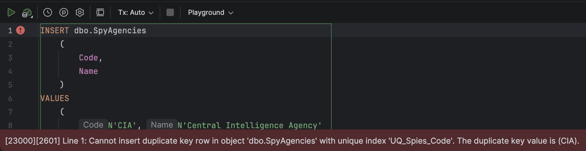
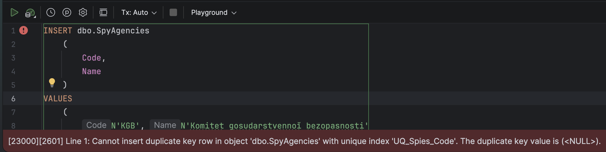
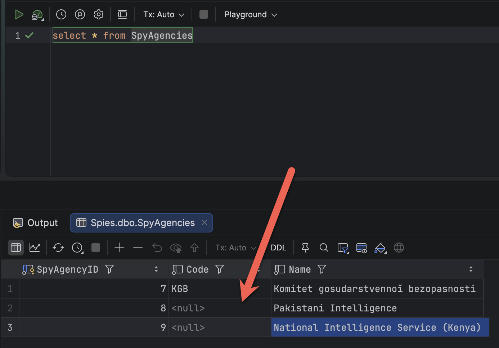

A **uniqe index** is a fairly simple construct.

It does not allow a column value to repeat across the rows.

Take the following table [DDL](https://en.wikipedia.org/wiki/Data_definition_language) in [Microsoft SQL Server](https://www.microsoft.com/en-us/sql-server).

```sql
CREATE TABLE Fruits
    (
        FruitID INT           IDENTITY NOT NULL PRIMARY KEY,
        Name    NVARCHAR(100) NOT NULL
    );
```

We can insert `Fruits` as follows:

```sql
INSERT dbo.Fruits
    (
        Name
    )
VALUES
    (
        N'Apples'
    ),
    (
        N'Bananas'
    ),
    (
        N'Mangoes'
    );
```

We can also do this:

```sql
INSERT dbo.Fruits
    (
        Name
    )
VALUES
    (
        N'Pears'
    ),
    (
        N'Pears'
    ),
    (
        N'Pears'
    );
```

This is a **contrived** example, so let us use something more **realistic**.

This is the table:

```sql
CREATE TABLE SpyAgencies
    (
        SpyAgencyID INT          IDENTITY NOT NULL PRIMARY KEY,
        Code        NVARCHAR(5)  NULL,
        Name        NVARCHAR(20) NOT NULL
    );
GO
```

And this is the data:

```sql
INSERT dbo.SpyAgencies
    (
        Code,
        Name
    )
VALUES
    (
        N'CIA', N'Central Intelligence Agency'
    ),
    (
        N'CIA', N'Candadian Intelligence Agency'
    );
```

This will result in the following:



We can see here that the **code is repeating**.

This is solved using a [unique index](https://learn.microsoft.com/en-us/sql/relational-databases/indexes/create-unique-indexes?view=sql-server-ver17).

```sql
CREATE UNIQUE INDEX UQ_Spies_Code
    ON dbo.SpyAgencies (Code);
```

If you run this code, you will get the following error:

```plaintext
Msg 1505, Level 16, State 1, Line 1
The CREATE UNIQUE INDEX statement terminated because a duplicate key was found for the object name 'dbo.SpyAgencies' and the index name 'UQ_Spies_Code'. The duplicate key value is (CIA).
The statement has been terminated.
```

This is because the data in the table **already violates the constraint**!

For today's purposes, go ahead and **delete the existing data**.

```sql
DELETE FROM dbo.SpyAgencies
```

Then run the code to create the index.

```sql
CREATE UNIQUE INDEX UQ_Spies_Code
    ON dbo.SpyAgencies (Code);
```

Now run the **insert** statements.

```sql
INSERT dbo.SpyAgencies
    (
        Code,
        Name
    )
VALUES
    (
        N'CIA', N'Central Intelligence Agency'
    ),
    (
        N'CIA', N'Candadian Intelligence Agency'
    );
```

Now we get a slightly different error:

```plaintext
Msg 2601, Level 14, State 1, Line 1
Cannot insert duplicate key row in object 'dbo.SpyAgencies' with unique index 'UQ_Spies_Code'. The duplicate key value is (CIA).
The statement has been terminated.

Completion time: 2026-06-08T20:28:26.0359650+03:00
```



So far so good.

Now let us look at a scenario where **we don't always know the agency code** as we are inserting the data.

```sql
INSERT dbo.SpyAgencies
    (
        Code,
        Name
    )
VALUES
    (
        N'KGB', N'Komitet gosudarstvennoĭ bezopasnosti'
    ),
    (
        NULL, 'Pakistani Intelligence'
    ),
    (
        NULL, 'National Intelligence Service (Kenya)'
    );

```

Here we know the code for the [KGB](https://en.wikipedia.org/wiki/KGB), but we don't know the code for 2 intelligence services - [Pakistani Intelligence](https://en.wikipedia.org/wiki/Inter-Services_Intelligence) and [National Intelligence Service (Kenya](https://www.nis.go.ke/)).

Ideally, this **should succed**, as `NULL` does not really constitute a code, and no two `NULLs` are equal.

Interestingly, this **fails**.

```plaintext
Msg 2601, Level 14, State 1, Line 1
Cannot insert duplicate key row in object 'dbo.SpyAgencies' with unique index 'UQ_Spies_Code'. The duplicate key value is (<NULL>).
The statement has been terminated.

Completion time: 2026-06-08T20:38:47.7266925+03:00
```



This is because SQL Server considers **two different `null` values as a volation of the unique constraint**.

This can be fixed by the fact that [indexes can be filtered](https://learn.microsoft.com/en-us/sql/relational-databases/indexes/create-filtered-indexes?view=sql-server-ver17).

The solution is as follows:

```sql
-- drop the existing inde
DROP INDEX UQ_Spies_Code
    ON dbo.SpyAgencies;
-- Recreate to ignore nulls
CREATE UNIQUE INDEX UQ_Spies_Code
    ON dbo.SpyAgencies (Code)
    WHERE (Code IS NOT NULL);
```

Now if we try to insert the data, we **succeeed**.



This essentially means:

> If the code is NULL, allow entry. Otherwise, only allow entry if it is unique.

### TLDR

**In SQL Server you can allow `NULL` values for columns with a unique index by using filtered indexes.**

Happy hacking!
