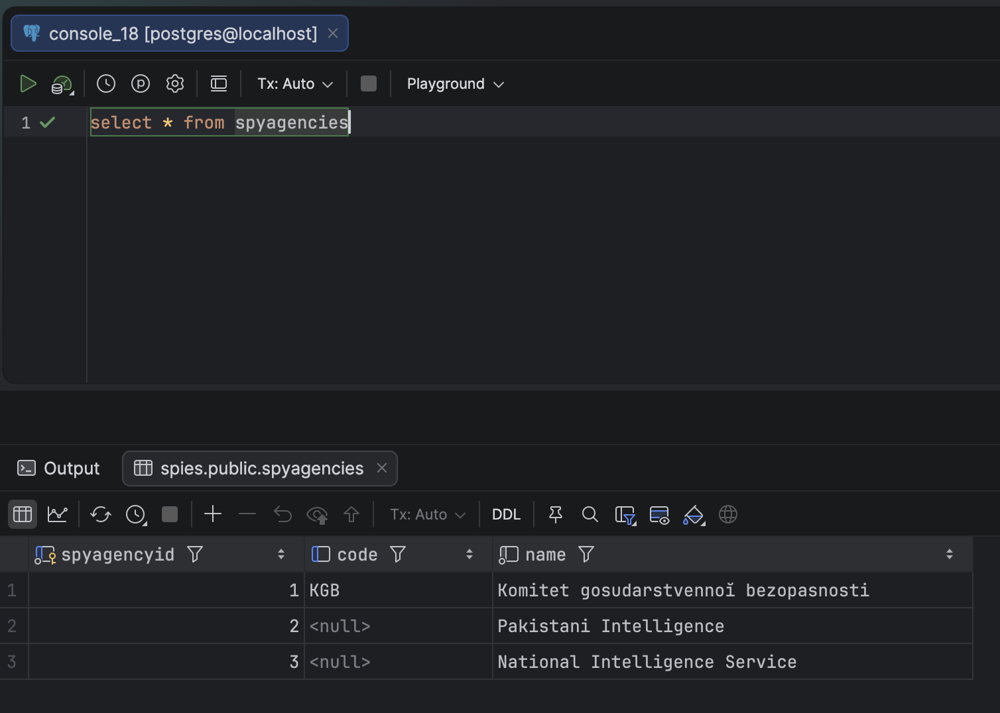
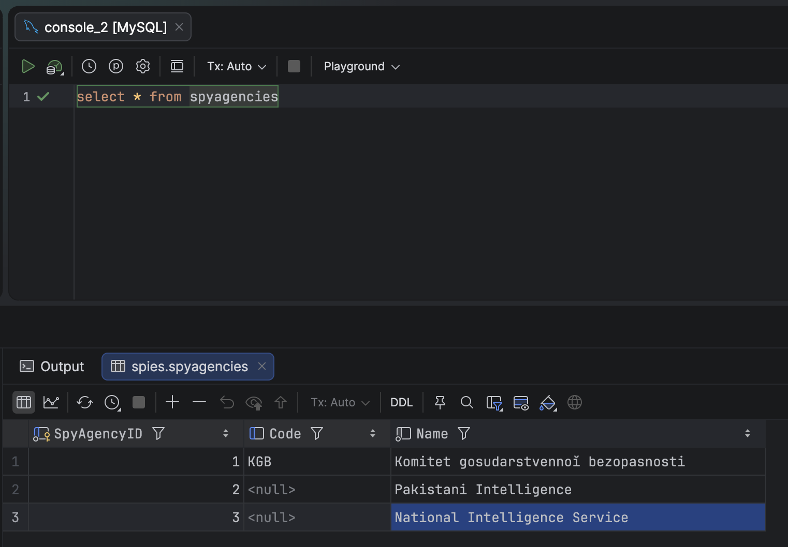
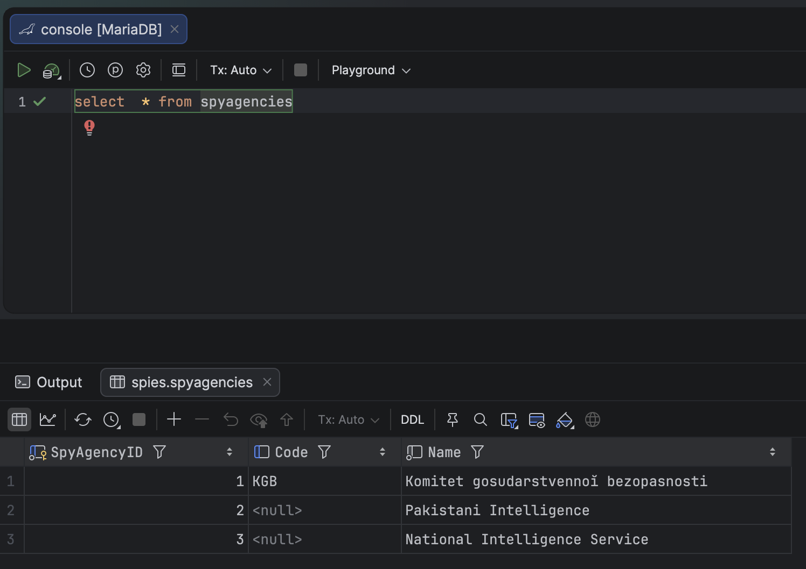

Yesterday's post, "[Creating A Unique Index That Allows NULL In SQL Server]()", looked at how [Microsoft SQL Server](https://www.microsoft.com/en-us/sql-server) treats `NULL` values on columns with [unique constraints](https://www.w3schools.com/sql/sql_unique.asp), and how to get it to ignore `NULLs` for that purpose.

In this post we will look at how [PostgreSQL](https://www.postgresql.org/),  [MySQL](https://www.mysql.com/) and [MariaDB](https://mariadb.org/) approach the problem.

## PostgreSQL

We will use the same [DDL](https://en.wikipedia.org/wiki/Data_definition_language):

```sql
CREATE TABLE spyagencies
    (
        spyagencyid INT          IDENTITY NOT NULL PRIMARY KEY,
        code        NVARCHAR(5)  NULL,
        name        NVARCHAR(50) NOT NULL
    );
GO
```

We then create our **index**:

```sql
CREATE UNIQUE INDEX uq_spies_code
    ON spyagencies(code)
```

Now, let us attempt to insert **multiple** `NULL` values.

```sql
INSERT spyagencies
    (
        Code,
        Name
    )
VALUES
    (
        N'KGB', N'Komitet gosudarstvennoĭ bezopasnosti'
    ),
    (
        NULL, 'Pakistani Intelligence'
    ),
    (
        NULL, 'National Intelligence Service'
    );
```

We succeed immediately.



Which is to say **PostgreSQL** does not consider `NULL` values as unique.

## MySQL & MariaDB

The **MySQL**  DDL is as follows:

```sql
CREATE TABLE spyagencies
(
    spyagencyid INT NOT NULL AUTO_INCREMENT PRIMARY KEY,
    code        VARCHAR(5) NULL,
    name        VARCHAR(50) NOT NULL
);
```

We then create our **index**.

```sql
CREATE UNIQUE INDEX uq_spies_code
    ON spyagencies(code)
```

Finally we run our **inserts**:

```sql
INSERT spyagencies
    (
        code,
        name
    )
VALUES
    (
        N'KGB', N'Komitet gosudarstvennoĭ bezopasnosti'
    ),
    (
        NULL, 'Pakistani Intelligence'
    ),
    (
        NULL, 'National Intelligence Service'
    );
```

This also succeeds immediately.



The same for **MariaDB**.



### TLDR

***MySQL* and *MariaDB* do not consider multiple `NULL` values as a unique index violation, and thus, unlike SQL Server, do not require indexes to be filtered.**

Happy hacking!
