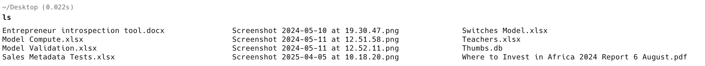
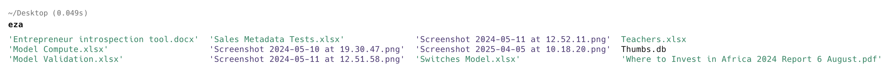
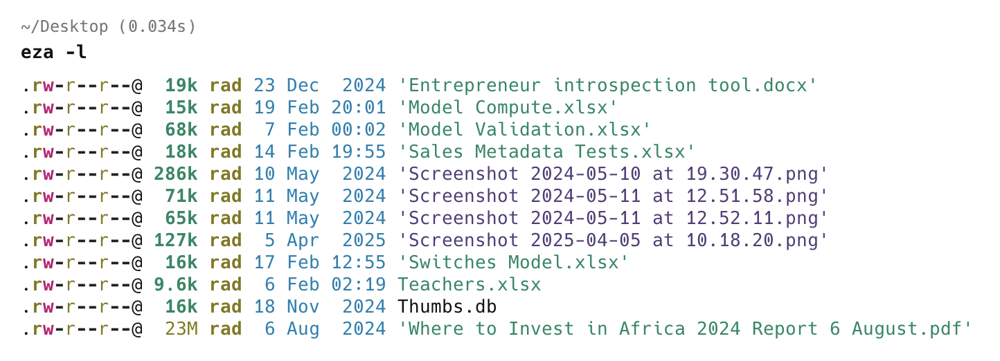
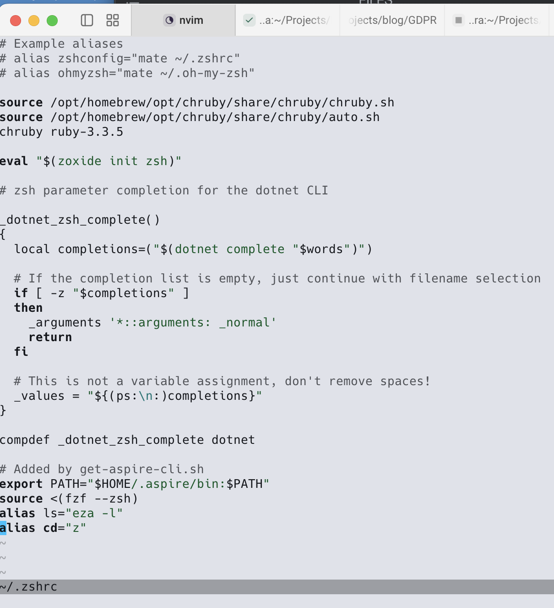
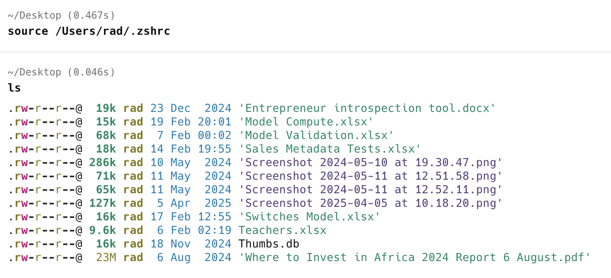

As a serious software developer and / or IT professional, you will invariably find yourself at some point doing work in the [terminal](https://dev.to/therubberduckiee/demystifying-the-terminal-how-it-works-behind-the-scenes-50h6).

A lot of the tooling available on the command line is pretty **robust**. But there is always room for **improvement**.

Take for example the humble list files command:

```bash
ls
```

By default, your output will look like this:



There is a tool on macOS (and Linux), [eza](https://github.com/eza-community/eza), that improves this:



Exa supports most of the switches that ls does.

So we can do this:

```bash
eza -l
```



My muscle memory is pretty much baked in, so I keep forgetting to use `eza` instead of `ls`.

This is where [aliases](https://en.wikipedia.org/wiki/Alias_(command)) come in.

I can define an alias and **register it** with my profile.

If you are using [z-shell](https://en.wikipedia.org/wiki/Z_shell), run the following command:

```bash
nvim ~/.zshrc
```

If you are using [bash](https://en.wikipedia.org/wiki/Bash_(Unix_shell)), this is the command:

```bash
nvim ~/.bashrc
```

This will open your **profile**.

Here, I am using [Neovim (nvim)](https://neovim.io/). Replace with your favourite editor.

My profile looks like this:



Go to the **end**, and add the following line:

```bash
alias ls="eza -l"
```

Note here that not only do I want to **replace** `ls` with `eza`, I want the files to be [listed with details](https://www.w3schools.com/bash/bash_ls.php).

Finally, we **reload** the profile.

```bash
source ~/.zshrc
```

Now if I run `ls`, this is the result:



Much more convenient!

### TLDR

**You can use aliases to simplify your command line workflow.**

Happy hacking!
