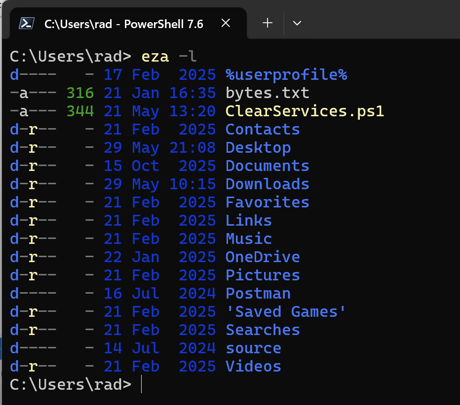
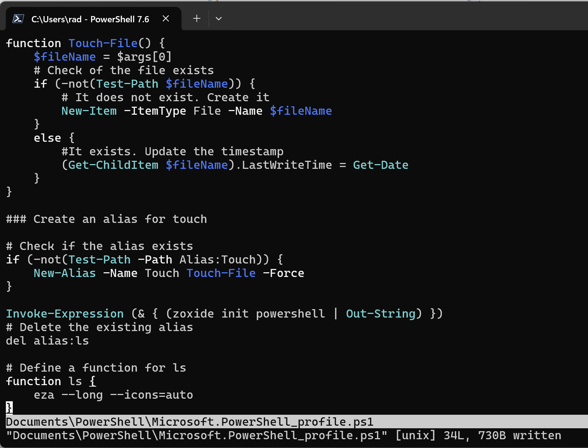
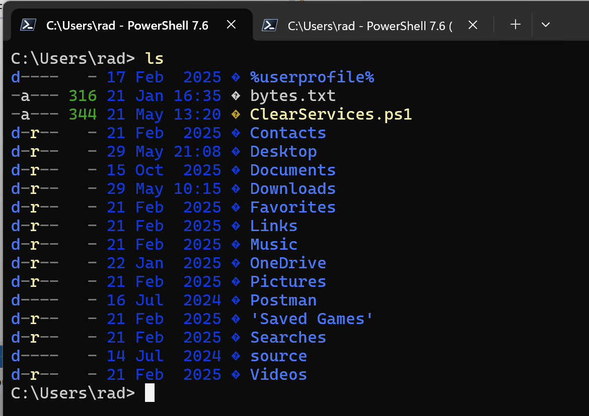

Yesterday's post, "[Using Aliases To Improve Command Line Experience]()", looked at how to use **aliases** to improve your terminal workflow. In particular we looked at the [z-shell](https://en.wikipedia.org/wiki/Z_shell) and [bash shell](https://en.wikipedia.org/wiki/Bash_(Unix_shell)), both available in **Linux**, **Unix** and **macOS**.

In this post we will look at **how to do the same** in **Windows** with [PowerShell](https://learn.microsoft.com/en-us/powershell/).

To my pleasant surprise, [eza](https://github.com/eza-community/eza) is **available** in Window

You can install it as follows:

```powershell
winget install eza-community.eza
```

[Winget](https://learn.microsoft.com/en-us/windows/package-manager/winget/) will download, install the software.

You can also use [chocolatey](https://chocolatey.org/) instead.

You can check that it works by running the software.

```bash
eza
```

You should see something like this:



**PowerShell** supports aliases, using the [set-alias](https://learn.microsoft.com/en-us/powershell/module/microsoft.powershell.utility/set-alias?view=powershell-7.6) [cmdlet](https://learn.microsoft.com/en-us/powershell/scripting/developer/cmdlet/cmdlet-overview?view=powershell-7.6).

Similar to the approach on Unix, Windows and macOS, we start by opening our [profile](https://learn.microsoft.com/en-us/powershell/scripting/learn/shell/creating-profiles?view=powershell-7.6):

```powershell
nvim $profile
```

[Neovim](https://neovim.io/), mercifully, is also available  on Windows, but you can use the **editor of your choice**.

Next we configure `eza`.

```bash
# Delete the existing alias
Remove-Item Alias:\ls

# Define a function for ls
function ls {
    eza --long --icons=auto
}
```



A couple of things to note:

1. `ls` in **PowerShell** is **already an alias** for [Get-ChildItem](https://learn.microsoft.com/en-us/powershell/module/microsoft.powershell.management/get-childitem?view=powershell-7.6). We first need to remove this alias using the [Remove-Item](https://learn.microsoft.com/en-us/powershell/module/microsoft.powershell.management/remove-item?view=powershell-7.6) `cmdlet`
2. Much as **PowerShell** supports [aliases](https://learn.microsoft.com/en-us/powershell/module/microsoft.powershell.utility/set-alias?view=powershell-7.6), you [cannot create an alias for a command with  parameter.](https://learn.microsoft.com/en-us/powershell/scripting/learn/shell/using-aliases?view=powershell-7.5#creating-alternate-names-for-commands-with-parameters) You have to crate a [function](https://learn.microsoft.com/en-us/powershell/scripting/learn/ps101/09-functions?view=powershell-7.6) instead.

Save and then **reload the profile**.

```powershell
. $profile
```

Now we can verify if everything worked.

```bash
ls
```



### TLDR

**`Eza` can also be configured in windows to replace the built in `ls` command.**

Happy hacking!
