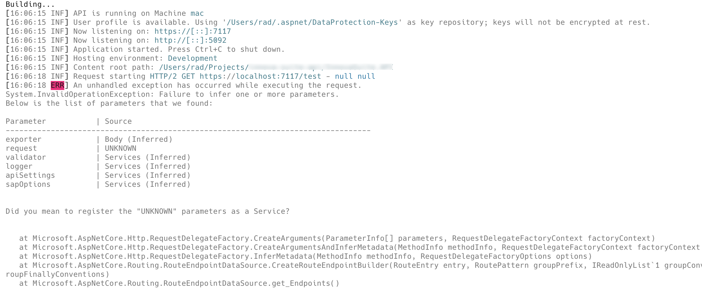
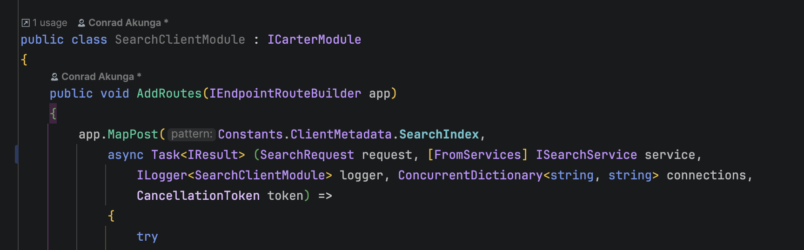
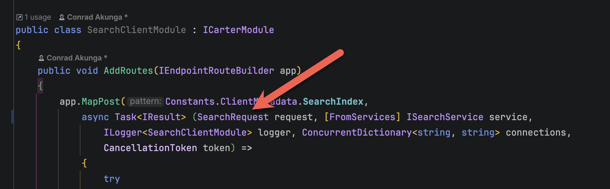
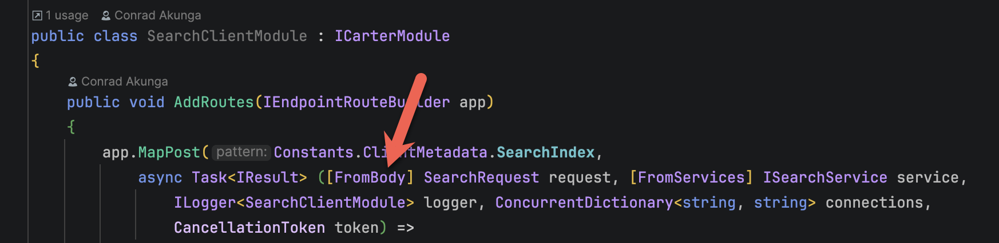
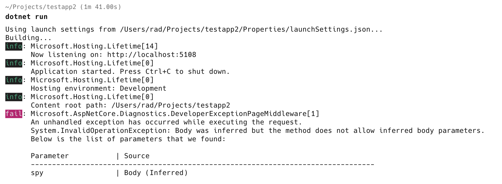

[Carter](https://github.com/CarterCommunity/Carter) is an excellent library that makes writing [ASP.NET](https://www.asp.net/) Web Applications and APIs that much **easier**.

Today I ran into a problem that manifested as follows:



The application did not start at all, complaining about an issue during **service registration**.

I spent an **entire day** chasing this problem and finally discovered the issue.

After several **hours** of searching (including **commenting out all the service registrations**), I finally had the idea to **look across the project** for any endpoints with a parameter named `request`.

And I found it:



Do you see the problem?



The problem is that the ASP.NET pipeline has **no idea where to find** the `SearchRequest`.

The solution is as folllows:



Here I have decorated the request with the [FromBody](https://learn.microsoft.com/en-us/dotnet/api/microsoft.aspnetcore.mvc.frombodyattribute?view=aspnetcore-10.0) attribute, to tell the pipeline to look for the parameter in the **body** of the [HttpRequest](https://learn.microsoft.com/en-us/dotnet/api/microsoft.aspnetcore.http.httprequest?view=aspnetcore-10.0).

Now, why are we getting this error at **startup** instead of **when we actually hit this endpoint**?

`Carter` **scans the application** for all classes implementing `ICarterModule`, and each module is used to configure endpoints via `IEndpointRouteBuilder`, which Carter uses internally to **register routes** with ASP.NET Core’s minimal API pipeline.

You can see the difference in a normal [Minimal AP](https://learn.microsoft.com/en-us/aspnet/core/fundamentals/minimal-apis?view=aspnetcore-10.0)I project.

```c#
var builder = WebApplication.CreateBuilder(args);

var app = builder.Build();

app.UseHttpsRedirection();

app.MapGet("/Spy", (Spy spy) =>
{
    // Return the spy
    return Results.Ok(spy);
});

app.Run();

record Spy(string FirstName, string LastName);
```

This will start **successfully**.

It is only **when you actually hit the endpoint** that ASP.NET complains it doesn't know where to find the `Spy`.



In other words, **you only get problems when you hit the endpoint**.

If you use `Carter`, it scans them **all** at **startup**.

This is actually a **good thing**, as you know in advance if you have any problems with your routes, rather than having **lesser-used routes throw errors after periods of normal operation**.

If only it helped you point towards the culprit!

### TLDR

**`Carter` will scan all modules for endpoints at startup and throw an exception if it cannot map all the parameters.**

Happy hacking!
