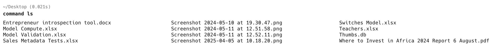

In a previous post, "[Using Aliases To Improve Command Line Experience]()", we looked at how to use [aliases](https://en.wikipedia.org/wiki/Alias_(command)) to **improve our command line workflow** and experience.

This **generally** works pretty well.

But there are times when you want to **temporarily** override your **alias**.

In our post, we aliased `ls` to `eza`, such that a default **file listing** yields this:


This is because my **alias** is set up as follows:

```bash
ls='eza -l --icons'
```

Suppose you wanted to **temporarily override this.**

You can achieve this by prefixing our alias with `command`.

```bash
command ls
```



Of course, this only works if the alias has a **pre-existing definition**.

### TLDR

**You can *temporarily* override an alias to an existing command definition by prefixing it with `command`.**

Happy hacking!
