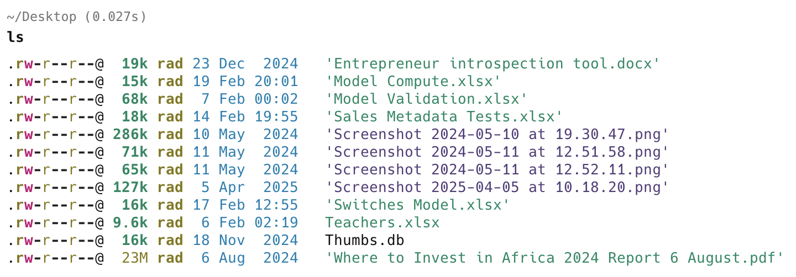
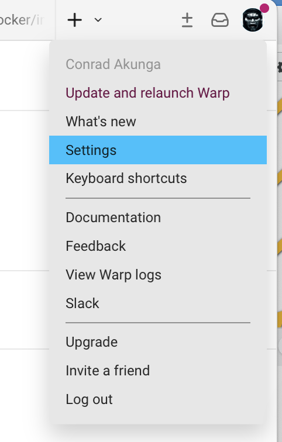
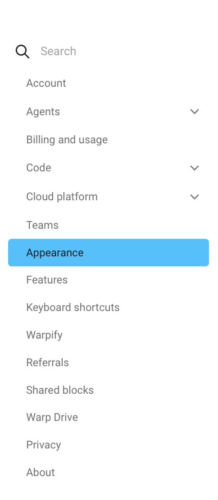
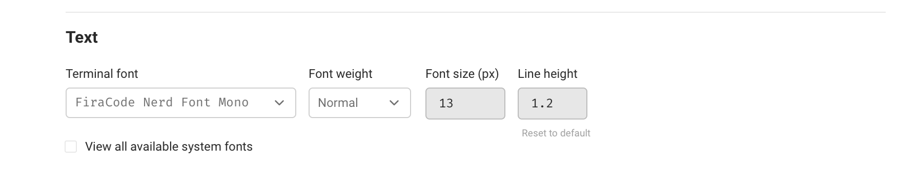
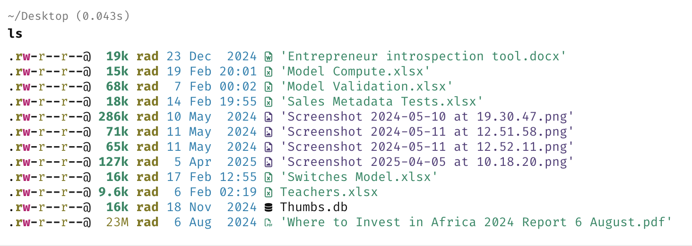

In a previous post, "[Using Aliases To Improve Command Line Experience]()", we looked at how to use [eza](https://github.com/eza-community/eza) and [aliases](https://en.wikipedia.org/wiki/Alias_(command)) to **improve your command line terminal experience**.

However, I realized the output was still **not what I expected**.



Given that the alias is the following:

```bash
ls='eza -l --icons'
```

**Where are the icons?**

Turns out that the display of icons is a **two-part** problem.

1. `eza` **obtains the icon** for each file type
2. The terminal **displays** them

I have only solved the **first** problem.

The second problem is the **terminal itself displaying the icons**.

I currently use the excellent [Warp](https://www.warp.dev/) terminal.

The solution is to **change the display font** to one that supports **icons**.

This is accessible via the **settings** menu:



Then the **appearance** section:



And finally, the **text** section, where you can **change the font**.



I am here using the excellent [Fira Code Nerd](https://firacode.org/fira-code-nerd-font-elevate-your-vscode-coding-experience/) font.

The change should take effect **immediately**.

My output now looks like this:



Much better!

### TLDR

**Use a font that supports icon display, like *Fire Code Nerd*, for an even better experience with `eza`.**

Happy hacking!
