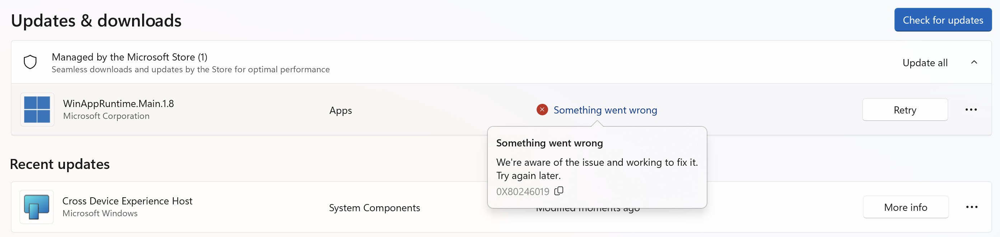
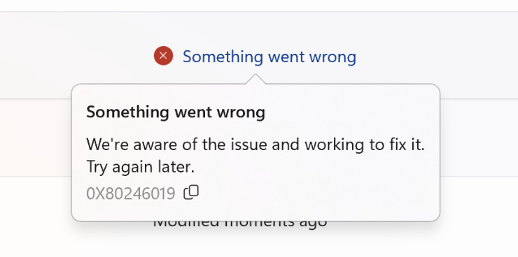

I was recently updating my [Microsoft Store](https://apps.microsoft.com/home) applications on my [Windows](https://www.microsoft.com/en-us/windows/) 11 virtual machine and ran into this:

Something went wrong.

Fair enough.

But **what use is this to me**, the **user**?

It can be argued that the error is **not something I can do anything abou**t.

In which case, **what's the point of telling me**?

It can further be argued that this is **better than just keeping quiet**.

Is it, though?
